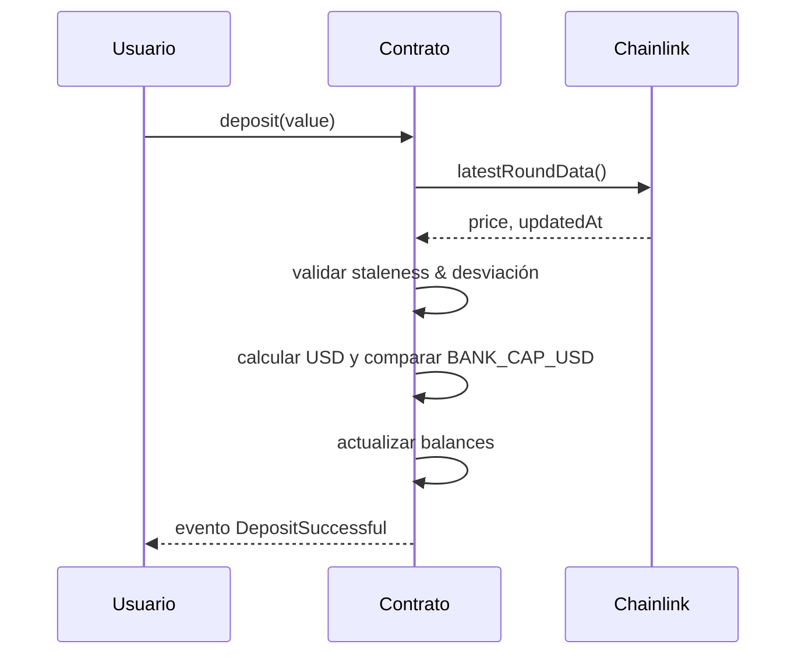
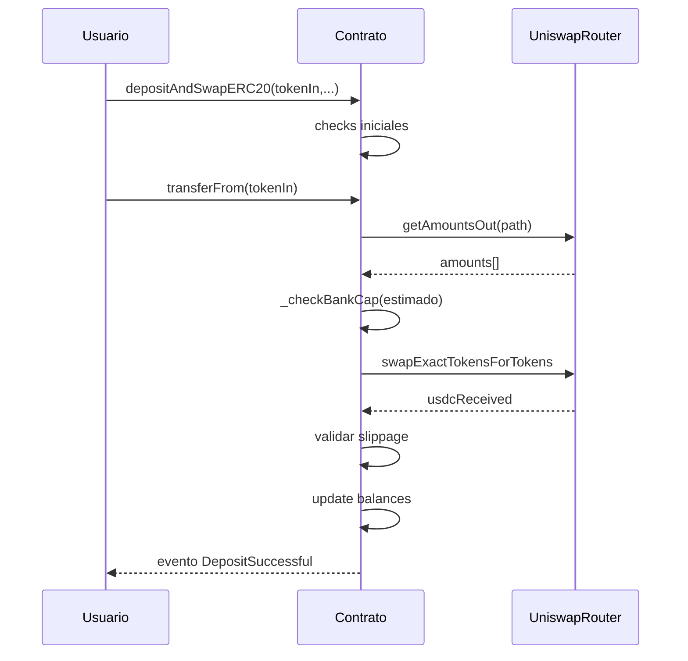
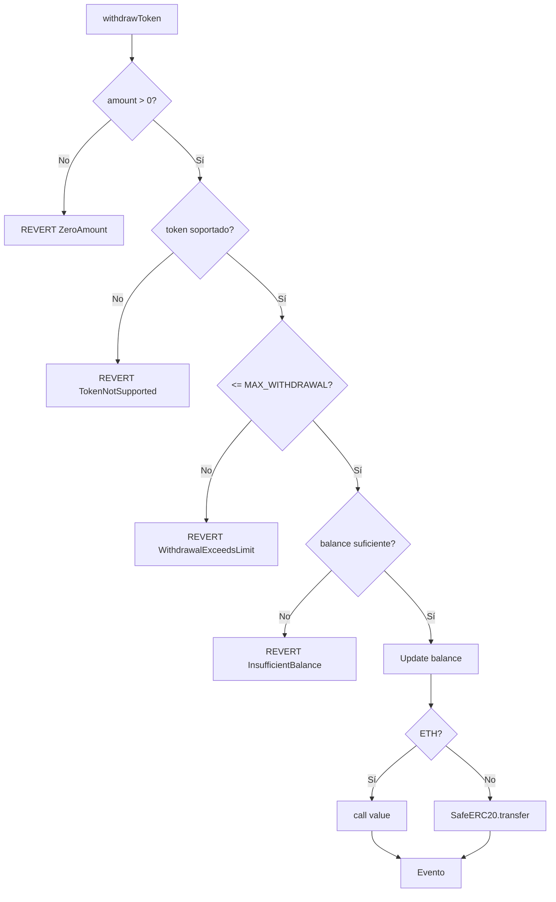
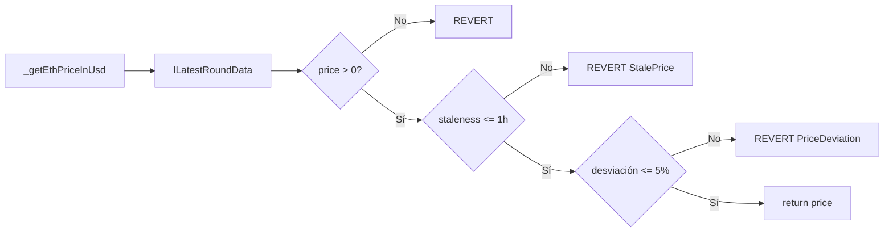

<div align="center">

# 🏦 KipuBankV3_TP4 – Banco DeFi Educativo con Swaps y Oráculos
## Trabajo Práctico Nº 4 – Solidity Avanzado

**Estado:** ✅ Completado y verificado en Sepolia  
**Contrato:** `0x5b7f2F853AdF9730fBA307dc2Bd2B19FF51FcDD7`  
**Tx Hash:** `0x403dd8a522806960ef682142215a9f0e9d3251ce4e919f170d02e3539cda0e71`  
**Etherscan:** https://sepolia.etherscan.io/address/0x5b7f2f853adf9730fba307dc2bd2b19ff51fcdd7#code  
**Blockscout:** (puede demorar indexación) https://sepolia.blockscout.com/address/0x5b7f2F853AdF9730fBA307dc2Bd2B19FF51FcDD7  

</div>

---

## 📑 Índice Rápido
- [Resumen Ejecutivo](#-resumen-ejecutivo)
- [Guía de Uso](#-guía-de-uso-rápida)
- [Interacción On-Chain (Foundry / cast)](#-interacción-on-chain-foundry--cast)
- [Arquitectura y Diseño](#-arquitectura-y-diseño)
- [Diagramas (Mermaid)](#-diagramas-mermaid)
- [Seguridad y Buenas Prácticas](#-seguridad-y-buenas-prácticas)
- [Gas y Optimización](#-gas-y-optimizaciones)
- [Roles y Control de Acceso](#-roles-y-control-de-acceso)
- [Errores Personalizados](#-errores-personalizados)
- [Pruebas y Cobertura](#-pruebas-y-cobertura)
- [Decisiones de Diseño Explicadas para Principiantes](#-decisiones-de-diseño-explicadas-para-principiantes)
- [Deploy y Verificación](#-deploy-y-verificación)
- [Entrega para Profesor](#-entrega-para-profesor)

---

## 🎯 Resumen Ejecutivo
KipuBankV3_TP4 es un contrato educativo DeFi que permite:
1. Depósitos de ETH nativo.  
2. Depósitos de cualquier ERC-20 soportado con swap automático a USDC vía Uniswap V2.  
3. Retiros controlados con límite por transacción.  
4. Validación de precios Chainlink con chequeos de staleness y desviación (circuit breaker).  
5. Protección CEI, ReentrancyGuard, Custom Errors y Slippage.  
6. Catálogo de tokens extensible y roles RBAC para administración segura.  

> Objetivo pedagógico: Mostrar una integración completa (tokens + oráculos + DEX + seguridad) siguiendo buenas prácticas profesionales.

---

## 🧪 Pruebas y Cobertura
| Métrica | Valor |
|--------|-------|
| Tests Passing | 47 / 47 |
| Cobertura Líneas (global) | 73.04% |
| Cobertura Líneas `KipuBankV3_TP4.sol` | 89.38% |
| Branches | 69.70% |
| Functions | 69.23% |

> Alta cobertura en el contrato principal asegura trazabilidad para auditoría educativa.

---

## 🛠 Instalación
```bash
git clone https://github.com/g-centurion/KipuBankV3_TP4.git
cd KipuBankV3_TP4
forge install
```

Configurar `.env` (NO COMMIT):
```bash
PRIVATE_KEY=0xTUCLAVE
RPC_URL_SEPOLIA=https://eth-sepolia.g.alchemy.com/v2/TU_RPC_KEY
ETHERSCAN_API_KEY=TU_KEY
```

Compilar y testear:
```bash
forge build
forge test -vv
forge coverage
```

---

## 🚀 Deploy y Verificación
```bash
source .env
forge script script/Deploy.s.sol:DeployScript \
   --rpc-url $RPC_URL_SEPOLIA \
   --broadcast \
   --verify \
   --etherscan-api-key $ETHERSCAN_API_KEY -vvvv
```
Resultado: Contrato desplegado y verificado.

---

## 📦 Guía de Uso Rápida

<details><summary><strong>Depositar ETH</strong></summary>

```solidity
kipuBank.deposit{ value: 0.5 ether }();
```
Internamente:
1. Valida monto > 0.
2. Obtiene precio ETH/USD (Chainlink).
3. Verifica desvío y staleness.
4. Calcula valor USD y verifica bank cap.
5. Actualiza balance y emite evento.
</details>

<details><summary><strong>Depositar ERC-20 y Swappear a USDC</strong></summary>

```solidity
erc20.approve(address(kipuBank), amountIn);
kipuBank.depositAndSwapERC20(tokenIn, amountIn, minUSDCOut, deadline);
```
Checks:
- Token permitido y distinto de ETH/USDC.
- Slippage vía `amountOutMin`.
- Ruta dinámica: si token es WETH usa ruta directa, si no Token→WETH→USDC.
</details>

<details><summary><strong>Retirar fondos</strong></summary>

```solidity
kipuBank.withdrawToken(address(0), 0.1 ether); // Retirar ETH
kipuBank.withdrawToken(USDC_ADDRESS, 50e6);    // Retirar USDC (6 decimales)
```
Checks: límites por tx, balance suficiente, soporte de token.
</details>

<details><summary><strong>Consultar Router y WETH</strong></summary>

```solidity
kipuBank.I_ROUTER();
kipuBank.getWethAddress();
```
</details>

<details><summary><strong>Roles y Administración</strong></summary>
Roles: `DEFAULT_ADMIN_ROLE`, `CAP_MANAGER_ROLE`, `PAUSE_MANAGER_ROLE`, `TOKEN_MANAGER_ROLE`.  
Asignados en constructor al deployer.  
Uso seguro: limita superficie de ataque y mantiene separación de responsabilidades.
</details>

---

## 🔄 Interacción On-Chain (Foundry / cast)
```bash
# Max withdrawal
cast call 0x5b7f2F853AdF9730fBA307dc2Bd2B19FF51FcDD7 "MAX_WITHDRAWAL_PER_TX()(uint256)" --rpc-url $RPC_URL_SEPOLIA

# Router
cast call 0x5b7f2F853AdF9730fBA307dc2Bd2B19FF51FcDD7 "I_ROUTER()(address)" --rpc-url $RPC_URL_SEPOLIA

# Ver rol admin
cast call 0x5b7f2F853AdF9730fBA307dc2Bd2B19FF51FcDD7 "hasRole(bytes32,address)(bool)" \
   0x0000000000000000000000000000000000000000000000000000000000000000 0xe7Bc10cbDA9e4830921384C49B9E711d48b0E8C2 \
   --rpc-url $RPC_URL_SEPOLIA
```

---

## 🧱 Arquitectura y Diseño
| Capa | Responsabilidad | Ejemplos |
|------|-----------------|----------|
| Interfaz Usuario | Entradas simples (deposit, withdraw) | `deposit()`, `withdrawToken()` |
| Integración DeFi | Swaps token→USDC | `depositAndSwapERC20()` |
| Oráculos | Precios ETH/USD y validaciones | `_getEthPriceInUsd()` |
| Seguridad | Roles, pausas, anti-reentrancia | `AccessControl`, `Pausable`, `ReentrancyGuard` |
| Contabilidad | Balances internos por token/usuario | `balances` mapping |
| Validaciones | Límites, slippage, cap | Custom errors + checks |

### Herencia y Razón
- `AccessControl`: granularidad de permisos > `Ownable`.
- `Pausable`: freno de emergencia ante anomalías externas.
- `ReentrancyGuard`: patrón clásico frente a llamada externa (swap / transfer).
- `SafeERC20`: protección frente a tokens no estándar.

### Interfaces Usadas
- `AggregatorV3Interface` (Chainlink): datos confiables + timestamp.
- `IUniswapV2Router02`: ejecución de swap, consulta `getAmountsOut`.
- `IERC20`: estándar mínimo para tokens.

### Librerías y Beneficios
- SafeERC20: evita errores silenciosos en transferencias.
- Custom Errors: ahorro de gas vs require strings (~30–40% menos).
- Uso de `immutable` y `constant`: reduce accesos a storage y coste de gas.

### Patrones Clave
- CEI (Checks-Effects-Interactions) en cada función pública.
- Circuit Breaker: precio desviado/stale → revert.
- Slippage Guard: `amountOutMin` en swaps.

---

## 📊 Diagramas (Mermaid)

<details><summary><strong>Flujo General</strong></summary>

```mermaid
flowchart LR
   A[Usuario] --> B{Deposita}
   B -->|ETH| C[deposit()]
   B -->|ERC20| D[depositAndSwapERC20]
   C --> E[Validar Precio / Cap]
   D --> F[Transfer + getAmountsOut + Cap]
   E --> G[Actualizar Balance]
   F --> H[Swap -> USDC]
   G --> I[Evento DepositSuccessful]
   H --> I
   I --> J{Retirar}
   J -->|ETH/USDC| K[withdrawToken]
   K --> L[Transfer + Evento]
```
</details>

<details><summary><strong>Depósito ETH</strong></summary>


</details>

<details><summary><strong>Depósito ERC20 + Swap</strong></summary>


</details>

<details><summary><strong>Retiro</strong></summary>


</details>

<details><summary><strong>Validación Oráculo</strong></summary>


</details>

---

## 🛡 Seguridad y Buenas Prácticas
| Práctica | Beneficio |
|----------|-----------|
| CEI Pattern | Mitiga reentrancia |
| ReentrancyGuard | Bloquea reentradas múltiples |
| Custom Errors | Ahorro gas y claridad de causa |
| Slippage Check | Previene ejecución a precios adversos |
| Stale Price Check | Evita usar datos antiguos |
| Price Deviation | Circuit breaker ante manipulación |
| Roles RBAC | Separación de privilegios |
| Pausable | Control de emergencia |
| SafeERC20 | Manejo seguro tokens no estándar |

---

## ⛽ Gas y Optimizaciones
- Uso de `constant` / `immutable` reduce SLOAD.
- Custom errors vs strings: menor bytecode + menor refund.
- `unchecked` en incrementos protegidos por condiciones.
- Reutilización de memoria en paths de swap.
- Una sola lectura de oráculo por función (no repetida).

Estimaciones (educativas):
- `deposit()`: ~70k–90k gas (oracle + cálculos).
- `depositAndSwapERC20()`: depende del swap (rango 140k–220k).  

---

## 👥 Roles y Control de Acceso
| Rol | Funciones |
|-----|-----------|
| DEFAULT_ADMIN_ROLE | Gestión total y asignación de roles |
| CAP_MANAGER_ROLE | Cambiar price feed ETH, futuro ajuste de límites |
| PAUSE_MANAGER_ROLE | pause / unpause |
| TOKEN_MANAGER_ROLE | addOrUpdateToken |

> Elección: AccessControl > Ownable para claridad y escalabilidad multi-rol.

---

## ❌ Errores Personalizados
| Error | Contexto |
|-------|----------|
| Bank__ZeroAmount | Entradas numéricas vacías |
| Bank__DepositExceedsCap | Bank cap excedido |
| Bank__WithdrawalExceedsLimit | Límite por TX superado |
| Bank__InsufficientBalance | Usuario no tiene saldo suficiente |
| Bank__TokenNotSupported | Token fuera de catálogo |
| Bank__SlippageTooHigh | Resultado < mínimo esperado |
| Bank__StalePrice | Oráculo desactualizado > TIMEOUT |
| Bank__PriceDeviation | Precio fuera de rango permitido |
| Bank__TransferFailed | Fallo bajo nivel en transferencias |

---

## 👶 Decisiones de Diseño Explicadas para Principiantes
1. "¿Por qué usar USDC como reserva?" → Estable y fácil de valuación en dólares; simplifica cálculos de riesgo.  
2. "¿Por qué pasar por WETH en swaps?" → Uniswap V2 usa pares; WETH actúa de puente universal.  
3. "¿Por qué separar roles?" → Minimiza daño si una clave se compromete.  
4. "¿Por qué validar precio de oráculo dos veces (stale + desviación)?" → Staleness evita datos viejos; desviación detecta manipulación.  
5. "¿Por qué custom errors?" → Más baratos y claros para auditoría.  
6. "¿Por qué CEI?" → Evita que, si una llamada externa reingresa, manipule estado ya actualizado.  
7. "¿Por qué límite por retiro?" → Control de drenaje rápido ante bug.  

---

## 📂 Script de Interacción (Foundry)
Archivo: `script/Interact.s.sol`  
Incluye ejemplos simulados de depósito y lectura de variables.  
Ejecución (simulada):
```bash
source .env
forge script script/Interact.s.sol:InteractScript --rpc-url $RPC_URL_SEPOLIA -vvvv --dry-run
```

---

## 🧾 Entrega para Profesor
| Item | Valor |
|------|-------|
| Dirección Contrato | 0x5b7f2F853AdF9730fBA307dc2Bd2B19FF51FcDD7 |
| Hash Despliegue | 0x403dd8a522806960ef682142215a9f0e9d3251ce4e919f170d02e3539cda0e71 |
| Etherscan | https://sepolia.etherscan.io/address/0x5b7f2f853adf9730fba307dc2bd2b19ff51fcdd7#code |
| Blockscout | https://sepolia.blockscout.com/address/0x5b7f2F853AdF9730fBA307dc2Bd2B19FF51FcDD7 |
| Funciones Clave | deposit, depositAndSwapERC20, withdrawToken |
| Seguridad | CEI, ReentrancyGuard, RBAC, Pausable, Slippage, Oracle Checks |
| Oráculos | Chainlink ETH/USD con staleness + desviación |
| DEX | Uniswap V2 Router (ruta Token→WETH→USDC) |
| Roles | Admin, Cap, Pause, Token Manager |
| Tests | 47 passing / 73% cobertura líneas |
| Fecha | 11 Nov 2025 |

🎓 El diseño busca balance entre claridad pedagógica y realismo técnico.

---

## 📜 Licencia
MIT

**Última actualización:** 11 Nov 2025

