 
<div align="center">

# KipuBankV3_TP4 – Banco DeFi con Swaps y Oráculos
<strong>Contrato desplegado en Sepolia</strong>

<p>
<strong>Contrato:</strong> <code>0x773808318d5CE8Bc953398B4A0580e53502eAAe1</code> ·
<strong>Tx:</strong> <code>0xc2ff113063914519b554741930fb2854dbec5fd3bab195f1ad5330ae41dfd723</code><br/>
<a href="https://sepolia.etherscan.io/address/0x773808318d5ce8bc953398b4a0580e53502eaae1#code">Etherscan</a> ·
<a href="https://eth-sepolia.blockscout.com/address/0x773808318d5CE8Bc953398B4A0580e53502eAAe1">Blockscout</a>
</p>

</div>

---

<details open>
<summary><h2>KipuBankV3: Trabajo práctico 4 (incluye correcciones TP3)</h2></summary>

- Visión general: [Resumen ejecutivo](#resumen-ejecutivo) y [Decisiones de diseño y trade-offs](#decisiones-de-diseno-y-trade-offs).
- Despliegue e interacción: [Instalación y uso](#instalacion-y-uso), [Deploy y verificación](#deploy-y-verificacion) y [Interacción on-chain (cast)](#interaccion-on-chain-cast).
- Análisis de amenazas: [Informe de análisis de amenazas (resumen)](#informe-de-analisis-de-amenazas-resumen) y [THREAT_MODEL.md](THREAT_MODEL.md).
- Pruebas: [Testing y cobertura](#testing-y-cobertura) (cobertura y métodos de prueba).

</details>

## Índice
- [Resumen ejecutivo](#resumen-ejecutivo)
- [Características principales](#caracteristicas-principales)
- [Especificaciones técnicas](#especificaciones-tecnicas)
- [Evolución desde KipuBankV2 (TP3)](#evolucion-desde-kipubankv2-tp3)
- [Decisiones de diseño y trade-offs](#decisiones-de-diseno-y-trade-offs)
- [Integraciones DeFi](#integraciones-defi)
- [Diagramas esenciales](#diagramas-esenciales)
- [Instalación y uso](#instalacion-y-uso)
- [Interacción on-chain (cast)](#interaccion-on-chain-cast)
- [Testing y cobertura](#testing-y-cobertura)
- [Informe de análisis de amenazas (resumen)](#informe-de-analisis-de-amenazas-resumen)
- [Entregable TP4](#entregable-tp4)
- [Deploy y verificación](#deploy-y-verificacion)
- [Gas y optimizaciones](#gas-y-optimizaciones)
- [Limitaciones y roadmap](#limitaciones-y-roadmap)
- [Licencia](#licencia)

---

<a id="resumen-ejecutivo"></a>
<details open>
<summary><h2>Resumen ejecutivo</h2></summary>

KipuBankV3 es un contrato DeFi educativo que admite depósitos de ETH y ERC-20 (con swap automático a USDC), retiros con límites por transacción y validaciones robustas vía Chainlink. Integra seguridad basada en CEI, ReentrancyGuard, Pausable, AccessControl y errores personalizados.

</details>

---

<a id="caracteristicas-principales"></a>
<details open>
<summary><h2>Características principales</h2></summary>

- Depósitos: ETH nativo y ERC-20 con conversión a USDC mediante Uniswap V2.
- Contabilidad multi‑token con saldos internos por usuario.
- Límite global de banco en USD y tope de retiro por transacción.
- Validación de oráculo: staleness y desviación máxima (circuit breaker).
- RBAC con roles separados y modo de pausa de emergencia.
- Timelock opcional (`TimelockKipuBank.sol`) para cambios administrativos diferidos.

</details>

---

<a id="evolucion-desde-kipubankv2-tp3"></a>
<details open>
<summary><h2>Evolución desde KipuBankV2 (TP3)</h2></summary>

KipuBankV3 es una evolución directa de KipuBankV2 (TP3), incorporando las correcciones solicitadas y ampliaciones funcionales del TP4.

Mejoras y correcciones aplicadas (según feedback de TP3):
- NatSpec completo: funciones, parámetros, eventos, errores y constantes documentadas.
- Custom errors en lugar de `require` con strings; se eliminaron long strings.
- Atomicidad y revert: adopción estricta de CEI; todos los checks van antes de mutar estado o interactuar externamente.
- Lógica con roles/modificadores: uso de `onlyRole` (AccessControl) para operaciones administrativas.
- Bank Cap: verificación explícita en depósitos de ETH y ERC‑20 con conversión a USD; no se permite superar el cap.
- Organización de estado: variables agrupadas por propósito (inmutables/constantes primero, storage coherente); sin inicializaciones redundantes (p. ej., contadores parten en 0 por defecto).
- Optimizaciones: cacheo de lecturas de storage y `unchecked` sólo donde es seguro.
- Estilo: comentarios y NatSpec estandarizados (inglés técnico donde corresponde).

Ampliaciones del TP4 respecto a V2:
- Swaps automáticos a USDC con Uniswap V2 y ruta por WETH.
- Validaciones de precio de Chainlink (staleness + desviación) con registro de último precio.
- Límite de retiro por transacción y cap global en USD.
- Catálogo de tokens administrado por rol y Timelock opcional para cambios sensibles.

</details>

<a id="especificaciones-tecnicas"></a>
<details>
<summary><h2>Especificaciones técnicas</h2></summary>

### Arquitectura (herencia, librerías e interfaces)
- Herencia: `AccessControl`, `Pausable`, `ReentrancyGuard`.
- Librerías: `SafeERC20`.
- Interfaces: `IERC20`, `IUniswapV2Router02`, `AggregatorV3Interface`.

### Constantes y parámetros
- `BANK_CAP_USD = 1,000,000 * 1e8` (USD, 8 dec)
- `PRICE_FEED_TIMEOUT = 1 hours`
- `MAX_PRICE_DEVIATION_BPS = 500` (5%)
- `MAX_WITHDRAWAL_PER_TX` (immutable, se define en el constructor)

### Módulos funcionales (TPs previos + TP4)
- Depósitos ETH: `deposit()` con validación de precio y cap.
- Depósitos ERC-20 con swap: `depositAndSwapERC20()` (ruta Token→WETH→USDC; o WETH→USDC).
- Retiros: `withdrawToken(address token, uint256 amount)` (ETH o USDC).
- Oráculos: `_getEthPriceInUsd()`, `_updateRecordedPrice()`.
- Conversión USD: `_getUsdValueFromWei()`, `_getUsdValueFromUsdc()`.
- Límite global: `_checkBankCap()` + `_getBankTotalUsdValue()`.
- Métricas: `getDepositCount()`, contadores internos.

### Tokens soportados y catálogo
- Base: ETH (address(0)) y USDC (6 dec) habilitados en constructor.
- Extensión: `addOrUpdateToken(token, priceFeed, decimals)` bajo `TOKEN_MANAGER_ROLE`.

### Timelock opcional
- [`src/TimelockKipuBank.sol`](src/TimelockKipuBank.sol) (basado en `TimelockController` de OZ): permite programar y ejecutar cambios (p. ej., `setEthPriceFeedAddress`) con delay mínimo de 2 días.

</details>

---

<a id="decisiones-de-diseno-y-trade-offs"></a>
<details>
<summary><h2>Decisiones de diseño y trade-offs</h2></summary>

- Base contable en USDC: simplifies contabilidad y UX; trade-off: dependencia del router y oráculo.
- Ruta fija de swaps por WETH: maximiza liquidez en Uniswap V2; trade-off: ruta no siempre óptima en precio.
- Validación de precio (staleness + desviación 5%): aumenta seguridad ante outliers; trade-off: puede revertir en picos de volatilidad.
- Límite global en USD y tope por retiro: reduce riesgo sistémico y de drenaje; trade-off: restringe montos grandes.
- RBAC separado (admin/cap/pause/token): menor superficie de error; trade-off: mayor operación de roles.
- Patrón CEI + ReentrancyGuard y SafeERC20: baseline de seguridad; trade-off: costo de gas marginal.
- Timelock opcional para cambios sensibles: defensa contra cambios apresurados; trade-off: menor agilidad operativa.

</details>

<a id="integraciones-defi"></a>
<details>
<summary><h2>Integraciones DeFi</h2></summary>

- Uniswap V2 Router: estimaciones con `getAmountsOut`, swap con `swapExactTokensForTokens` y ruta por WETH.
- Chainlink: `latestRoundData()` para ETH/USD; validación de staleness y desviación contra `lastRecordedPrice`.

</details>

---

<a id="diagramas-esenciales"></a>
<details open>
<summary><h2>Diagramas esenciales</h2></summary>

Todos los diagramas del sistema están aquí para entender el funcionamiento completo sin necesidad de consultar archivos externos.

<details><summary><strong>1. Flujo general del sistema</strong></summary>

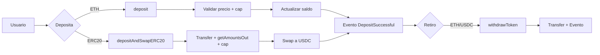
</details>

<details><summary><strong>2. Depósito de ETH (secuencia)</strong></summary>

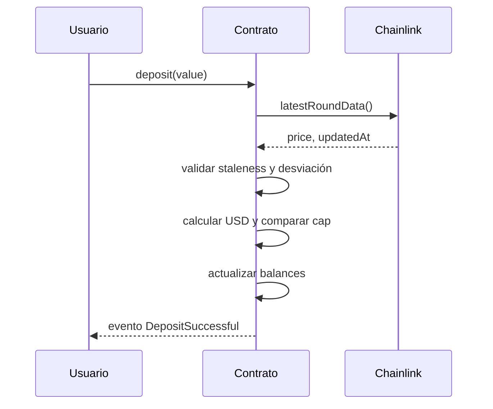
</details>

<details><summary><strong>3. Depósito ERC20 con swap</strong></summary>

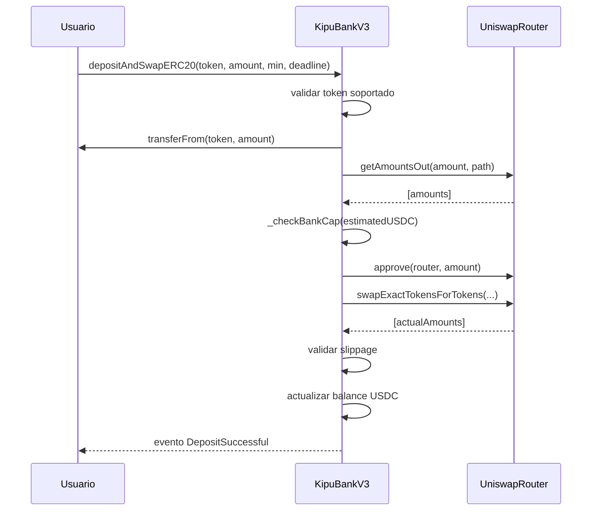
</details>

<details><summary><strong>4. Retiro (árbol de decisión)</strong></summary>

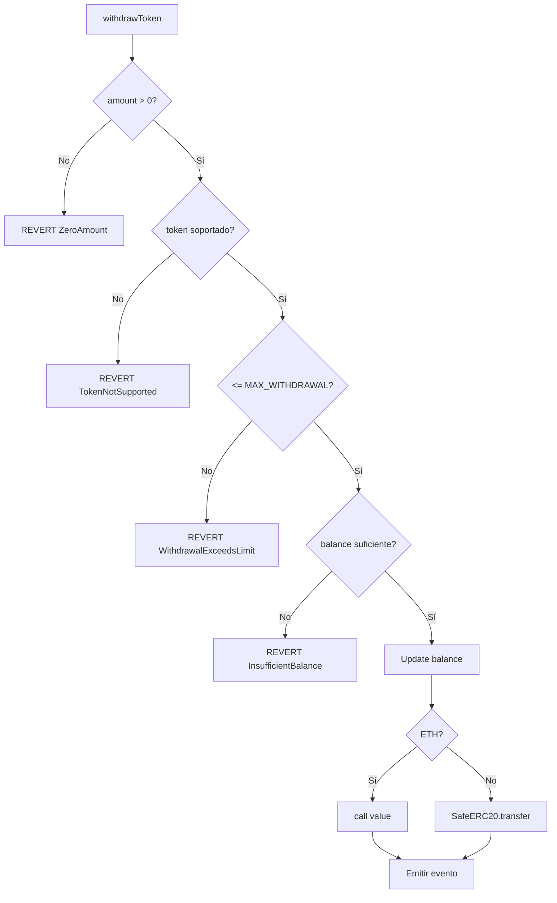
</details>

<details><summary><strong>5. Validación de oráculo (_getEthPriceInUsd)</strong></summary>

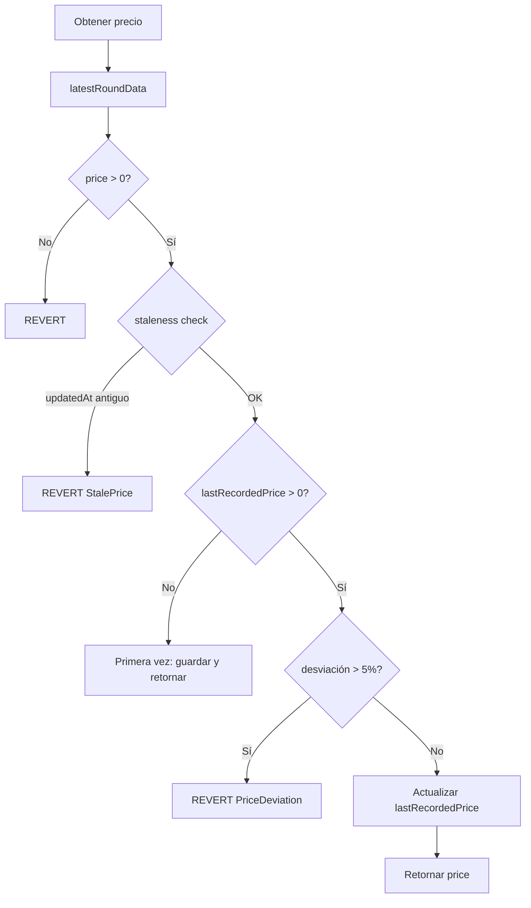
</details>

<details><summary><strong>6. Patrón CEI (Checks-Effects-Interactions)</strong></summary>

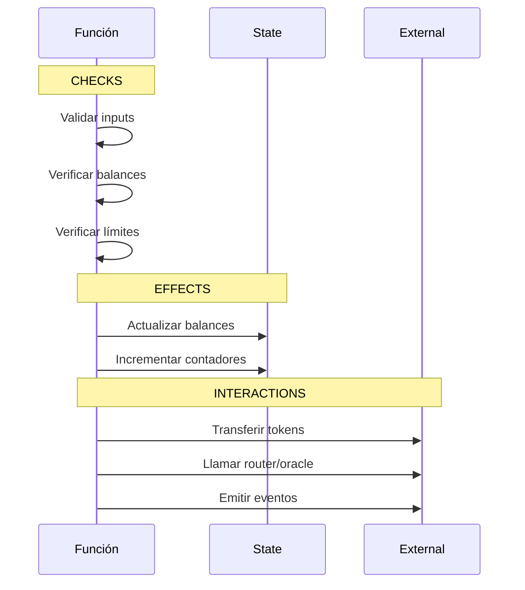
</details>

<details><summary><strong>7. Gestión de roles (AccessControl)</strong></summary>

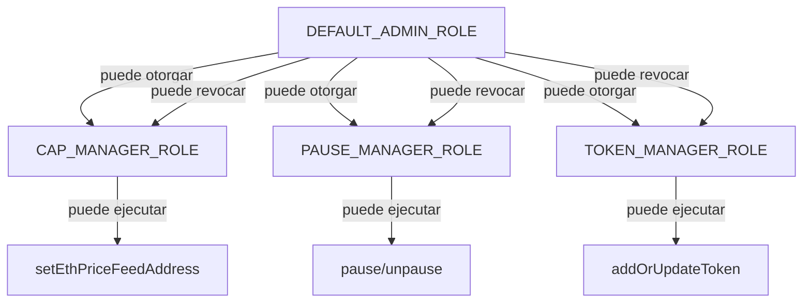
</details>

<details><summary><strong>8. Timelock: programar operación</strong></summary>

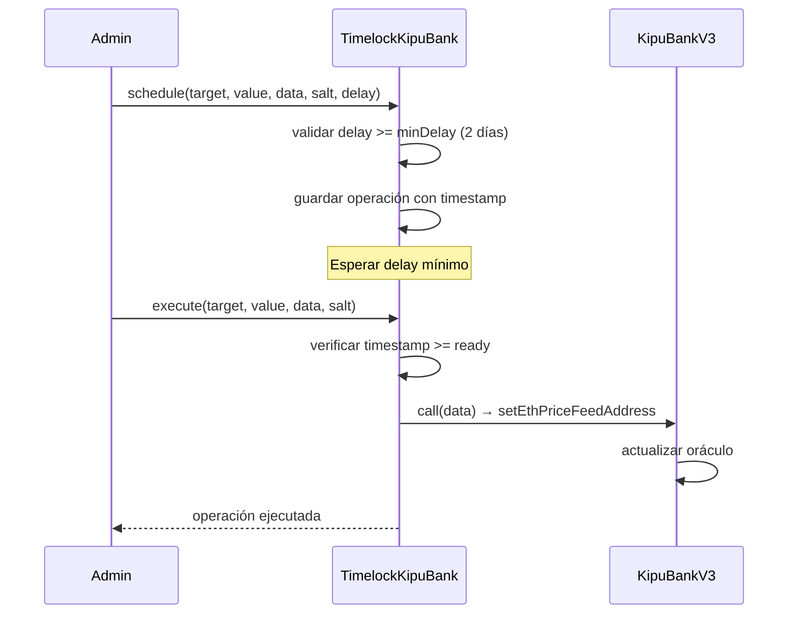
</details>

<details><summary><strong>9. Catálogo de tokens</strong></summary>

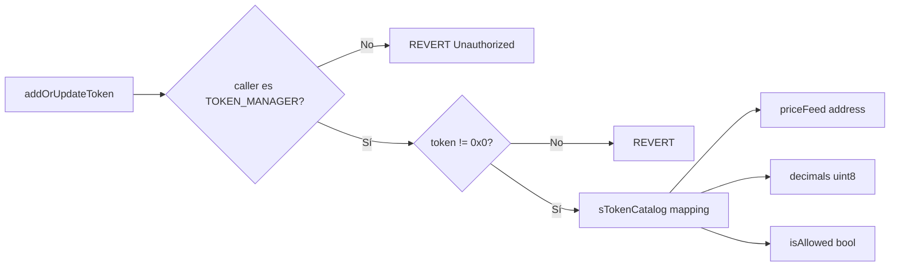
</details>

<details><summary><strong>10. Ciclo completo de transacción</strong></summary>

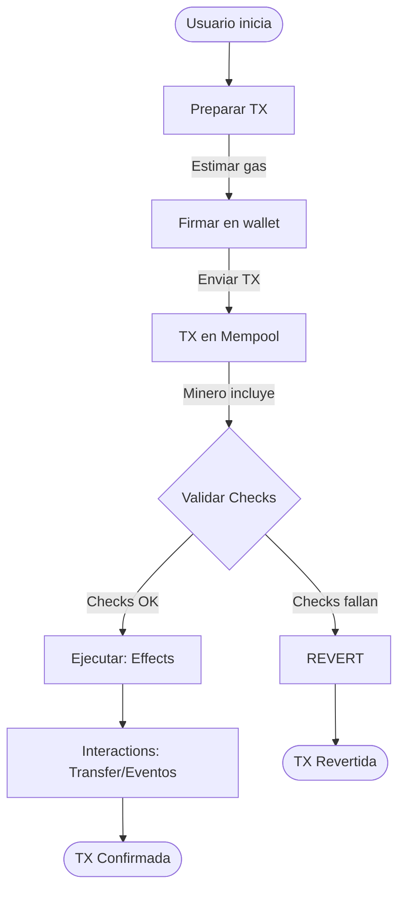
</details>

> Referencia completa con diagramas ASCII detallados: [FLOW_DIAGRAMS.md](FLOW_DIAGRAMS.md)

</details>

---

<a id="instalacion-y-uso"></a>
<details>
<summary><h2>Instalación y uso</h2></summary>

```bash
git clone https://github.com/g-centurion/KipuBankV3_TP4.git
cd KipuBankV3_TP4
forge install
```

Configurar `.env` (no commitear):
```bash
PRIVATE_KEY=0xTUCLAVE
RPC_URL_SEPOLIA=https://eth-sepolia.g.alchemy.com/v2/TU_RPC_KEY
ETHERSCAN_API_KEY=TU_KEY
```

Compilar y probar:
```bash
forge build
forge test -vv
forge coverage
```

### Script de interacción (dry‑run)
Archivo: `script/Interact.s.sol`
```bash
source .env
forge script script/Interact.s.sol:InteractScript --rpc-url $RPC_URL_SEPOLIA -vvvv --dry-run
```

#### Guía de frontend
- Ver [FRONTEND_GUIDE.md](FRONTEND_GUIDE.md): guía práctica para integrar el contrato en una aplicación web. Incluye conexión con ethers/viem, ejemplos de lectura/escritura, suscripción a eventos y manejo de errores.

</details>

---

<a id="interaccion-on-chain-cast"></a>
<details>
<summary><h2>Interacción on-chain (cast)</h2></summary>

```bash
# Max withdrawal
cast call 0x773808318d5CE8Bc953398B4A0580e53502eAAe1 "MAX_WITHDRAWAL_PER_TX()(uint256)" --rpc-url $RPC_URL_SEPOLIA

# Router
cast call 0x773808318d5CE8Bc953398B4A0580e53502eAAe1 "I_ROUTER()(address)" --rpc-url $RPC_URL_SEPOLIA

# Ver rol admin
cast call 0x773808318d5CE8Bc953398B4A0580e53502eAAe1 "hasRole(bytes32,address)(bool)" \
   0x0000000000000000000000000000000000000000000000000000000000000000 0xe7Bc10cbDA9e4830921384C49B9E711d48b0E8C2 \
   --rpc-url $RPC_URL_SEPOLIA
```

</details>

---

<a id="informe-de-analisis-de-amenazas-resumen"></a>
<details>
<summary><h2>Informe de análisis de amenazas (resumen)</h2></summary>

- Debilidades y madurez
   - Oráculo único ETH/USD: dependencia central. Paso: TWAP/multi‑feed + fallback manual y alertas.
   - Ruta fija (via WETH): puede no ser la más barata. Paso: ruteo dinámico/Agregador y slippage adaptativo.
   - Gobernanza sin multisig activo: riesgo de clave única. Paso: multisig + timelock operativo y umbrales claros.
   - Sin stress tests de gas/MEV: riesgo de costos y reorgs. Paso: escenarios de carga, bundle testing y simulaciones.

- Cobertura de pruebas
   - Métricas vigentes: ver [Testing y cobertura](#testing-y-cobertura) (tests, % líneas/funciones y reporte HTML opcional).

- Métodos de prueba
   - Unitarias e integración con mocks (router/oráculo), fuzzing, verificación de eventos y RBAC; generación de `lcov` y HTML.

Documento completo: ver [THREAT_MODEL.md](THREAT_MODEL.md) y [AUDITOR_GUIDE.md](AUDITOR_GUIDE.md).

</details>

<a id="testing-y-cobertura"></a>
<details>
<summary><h2>Testing y cobertura</h2></summary>

```bash
- Framework: Foundry (forge-std/Test).
- Tipos de pruebas: unitarias, integración (router/oráculo mocked), fuzzing, eventos, control de acceso y escenarios multi‑usuario.

### Resumen de resultados
| Métrica | Valor |
|--------|-------|
| Tests passing | 43 / 43 |
| Cobertura global (líneas) | 66.5% |
| Cobertura global (funciones) | 67.5% |
| `KipuBankV3_TP4.sol` (líneas) | 89.38% (101/113) |
| `KipuBankV3_TP4.sol` (funciones) | 88.24% (15/17) |

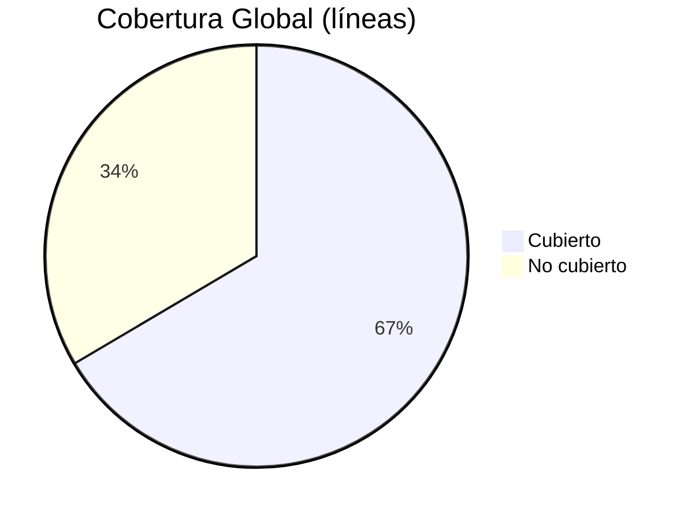

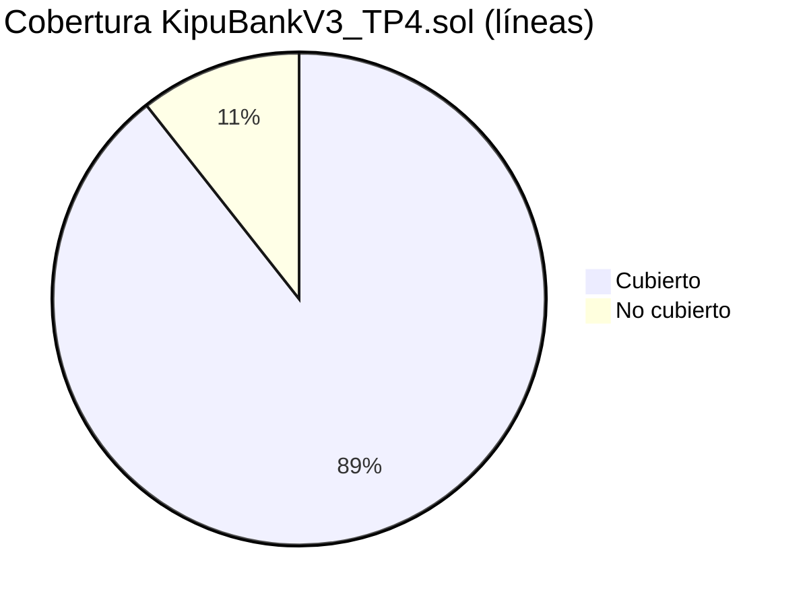

#### Cobertura por archivo (líneas)

| Archivo | Líneas | Cobertura |
|---------|--------|-----------|
| `src/KipuBankV3_TP4.sol` | 101/113 | 89.38% |
| `test/KipuBankV3Test.sol` | 48/59 | 81.36% |
| `script/Deploy.s.sol` | 0/26 | 0% (no ejecutado en tests) |
| `script/Interact.s.sol` | 0/20 | 0% (no ejecutado en tests) |
| `src/TimelockKipuBank.sol` | 0/6 | 0% (sin tests específicos) |

### Áreas cubiertas por los tests
- Depósito de ETH y validación de cap y precio.
- Swap ERC‑20→USDC con slippage mínimo y ruta WETH.
- Retiro con límites y manejo de errores personalizados.
- Pausa/despausa y verificación de roles (grant/revoke, unauthorized).
- Fuzzing de montos y secuencias de operaciones.
- Emisión de eventos y contadores (`getDepositCount`).

### Generar reporte HTML de cobertura (opcional, local)
```bash
forge coverage --report lcov
sudo apt-get install -y lcov
genhtml -o coverage-html lcov.info
```

</details>

---

<a id="entregable-tp4"></a>
<details open>
<summary><h2>Entregable TP4</h2></summary>

### Objetivo
Banco DeFi educativo con depósitos de ETH y ERC‑20, swap automático a USDC vía Uniswap V2, retiros con límites por transacción y validación de precios con Chainlink (staleness + desviación máxima), aplicando buenas prácticas de seguridad.

### Funcionalidades principales
- Depósitos ETH con conversión automática a USD y validación de cap global.
- Depósitos ERC‑20 con swap a USDC mediante ruta Token→WETH→USDC.
- Retiros hasta límite por transacción (ETH y USDC).
- Catálogo de tokens administrado por rol y Timelock opcional para cambios sensibles.
- Sistema de roles (admin, cap manager, pause manager, token manager) y pausa de emergencia.

### Arquitectura
- Herencia: AccessControl, Pausable, ReentrancyGuard
- Librerías: SafeERC20
- Integraciones: Uniswap V2 Router, Chainlink (ETH/USD)
- Red: Sepolia | Contrato: `0x773808318d5CE8Bc953398B4A0580e53502eAAe1`

### Interfaz pública

| Función | Rol | Descripción |
|---------|-----|-------------|
| `deposit()` | — | Acepta ETH nativo y actualiza saldo interno |
| `depositAndSwapERC20()` | — | Recibe ERC‑20 y realiza swap a USDC |
| `withdrawToken()` | — | Retira ETH o USDC respetando límites |
| `pause()` / `unpause()` | PAUSE_MANAGER | Control de emergencia |
| `setEthPriceFeedAddress()` | CAP_MANAGER | Actualiza oráculo ETH/USD |
| `addOrUpdateToken()` | TOKEN_MANAGER | Administra tokens soportados |
| `getDepositCount()` / `getWethAddress()` | — | Consultas públicas |

Eventos: `DepositSuccessful`, `WithdrawalSuccessful`

Errores personalizados: `Bank__ZeroAmount`, `Bank__DepositExceedsCap`, `Bank__WithdrawalExceedsLimit`, `Bank__InsufficientBalance`, `Bank__TokenNotSupported`, `Bank__SlippageTooHigh`, `Bank__StalePrice`, `Bank__PriceDeviation`, `Bank__TransferFailed`

### Parámetros clave
- Cap global: 1,000,000 USD (8 decimales)
- Timeout oráculo: 1 hora
- Desviación máxima: 5% (500 bps)
- Límite por retiro: configurado en constructor

### Seguridad
- Patrón CEI, ReentrancyGuard, SafeERC20
- Validación de oráculo (staleness + desviación)
- Slippage controlado en swaps
- RBAC y pausa de emergencia

Documentación de seguridad: AUDITOR_GUIDE.md y THREAT_MODEL.md

</details>

---

<a id="deploy-y-verificacion"></a>
<details>
<summary><h2>Deploy y verificación</h2></summary>

```bash
source .env
forge script script/Deploy.s.sol:DeployScript \
   --rpc-url $RPC_URL_SEPOLIA \
   --broadcast \
   --verify \
   --etherscan-api-key $ETHERSCAN_API_KEY -vvvv
```
Resultado: contrato desplegado y verificado en Sepolia.

- Ejemplo de deploy: [`script/Deploy.s.sol`](script/Deploy.s.sol) documenta direcciones de Sepolia, parámetros clave (feeds, router, `MAX_WITHDRAWAL_PER_TX`) y logs de despliegue para reproducibilidad.

</details>

---

<a id="gas-y-optimizaciones"></a>
<details>
<summary><h2>Gas y optimizaciones</h2></summary>

- `constant`/`immutable` para reducir SLOAD.
- Errores personalizados en lugar de strings.
- `unchecked` en incrementos con pre‑checks.
- Una sola lectura de oráculo por función.
- Reutilización de memoria en rutas de swap.

</details>

---

<a id="limitaciones-y-roadmap"></a>
<details>
<summary><h2>Limitaciones y roadmap</h2></summary>

| Área | Limitación |
|------|------------|
| Oráculos | Solo ETH/USD (sin TWAP/multi‑feed) |
| Swaps | Ruta fija Token→WETH→USDC |
| Gobernanza | Timelock opcional, sin multisig |
| Auditoría | Slither debe ejecutarse localmente |
| Tests | Faltan stress tests de gas/MEV |

Siguientes mejoras sugeridas: integrar multisig + timelock, TWAP/multi‑oracle, módulos de estrategia y CI con cobertura y Slither.

</details>

---

<a id="licencia"></a>
<details open>
<summary><h2>Licencia</h2></summary>

MIT

</details>

<sub>Última actualización: 13 Nov 2025</sub>


---


