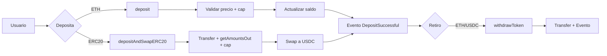
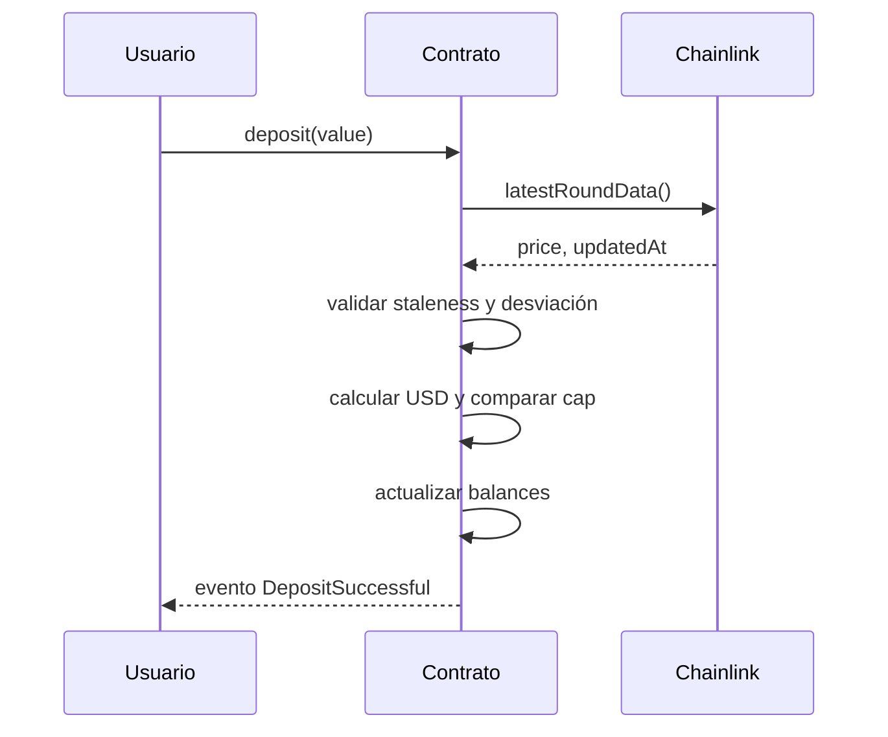
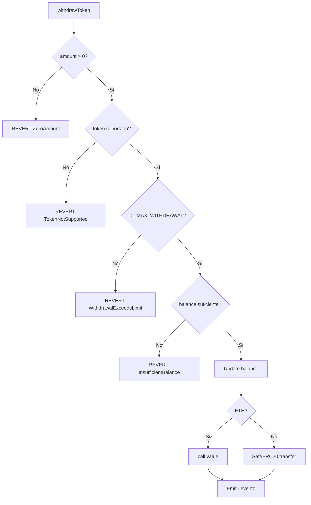
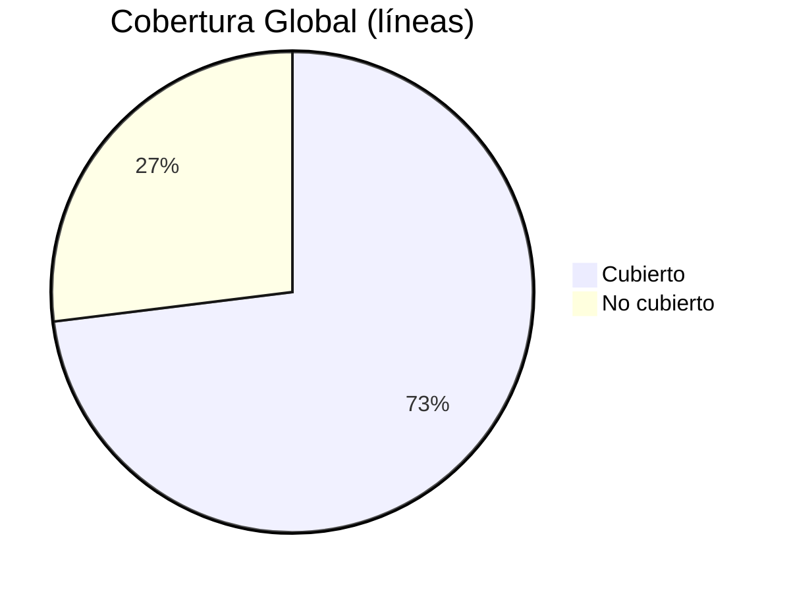

 
<div align="center">

# 🏦 KipuBankV3_TP4 – Banco DeFi con Swaps y Oráculos
<strong>Contrato desplegado en Sepolia</strong>

<sub>
Contrato: <code>0x5b7f2F853AdF9730fBA307dc2Bd2B19FF51FcDD7</code> ·
Tx: <code>0x403dd8a522806960ef682142215a9f0e9d3251ce4e919f170d02e3539cda0e71</code> ·
<a href="https://sepolia.etherscan.io/address/0x5b7f2f853adf9730fba307dc2bd2b19ff51fcdd7#code">Etherscan</a> ·
<a href="https://eth-sepolia.blockscout.com/address/0x5b7f2F853AdF9730fBA307dc2Bd2B19FF51FcDD7">Blockscout</a>
</sub>

</div>

---

## 📑 Índice
- [Resumen ejecutivo](#-resumen-ejecutivo)
- [Características principales](#-características-principales)
- [Especificaciones técnicas](#-especificaciones-técnicas)
- [Integraciones DeFi](#-integraciones-defi)
- [Diagramas esenciales](#-diagramas-esenciales)
- [Instalación y uso](#-instalación-y-uso)
- [Interacción on-chain (cast)](#-interacción-on-chain-cast)
- [Testing y cobertura](#-testing-y-cobertura)
- [Entregable TP4 (formato oficial)](#-entregable-tp4-formato-oficial)
- [Deploy y verificación](#-deploy-y-verificación)
- [Gas y optimizaciones](#-gas-y-optimizaciones)
- [Roles y control de acceso](#-roles-y-control-de-acceso)
- [Errores personalizados](#-errores-personalizados)
- [Limitaciones y roadmap](#-limitaciones-y-roadmap)
- [Licencia](#-licencia)

---

## 🎯 Resumen ejecutivo
KipuBankV3 es un contrato DeFi educativo que admite depósitos de ETH y ERC-20 (con swap automático a USDC), retiros con límites por transacción y validaciones robustas vía Chainlink. Integra seguridad basada en CEI, ReentrancyGuard, Pausable, AccessControl y errores personalizados.

---

## 🧩 Características principales
- Depósitos: ETH nativo y ERC-20 con conversión a USDC mediante Uniswap V2.
- Contabilidad multi‑token con saldos internos por usuario.
- Límite global de banco en USD y tope de retiro por transacción.
- Validación de oráculo: staleness y desviación máxima (circuit breaker).
- RBAC con roles separados y modo de pausa de emergencia.
- Timelock opcional (`TimelockKipuBank.sol`) para cambios administrativos diferidos.

---

## 🧠 Especificaciones técnicas

### Arquitectura (herencia, librerías e interfaces)
- Herencia: `AccessControl`, `Pausable`, `ReentrancyGuard`.
- Librerías: `SafeERC20`.
- Interfaces: `IERC20`, `IUniswapV2Router02`, `AggregatorV3Interface`.

### Constantes y parámetros
- `BANK_CAP_USD = 1,000,000 * 1e8` (USD, 8 dec)
- `PRICE_FEED_TIMEOUT = 1 hours`
- `MAX_PRICE_DEVIATION_BPS = 500` (5%)
- `MAX_WITHDRAWAL_PER_TX` (immutable, se define en el constructor)

### Módulos funcionales (TPs previos + TP4)
- Depósitos ETH: `deposit()` con validación de precio y cap.
- Depósitos ERC-20 con swap: `depositAndSwapERC20()` (ruta Token→WETH→USDC; o WETH→USDC).
- Retiros: `withdrawToken(address token, uint256 amount)` (ETH o USDC).
- Oráculos: `_getEthPriceInUsd()`, `_updateRecordedPrice()`.
- Conversión USD: `_getUsdValueFromWei()`, `_getUsdValueFromUsdc()`.
- Límite global: `_checkBankCap()` + `_getBankTotalUsdValue()`.
- Métricas: `getDepositCount()`, contadores internos.

### Tokens soportados y catálogo
- Base: ETH (address(0)) y USDC (6 dec) habilitados en constructor.
- Extensión: `addOrUpdateToken(token, priceFeed, decimals)` bajo `TOKEN_MANAGER_ROLE`.

### Timelock opcional
- [`src/TimelockKipuBank.sol`](src/TimelockKipuBank.sol) (basado en `TimelockController` de OZ): permite programar y ejecutar cambios (p. ej., `setEthPriceFeedAddress`) con delay mínimo de 2 días.

---

## 🔗 Integraciones DeFi
- Uniswap V2 Router: estimaciones con `getAmountsOut`, swap con `swapExactTokensForTokens` y ruta por WETH.
- Chainlink: `latestRoundData()` para ETH/USD; validación de staleness y desviación contra `lastRecordedPrice`.

---

## 🗺 Diagramas esenciales
Se muestran los flujos clave. Los diagramas de mayor detalle (incluyendo árboles de decisión y matrices) están en [FLOW_DIAGRAMS.md](FLOW_DIAGRAMS.md).

<details><summary><strong>Flujo general</strong></summary>


</details>

<details><summary><strong>Depósito ETH</strong></summary>


</details>

<details><summary><strong>Retiro</strong></summary>


</details>

> Más diagramas, incluyendo validación de oráculo, catálogo de tokens, roles, pausa y timelock: ver [FLOW_DIAGRAMS.md](FLOW_DIAGRAMS.md).

---

## 🛠 Instalación y uso
```bash
git clone https://github.com/g-centurion/KipuBankV3_TP4.git
cd KipuBankV3_TP4
forge install
```

Configurar `.env` (no commitear):
```bash
PRIVATE_KEY=0xTUCLAVE
RPC_URL_SEPOLIA=https://eth-sepolia.g.alchemy.com/v2/TU_RPC_KEY
ETHERSCAN_API_KEY=TU_KEY
```

Compilar y probar:
```bash
forge build
forge test -vv
forge coverage
```

### Script de interacción (dry‑run)
Archivo: `script/Interact.s.sol`
```bash
source .env
forge script script/Interact.s.sol:InteractScript --rpc-url $RPC_URL_SEPOLIA -vvvv --dry-run
```

---

## 🔄 Interacción on-chain (cast)
```bash
# Max withdrawal
cast call 0x5b7f2F853AdF9730fBA307dc2Bd2B19FF51FcDD7 "MAX_WITHDRAWAL_PER_TX()(uint256)" --rpc-url $RPC_URL_SEPOLIA

# Router
cast call 0x5b7f2F853AdF9730fBA307dc2Bd2B19FF51FcDD7 "I_ROUTER()(address)" --rpc-url $RPC_URL_SEPOLIA

# Ver rol admin
cast call 0x5b7f2F853AdF9730fBA307dc2Bd2B19FF51FcDD7 "hasRole(bytes32,address)(bool)" \
   0x0000000000000000000000000000000000000000000000000000000000000000 0xe7Bc10cbDA9e4830921384C49B9E711d48b0E8C2 \
   --rpc-url $RPC_URL_SEPOLIA
```

---

## 🧪 Testing y cobertura
- Framework: Foundry (forge-std/Test).
- Tipos de pruebas: unitarias, integración (router/oráculo mocked), fuzzing, eventos, control de acceso y escenarios multi‑usuario.

### Resumen de resultados
| Métrica | Valor |
|--------|-------|
| Tests passing | 47 / 47 |
| Cobertura global (líneas) | 73.04% |
| `KipuBankV3_TP4.sol` (líneas) | 89.38% |
| Branches | 69.70% |
| Functions | 69.23% |



#### Cobertura por archivo (líneas)

| Archivo | Cobertura |
|---------|-----------|
| `src/KipuBankV3_TP4.sol` | 89.38% |
| `test/KipuBankV3Test.sol` | 81.36% |

### Áreas cubiertas por los tests
- Depósito de ETH y validación de cap y precio.
- Swap ERC‑20→USDC con slippage mínimo y ruta WETH.
- Retiro con límites y manejo de errores personalizados.
- Pausa/despausa y verificación de roles (grant/revoke, unauthorized).
- Fuzzing de montos y secuencias de operaciones.
- Emisión de eventos y contadores (`getDepositCount`).

### Generar reporte HTML de cobertura (opcional, local)
```bash
forge coverage --report lcov
sudo apt-get install -y lcov
genhtml -o coverage-html lcov.info
```

---

## 📦 Entregable TP4 (formato oficial)
Esta sección sigue el formato típico del enunciado del TP4 y reúne en un solo lugar lo mínimo indispensable para la entrega formal.

### 1) Objetivo
Implementar un “banco” DeFi educativo que acepte depósitos de ETH y ERC‑20, realice swap automático a USDC vía Uniswap V2, exponga retiros con límite por transacción y valide precios con Chainlink (staleness + desviación), aplicando buenas prácticas de seguridad.

### 2) Requisitos funcionales implementados
- Depósito de ETH: `deposit()` con cálculo de valor USD y verificación de `BANK_CAP_USD`.
- Depósito de ERC‑20 con swap a USDC: `depositAndSwapERC20(tokenIn, amountIn, amountOutMin, deadline)`; ruta Token→WETH→USDC (o WETH→USDC).
- Retiros: `withdrawToken(token, amount)` para ETH y USDC, con límite `MAX_WITHDRAWAL_PER_TX`.
- Catálogo de tokens: alta/actualización mediante `addOrUpdateToken` (rol `TOKEN_MANAGER_ROLE`).
- Emisión de eventos: `DepositSuccessful`, `WithdrawalSuccessful`.

### 3) Requisitos no funcionales
- Seguridad: CEI, `ReentrancyGuard`, `Pausable`, `AccessControl`, `SafeERC20`, errores personalizados.
- Oráculos: validación de staleness (`PRICE_FEED_TIMEOUT`) y desviación (`MAX_PRICE_DEVIATION_BPS`).
- Observabilidad: eventos y contadores (`getDepositCount`).

### 4) Arquitectura y diagramas
- Herencia y librerías: `AccessControl`, `Pausable`, `ReentrancyGuard`, `SafeERC20`.
- Integraciones: `IUniswapV2Router02`, `AggregatorV3Interface`.
- Diagramas detallados: ver [FLOW_DIAGRAMS.md](FLOW_DIAGRAMS.md).

### 5) Contratos y direcciones
- Red: Sepolia
- Contrato principal: `0x5b7f2F853AdF9730fBA307dc2Bd2B19FF51FcDD7`
- Verificación: Etherscan y Blockscout enlazados en el encabezado.

### 6) API del contrato (públicas/external)
Funciones principales:
```
function deposit() external payable;
function depositAndSwapERC20(address tokenIn, uint256 amountIn, uint256 amountOutMin, uint48 deadline) external;
function withdrawToken(address tokenAddress, uint256 amountToWithdraw) external;

// Administración
function pause() external;
function unpause() external;
function setEthPriceFeedAddress(address newAddress) external;
function addOrUpdateToken(address token, address priceFeed, uint8 decimals) external;

// Vistas
function getDepositCount() external view returns (uint256);
function getWethAddress() external view returns (address);
```

Eventos:
```
event DepositSuccessful(address indexed user, address indexed token, uint256 amount);
event WithdrawalSuccessful(address indexed user, address indexed token, uint256 amount);
```

Errores personalizados (extracto): `Bank__ZeroAmount`, `Bank__DepositExceedsCap`, `Bank__WithdrawalExceedsLimit`, `Bank__InsufficientBalance`, `Bank__TokenNotSupported`, `Bank__SlippageTooHigh`, `Bank__StalePrice`, `Bank__PriceDeviation`, `Bank__TransferFailed`.

### 7) Parámetros y constantes relevantes
- `BANK_CAP_USD = 1_000_000 * 1e8`
- `PRICE_FEED_TIMEOUT = 1 hours`
- `MAX_PRICE_DEVIATION_BPS = 500`
- `MAX_WITHDRAWAL_PER_TX` (immutable configurado en el constructor)

### 8) Roles y permisos
- `DEFAULT_ADMIN_ROLE`, `CAP_MANAGER_ROLE`, `PAUSE_MANAGER_ROLE`, `TOKEN_MANAGER_ROLE`.
- Ver tabla en [Roles y control de acceso](#-roles-y-control-de-acceso).

### 9) Consideraciones de seguridad
- Reentrancia mitigada con CEI y `ReentrancyGuard`.
- Oráculo: staleness/desviación + actualización de `lastRecordedPrice`.
- Slippage: parámetro `amountOutMin` y chequeo posterior al swap.
- Límite por retiro y cap global del banco en USD.

### 10) Despliegue y verificación
Comandos en [Deploy y verificación](#-deploy-y-verificación).

### 11) Pruebas y cobertura
Resumen en [Testing y cobertura](#-testing-y-cobertura). 47/47 tests; 73.04% líneas global; 89.38% en contrato principal.

### 12) Conclusiones y mejoras
- El contrato cumple los requisitos del TP4 con foco en seguridad y trazabilidad.
- Pendientes sugeridos: TWAP/multi‑feed, multisig+timelock operativo, pruebas de gas y MEV extendidas.

---

## 🚀 Deploy y verificación
```bash
source .env
forge script script/Deploy.s.sol:DeployScript \
   --rpc-url $RPC_URL_SEPOLIA \
   --broadcast \
   --verify \
   --etherscan-api-key $ETHERSCAN_API_KEY -vvvv
```
Resultado: contrato desplegado y verificado en Sepolia.

---

## ⛽ Gas y optimizaciones
- `constant`/`immutable` para reducir SLOAD.
- Errores personalizados en lugar de strings.
- `unchecked` en incrementos con pre‑checks.
- Una sola lectura de oráculo por función.
- Reutilización de memoria en rutas de swap.

---

## 👥 Roles y control de acceso
| Rol | Propósito |
|-----|-----------|
| DEFAULT_ADMIN_ROLE | Gestión total y asignación de roles |
| CAP_MANAGER_ROLE | Cambios de feed/params de riesgo |
| PAUSE_MANAGER_ROLE | `pause` / `unpause` |
| TOKEN_MANAGER_ROLE | Alta/actualización de tokens soportados |

---

## ❌ Errores personalizados
| Error | Contexto |
|-------|----------|
| Bank__ZeroAmount | Entradas numéricas vacías |
| Bank__DepositExceedsCap | Bank cap excedido |
| Bank__WithdrawalExceedsLimit | Límite por TX superado |
| Bank__InsufficientBalance | Saldo insuficiente |
| Bank__TokenNotSupported | Token fuera de catálogo |
| Bank__SlippageTooHigh | Resultado < mínimo esperado |
| Bank__StalePrice | Oráculo desactualizado > TIMEOUT |
| Bank__PriceDeviation | Desviación > tolerancia |
| Bank__TransferFailed | Fallo de transferencia |

---

## 🚧 Limitaciones y roadmap
| Área | Limitación |
|------|------------|
| Oráculos | Solo ETH/USD (sin TWAP/multi‑feed) |
| Swaps | Ruta fija Token→WETH→USDC |
| Gobernanza | Timelock opcional, sin multisig |
| Auditoría | Slither debe ejecutarse localmente |
| Tests | Faltan stress tests de gas/MEV |

Siguientes mejoras sugeridas: integrar multisig + timelock, TWAP/multi‑oracle, módulos de estrategia y CI con cobertura y Slither.

---

## 📜 Licencia
MIT

<sub>Última actualización: 12 Nov 2025</sub>


---


