 
<div align="center">

# KipuBankV3_TP4 – Banco DeFi con Swaps y Oráculos
<strong>Contrato desplegado en Sepolia</strong>

<sub>
Contrato: <code>0x773808318d5CE8Bc953398B4A0580e53502eAAe1</code> ·
Tx: <code>0xc2ff113063914519b554741930fb2854dbec5fd3bab195f1ad5330ae41dfd723</code> ·
<a href="https://sepolia.etherscan.io/address/0x773808318d5ce8bc953398b4a0580e53502eaae1#code">Etherscan</a> ·
<a href="https://eth-sepolia.blockscout.com/address/0x773808318d5CE8Bc953398B4A0580e53502eAAe1">Blockscout</a>
</sub>

</div>

---

<details open>
<summary><h2>Checklist del enunciado (README requerido)</h2></summary>

- Explicación de alto nivel de mejoras y el porqué: ver [Resumen ejecutivo](#resumen-ejecutivo) y [Decisiones de diseño y trade-offs](#decisiones-de-diseno-y-trade-offs).
- Instrucciones de despliegue e interacción: ver [Instalación y uso](#instalacion-y-uso), [Deploy y verificación](#deploy-y-verificacion) y [Interacción on-chain (cast)](#interaccion-on-chain-cast).
- Notas sobre decisiones de diseño o trade-offs: ver [Decisiones de diseño y trade-offs](#decisiones-de-diseno-y-trade-offs).
- Informe de análisis de amenazas que incluya:
   - Identificación de debilidades y pasos a madurez: ver [Informe de análisis de amenazas (resumen)](#informe-de-analisis-de-amenazas-resumen) y [THREAT_MODEL.md](THREAT_MODEL.md).
   - Cobertura de pruebas: ver [Testing y cobertura](#testing-y-cobertura).
   - Métodos de prueba: ver [Testing y cobertura](#testing-y-cobertura) (tipos de tests y cómo ejecutarlos).

</details>

## Índice
- [Resumen ejecutivo](#resumen-ejecutivo)
- [Características principales](#caracteristicas-principales)
- [Especificaciones técnicas](#especificaciones-tecnicas)
- [Decisiones de diseño y trade-offs](#decisiones-de-diseno-y-trade-offs)
- [Integraciones DeFi](#integraciones-defi)
- [Diagramas esenciales](#diagramas-esenciales)
- [Instalación y uso](#instalacion-y-uso)
- [Interacción on-chain (cast)](#interaccion-on-chain-cast)
- [Testing y cobertura](#testing-y-cobertura)
- [Informe de análisis de amenazas (resumen)](#informe-de-analisis-de-amenazas-resumen)
- [Entregable TP4 (formato oficial)](#entregable-tp4-formato-oficial)
- [Deploy y verificación](#deploy-y-verificacion)
- [Gas y optimizaciones](#gas-y-optimizaciones)
- [Limitaciones y roadmap](#limitaciones-y-roadmap)
- [Licencia](#licencia)

---

<a id="resumen-ejecutivo"></a>
<details open>
<summary><h2>Resumen ejecutivo</h2></summary>

KipuBankV3 es un contrato DeFi educativo que admite depósitos de ETH y ERC-20 (con swap automático a USDC), retiros con límites por transacción y validaciones robustas vía Chainlink. Integra seguridad basada en CEI, ReentrancyGuard, Pausable, AccessControl y errores personalizados.

</details>

---

<a id="caracteristicas-principales"></a>
<details open>
<summary><h2>Características principales</h2></summary>

- Depósitos: ETH nativo y ERC-20 con conversión a USDC mediante Uniswap V2.
- Contabilidad multi‑token con saldos internos por usuario.
- Límite global de banco en USD y tope de retiro por transacción.
- Validación de oráculo: staleness y desviación máxima (circuit breaker).
- RBAC con roles separados y modo de pausa de emergencia.
- Timelock opcional (`TimelockKipuBank.sol`) para cambios administrativos diferidos.

</details>

---

<a id="especificaciones-tecnicas"></a>
<details>
<summary><h2>Especificaciones técnicas</h2></summary>

### Arquitectura (herencia, librerías e interfaces)
- Herencia: `AccessControl`, `Pausable`, `ReentrancyGuard`.
- Librerías: `SafeERC20`.
- Interfaces: `IERC20`, `IUniswapV2Router02`, `AggregatorV3Interface`.

### Constantes y parámetros
- `BANK_CAP_USD = 1,000,000 * 1e8` (USD, 8 dec)
- `PRICE_FEED_TIMEOUT = 1 hours`
- `MAX_PRICE_DEVIATION_BPS = 500` (5%)
- `MAX_WITHDRAWAL_PER_TX` (immutable, se define en el constructor)

### Módulos funcionales (TPs previos + TP4)
- Depósitos ETH: `deposit()` con validación de precio y cap.
- Depósitos ERC-20 con swap: `depositAndSwapERC20()` (ruta Token→WETH→USDC; o WETH→USDC).
- Retiros: `withdrawToken(address token, uint256 amount)` (ETH o USDC).
- Oráculos: `_getEthPriceInUsd()`, `_updateRecordedPrice()`.
- Conversión USD: `_getUsdValueFromWei()`, `_getUsdValueFromUsdc()`.
- Límite global: `_checkBankCap()` + `_getBankTotalUsdValue()`.
- Métricas: `getDepositCount()`, contadores internos.

### Tokens soportados y catálogo
- Base: ETH (address(0)) y USDC (6 dec) habilitados en constructor.
- Extensión: `addOrUpdateToken(token, priceFeed, decimals)` bajo `TOKEN_MANAGER_ROLE`.

### Timelock opcional
- [`src/TimelockKipuBank.sol`](src/TimelockKipuBank.sol) (basado en `TimelockController` de OZ): permite programar y ejecutar cambios (p. ej., `setEthPriceFeedAddress`) con delay mínimo de 2 días.

</details>

---

<a id="decisiones-de-diseno-y-trade-offs"></a>
<details>
<summary><h2>Decisiones de diseño y trade-offs</h2></summary>

- Base contable en USDC: simplifies contabilidad y UX; trade-off: dependencia del router y oráculo.
- Ruta fija de swaps por WETH: maximiza liquidez en Uniswap V2; trade-off: ruta no siempre óptima en precio.
- Validación de precio (staleness + desviación 5%): aumenta seguridad ante outliers; trade-off: puede revertir en picos de volatilidad.
- Límite global en USD y tope por retiro: reduce riesgo sistémico y de drenaje; trade-off: restringe montos grandes.
- RBAC separado (admin/cap/pause/token): menor superficie de error; trade-off: mayor operación de roles.
- Patrón CEI + ReentrancyGuard y SafeERC20: baseline de seguridad; trade-off: costo de gas marginal.
- Timelock opcional para cambios sensibles: defensa contra cambios apresurados; trade-off: menor agilidad operativa.

</details>

<a id="integraciones-defi"></a>
<details>
<summary><h2>Integraciones DeFi</h2></summary>

- Uniswap V2 Router: estimaciones con `getAmountsOut`, swap con `swapExactTokensForTokens` y ruta por WETH.
- Chainlink: `latestRoundData()` para ETH/USD; validación de staleness y desviación contra `lastRecordedPrice`.

</details>

---

<a id="diagramas-esenciales"></a>
<details open>
<summary><h2>Diagramas esenciales</h2></summary>

Todos los diagramas del sistema están aquí para entender el funcionamiento completo sin necesidad de consultar archivos externos.

<details><summary><strong>1. Flujo general del sistema</strong></summary>

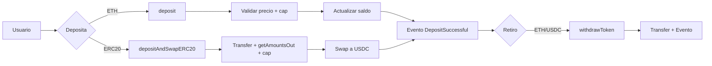
</details>

<details><summary><strong>2. Depósito de ETH (secuencia)</strong></summary>

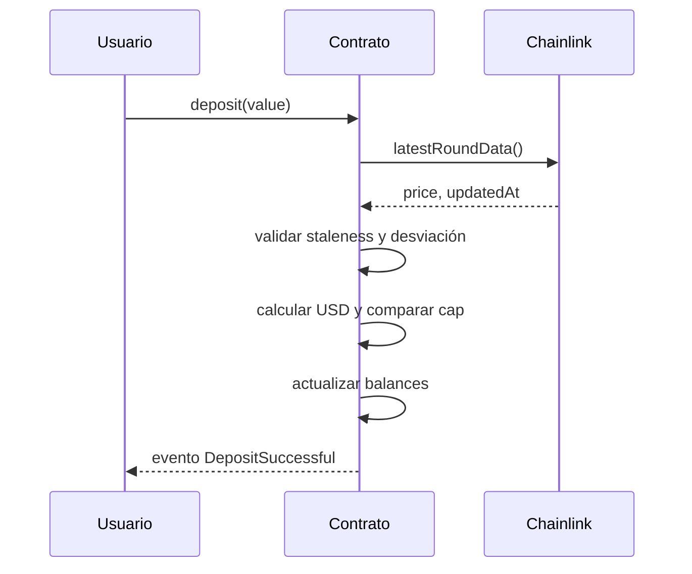
</details>

<details><summary><strong>3. Depósito ERC20 con swap</strong></summary>

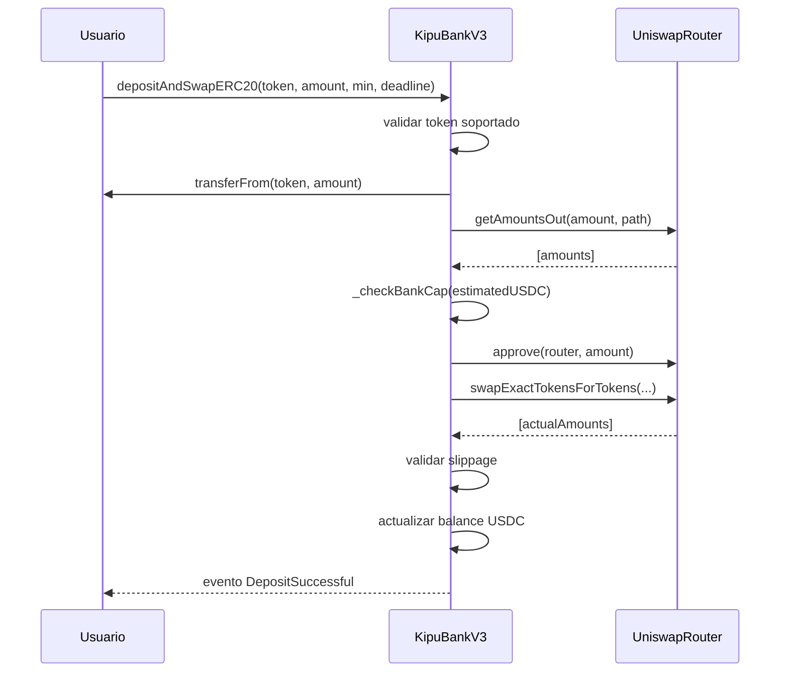
</details>

<details><summary><strong>4. Retiro (árbol de decisión)</strong></summary>

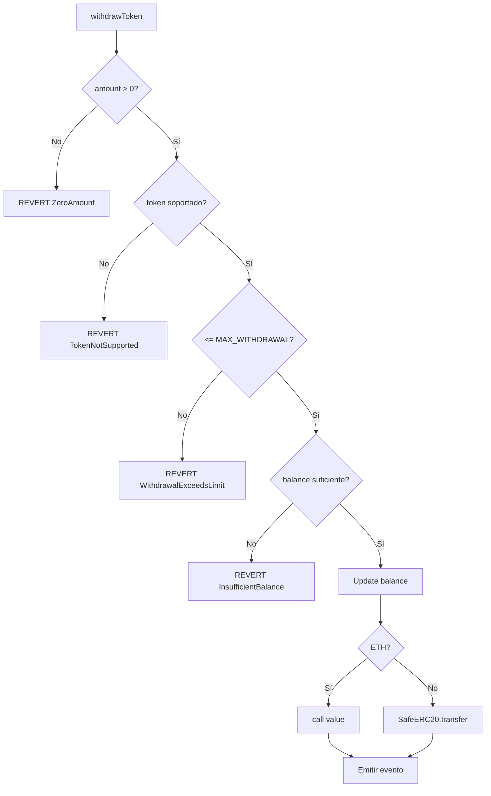
</details>

<details><summary><strong>5. Validación de oráculo (_getEthPriceInUsd)</strong></summary>

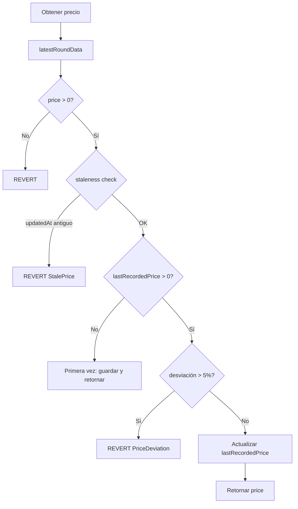
</details>

<details><summary><strong>6. Patrón CEI (Checks-Effects-Interactions)</strong></summary>

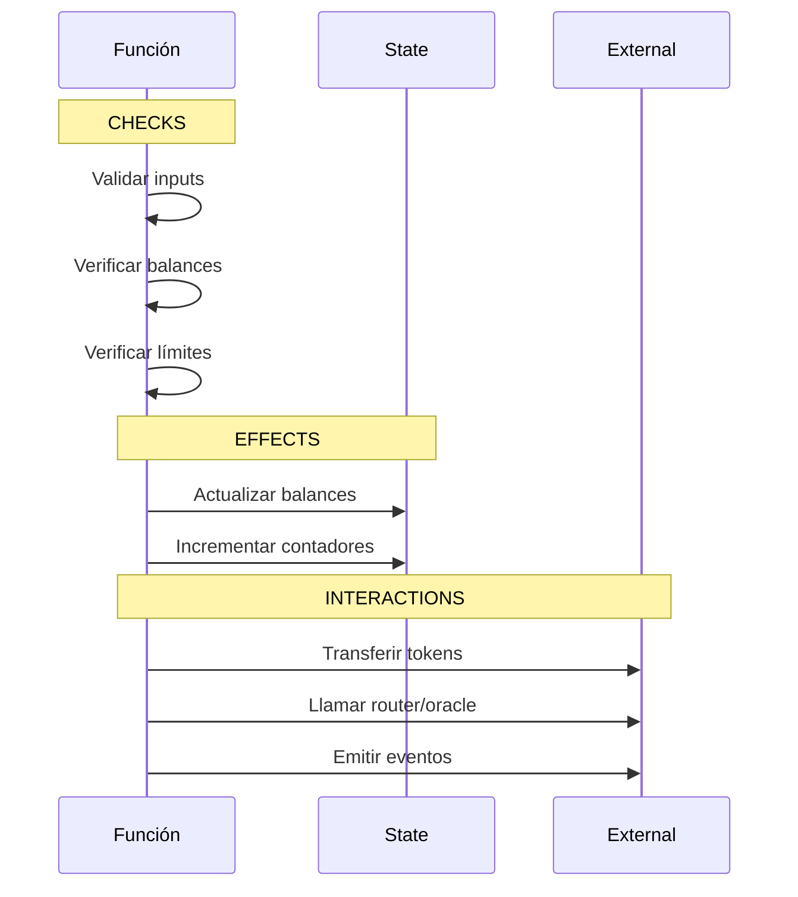
</details>

<details><summary><strong>7. Gestión de roles (AccessControl)</strong></summary>

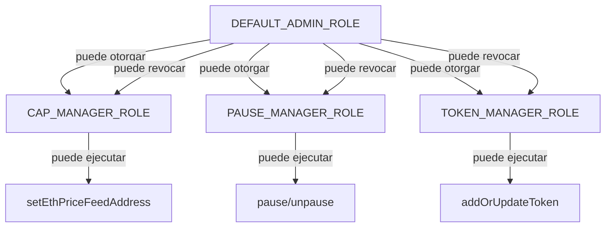
</details>

<details><summary><strong>8. Timelock: programar operación</strong></summary>

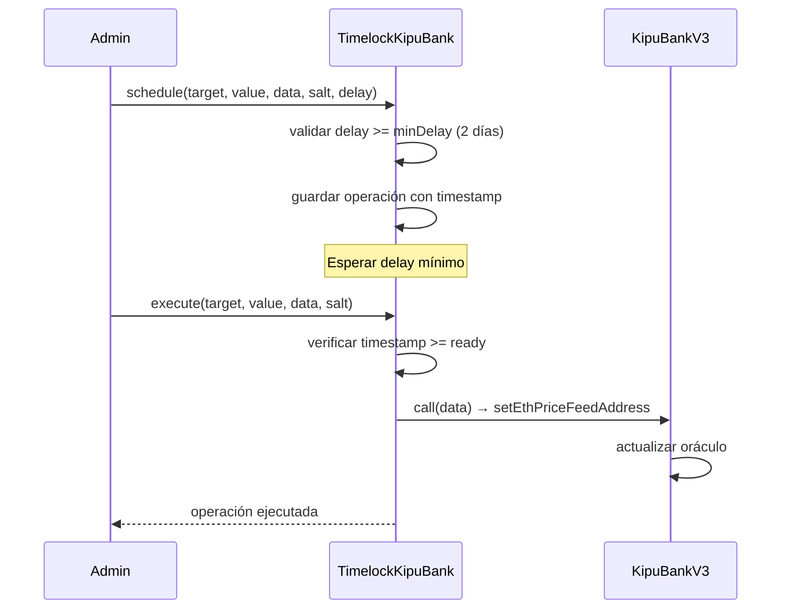
</details>

<details><summary><strong>9. Catálogo de tokens</strong></summary>

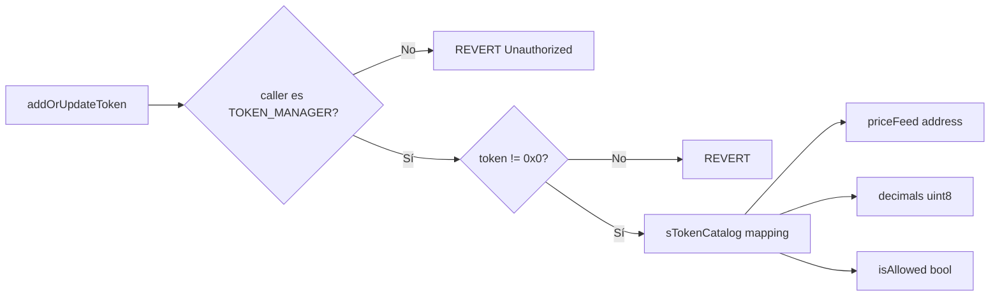
</details>

<details><summary><strong>10. Ciclo completo de transacción</strong></summary>


</details>

> Referencia completa con diagramas ASCII detallados: [FLOW_DIAGRAMS.md](FLOW_DIAGRAMS.md)

</details>

---

<a id="instalacion-y-uso"></a>
<details>
<summary><h2>Instalación y uso</h2></summary>

```bash
git clone https://github.com/g-centurion/KipuBankV3_TP4.git
cd KipuBankV3_TP4
forge install
```

Configurar `.env` (no commitear):
```bash
PRIVATE_KEY=0xTUCLAVE
RPC_URL_SEPOLIA=https://eth-sepolia.g.alchemy.com/v2/TU_RPC_KEY
ETHERSCAN_API_KEY=TU_KEY
```

Compilar y probar:
```bash
forge build
forge test -vv
forge coverage
```

### Script de interacción (dry‑run)
Archivo: `script/Interact.s.sol`
```bash
source .env
forge script script/Interact.s.sol:InteractScript --rpc-url $RPC_URL_SEPOLIA -vvvv --dry-run
```

#### Guía de frontend
- Ver [FRONTEND_GUIDE.md](FRONTEND_GUIDE.md): guía práctica para integrar el contrato en una aplicación web. Incluye conexión con ethers/viem, ejemplos de lectura/escritura, suscripción a eventos y manejo de errores.

</details>

---

<a id="interaccion-on-chain-cast"></a>
<details>
<summary><h2>Interacción on-chain (cast)</h2></summary>

```bash
# Max withdrawal
cast call 0x773808318d5CE8Bc953398B4A0580e53502eAAe1 "MAX_WITHDRAWAL_PER_TX()(uint256)" --rpc-url $RPC_URL_SEPOLIA

# Router
cast call 0x773808318d5CE8Bc953398B4A0580e53502eAAe1 "I_ROUTER()(address)" --rpc-url $RPC_URL_SEPOLIA

# Ver rol admin
cast call 0x773808318d5CE8Bc953398B4A0580e53502eAAe1 "hasRole(bytes32,address)(bool)" \
   0x0000000000000000000000000000000000000000000000000000000000000000 0xe7Bc10cbDA9e4830921384C49B9E711d48b0E8C2 \
   --rpc-url $RPC_URL_SEPOLIA
```

</details>

---

<a id="informe-de-analisis-de-amenazas-resumen"></a>
<details>
<summary><h2>Informe de análisis de amenazas (resumen)</h2></summary>

- Debilidades actuales y pasos a madurez
   - Un solo feed ETH/USD: riesgo ante fallas del oráculo. Paso: agregar TWAP/multi-feed y fallback manual.
   - Ruta fija de swaps: riesgo de precio peor al óptimo. Paso: ruteo dinámico/Agregadores y límites de slippage adaptativos.
   - Gobernanza sin multisig activo: riesgo de llaves únicas. Paso: multisig + timelock operativo.
   - Falta de stress tests de gas/MEV: riesgo de costos y reorgs. Paso: incorporar escenarios de carga y simulaciones con bundles.

- Cobertura de pruebas y métodos
   - Cobertura actual: ver métricas en [Testing y cobertura](#testing-y-cobertura).
   - Métodos: unitarias, integración con mocks (router/oráculo), fuzzing, verificación de eventos y RBAC; generación de reporte `lcov` y HTML.

Documento completo: ver [THREAT_MODEL.md](THREAT_MODEL.md) y [AUDITOR_GUIDE.md](AUDITOR_GUIDE.md).

</details>

<a id="testing-y-cobertura"></a>
<details>
<summary><h2>Testing y cobertura</h2></summary>

```bash
- Framework: Foundry (forge-std/Test).
- Tipos de pruebas: unitarias, integración (router/oráculo mocked), fuzzing, eventos, control de acceso y escenarios multi‑usuario.

### Resumen de resultados
| Métrica | Valor |
|--------|-------|
| Tests passing | 43 / 43 |
| Cobertura global (líneas) | 66.5% |
| Cobertura global (funciones) | 67.5% |
| `KipuBankV3_TP4.sol` (líneas) | 89.38% (101/113) |
| `KipuBankV3_TP4.sol` (funciones) | 88.24% (15/17) |

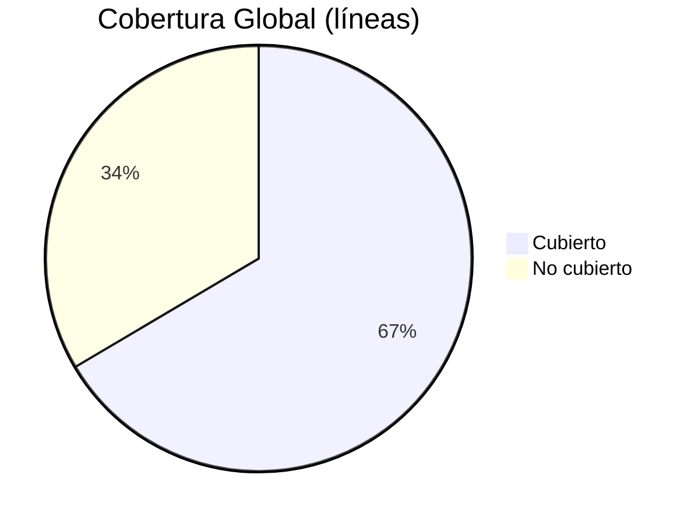

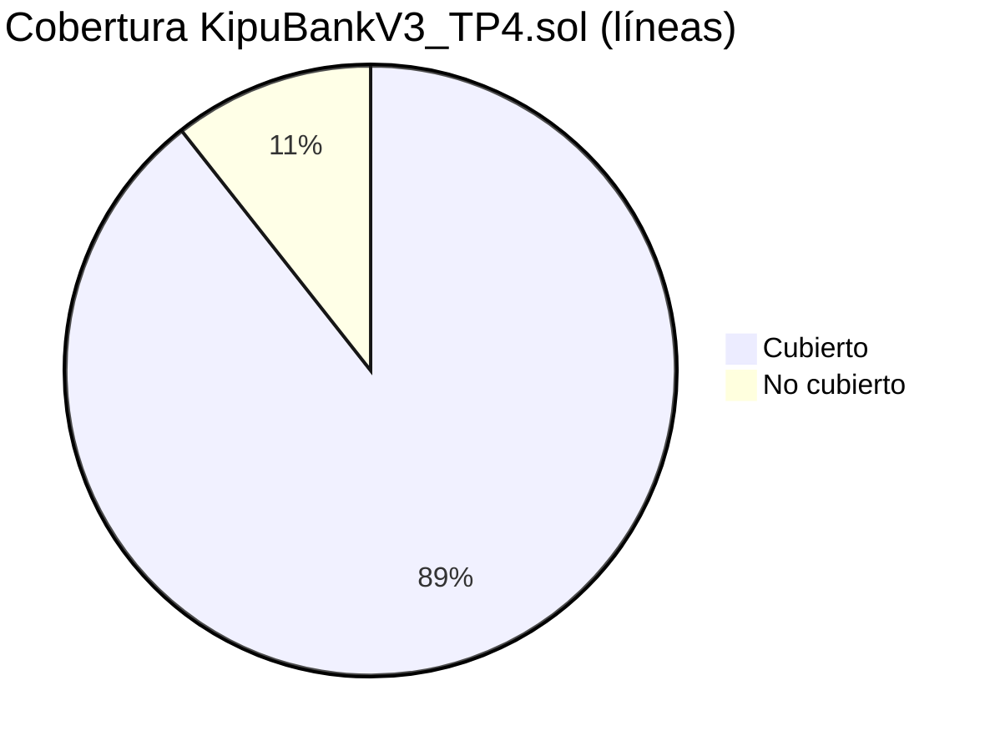

#### Cobertura por archivo (líneas)

| Archivo | Líneas | Cobertura |
|---------|--------|-----------|
| `src/KipuBankV3_TP4.sol` | 101/113 | 89.38% |
| `test/KipuBankV3Test.sol` | 48/59 | 81.36% |
| `script/Deploy.s.sol` | 0/26 | 0% (no ejecutado en tests) |
| `script/Interact.s.sol` | 0/20 | 0% (no ejecutado en tests) |
| `src/TimelockKipuBank.sol` | 0/6 | 0% (sin tests específicos) |

### Áreas cubiertas por los tests
- Depósito de ETH y validación de cap y precio.
- Swap ERC‑20→USDC con slippage mínimo y ruta WETH.
- Retiro con límites y manejo de errores personalizados.
- Pausa/despausa y verificación de roles (grant/revoke, unauthorized).
- Fuzzing de montos y secuencias de operaciones.
- Emisión de eventos y contadores (`getDepositCount`).

### Generar reporte HTML de cobertura (opcional, local)
```bash
forge coverage --report lcov
sudo apt-get install -y lcov
genhtml -o coverage-html lcov.info
```

</details>

---

<a id="entregable-tp4-formato-oficial"></a>
<details open>
<summary><h2>Entregable TP4 (formato oficial)</h2></summary>

Esta sección sigue el formato típico del enunciado del TP4 y reúne en un solo lugar lo mínimo indispensable para la entrega formal.

### 1) Objetivo
Implementar un “banco” DeFi educativo que acepte depósitos de ETH y ERC‑20, realice swap automático a USDC vía Uniswap V2, exponga retiros con límite por transacción y valide precios con Chainlink (staleness + desviación), aplicando buenas prácticas de seguridad.

### 2) Requisitos funcionales implementados
- Depósito de ETH: `deposit()` con cálculo de valor USD y verificación de `BANK_CAP_USD`.
- Depósito de ERC‑20 con swap a USDC: `depositAndSwapERC20(tokenIn, amountIn, amountOutMin, deadline)`; ruta Token→WETH→USDC (o WETH→USDC).
- Retiros: `withdrawToken(token, amount)` para ETH y USDC, con límite `MAX_WITHDRAWAL_PER_TX`.
- Catálogo de tokens: alta/actualización mediante `addOrUpdateToken` (rol `TOKEN_MANAGER_ROLE`).
- Emisión de eventos: `DepositSuccessful`, `WithdrawalSuccessful`.

### 3) Requisitos no funcionales
- Seguridad: CEI, `ReentrancyGuard`, `Pausable`, `AccessControl`, `SafeERC20`, errores personalizados.
- Oráculos: validación de staleness (`PRICE_FEED_TIMEOUT`) y desviación (`MAX_PRICE_DEVIATION_BPS`).
- Observabilidad: eventos y contadores (`getDepositCount`).

### 4) Arquitectura y diagramas
- Herencia y librerías: `AccessControl`, `Pausable`, `ReentrancyGuard`, `SafeERC20`.
- Integraciones: `IUniswapV2Router02`, `AggregatorV3Interface`.
- Diagramas detallados: ver [FLOW_DIAGRAMS.md](FLOW_DIAGRAMS.md).

### 5) Contratos y direcciones
- Red: Sepolia
- Contrato principal: `0x773808318d5CE8Bc953398B4A0580e53502eAAe1`
- Verificación: Etherscan y Blockscout enlazados en el encabezado.

### 6) API del contrato (interfaz pública y consideraciones de seguridad)

#### 6.1 Funciones principales (con roles y errores asociados)

| Función | Descripción | Rol requerido | Errores relevantes |
|---|---|---|---|
| `deposit()` | Acepta ETH nativo y acredita el saldo interno en USD | Ninguno | `Bank__ZeroAmount`, `Bank__DepositExceedsCap`, `Bank__StalePrice`, `Bank__PriceDeviation` |
| `depositAndSwapERC20(tokenIn, amountIn, amountOutMin, deadline)` | Recibe ERC‑20, calcula ruta por WETH y realiza swap a USDC | Ninguno | `Bank__ZeroAmount`, `Bank__TokenNotSupported`, `Bank__SlippageTooHigh`, `Bank__DepositExceedsCap`, `Bank__StalePrice`, `Bank__PriceDeviation` |
| `withdrawToken(token, amount)` | Retira ETH o USDC hasta el límite por transacción | Ninguno | `Bank__ZeroAmount`, `Bank__WithdrawalExceedsLimit`, `Bank__InsufficientBalance`, `Bank__TokenNotSupported`, `Bank__TransferFailed` |
| `pause()` | Activa el modo de pausa de emergencia | `PAUSE_MANAGER_ROLE` | — |
| `unpause()` | Desactiva el modo de pausa | `PAUSE_MANAGER_ROLE` | — |
| `setEthPriceFeedAddress(newAddress)` | Actualiza el oráculo ETH/USD | `CAP_MANAGER_ROLE` | — |
| `addOrUpdateToken(token, priceFeed, decimals)` | Administra el catálogo de tokens soportados | `TOKEN_MANAGER_ROLE` | — |
| `getDepositCount()` | Devuelve el contador de depósitos totales | Ninguno | — |
| `getWethAddress()` | Devuelve la dirección de WETH configurada | Ninguno | — |

Eventos emitidos:
```
event DepositSuccessful(address indexed user, address indexed token, uint256 amount);
event WithdrawalSuccessful(address indexed user, address indexed token, uint256 amount);
```

#### 6.2 Roles del contrato (referencia)

| Rol | Propósito |
|-----|-----------|
| `DEFAULT_ADMIN_ROLE` | Administración general y asignación de roles |
| `CAP_MANAGER_ROLE` | Gestión de oráculo y parámetros de riesgo |
| `PAUSE_MANAGER_ROLE` | Operaciones de pausa/despausa |
| `TOKEN_MANAGER_ROLE` | Alta y actualización de tokens soportados |

#### 6.3 Errores personalizados (referencia)

| Error | Descripción breve |
|-------|-------------------|
| `Bank__ZeroAmount` | Valor de entrada igual a cero |
| `Bank__DepositExceedsCap` | Límite global del banco excedido |
| `Bank__WithdrawalExceedsLimit` | Límite por transacción superado |
| `Bank__InsufficientBalance` | Saldo insuficiente del usuario |
| `Bank__TokenNotSupported` | Token no habilitado en el catálogo |
| `Bank__SlippageTooHigh` | Resultado del swap inferior al mínimo |
| `Bank__StalePrice` | Desactualización del oráculo más allá del tiempo límite |
| `Bank__PriceDeviation` | Desviación de precio por encima del umbral |
| `Bank__TransferFailed` | Fallo en la transferencia del token |

### 7) Parámetros y constantes relevantes
- `BANK_CAP_USD = 1_000_000 * 1e8`
- `PRICE_FEED_TIMEOUT = 1 hours`
- `MAX_PRICE_DEVIATION_BPS = 500`
- `MAX_WITHDRAWAL_PER_TX` (immutable configurado en el constructor)

### 8) Roles y permisos
Resumen en la sección [API del contrato](#6-api-del-contrato-interfaz-pública-y-consideraciones-de-seguridad).

### 9) Consideraciones de seguridad
- Reentrancia mitigada con CEI y `ReentrancyGuard`.
- Oráculo: staleness/desviación + actualización de `lastRecordedPrice`.
- Slippage: parámetro `amountOutMin` y chequeo posterior al swap.
- Límite por retiro y cap global del banco en USD.

- Material para auditoría: ver [AUDITOR_GUIDE.md](AUDITOR_GUIDE.md) con flujos críticos, checklist de seguridad y pruebas recomendadas.
- Modelo de amenazas: ver [THREAT_MODEL.md](THREAT_MODEL.md) con riesgos priorizados, escenarios y mitigaciones aplicadas.

### 10) Despliegue y verificación
Comandos en [Deploy y verificación](#deploy-y-verificacion).

### 11) Pruebas y cobertura
Resumen en [Testing y cobertura](#testing-y-cobertura). 43/43 tests; 66.5% líneas global; 89.38% en contrato principal.

### 12) Conclusiones y mejoras
- El contrato cumple los requisitos del TP4 con foco en seguridad y trazabilidad.
- Pendientes sugeridos: TWAP/multi‑feed, multisig+timelock operativo, pruebas de gas y MEV extendidas.

</details>

---

<a id="deploy-y-verificacion"></a>
<details>
<summary><h2>Deploy y verificación</h2></summary>

```bash
source .env
forge script script/Deploy.s.sol:DeployScript \
   --rpc-url $RPC_URL_SEPOLIA \
   --broadcast \
   --verify \
   --etherscan-api-key $ETHERSCAN_API_KEY -vvvv
```
Resultado: contrato desplegado y verificado en Sepolia.

- Ejemplo de deploy: [`script/Deploy.s.sol`](script/Deploy.s.sol) documenta direcciones de Sepolia, parámetros clave (feeds, router, `MAX_WITHDRAWAL_PER_TX`) y logs de despliegue para reproducibilidad.

</details>

---

<a id="gas-y-optimizaciones"></a>
<details>
<summary><h2>Gas y optimizaciones</h2></summary>

- `constant`/`immutable` para reducir SLOAD.
- Errores personalizados en lugar de strings.
- `unchecked` en incrementos con pre‑checks.
- Una sola lectura de oráculo por función.
- Reutilización de memoria en rutas de swap.

</details>

---

<a id="limitaciones-y-roadmap"></a>
<details>
<summary><h2>Limitaciones y roadmap</h2></summary>

| Área | Limitación |
|------|------------|
| Oráculos | Solo ETH/USD (sin TWAP/multi‑feed) |
| Swaps | Ruta fija Token→WETH→USDC |
| Gobernanza | Timelock opcional, sin multisig |
| Auditoría | Slither debe ejecutarse localmente |
| Tests | Faltan stress tests de gas/MEV |

Siguientes mejoras sugeridas: integrar multisig + timelock, TWAP/multi‑oracle, módulos de estrategia y CI con cobertura y Slither.

</details>

---

<a id="licencia"></a>
<details open>
<summary><h2>Licencia</h2></summary>

MIT

</details>

<sub>Última actualización: 13 Nov 2025</sub>


---


