 
<div align="center">

# KipuBankV3_TP4 – Banco DeFi con Swaps y Oráculos
<strong>Contrato desplegado en Sepolia</strong>

<p>
<strong>Contrato:</strong> <code>0xCB2C14F98fA5f016684e8FC3F96830C66330b122</code> ·
<strong>Tx:</strong> <code>0x0650f5f96624127a21172ba302e81bcee24dd9f972eddc79ef4991d8a3b7543c</code><br/>
<a href="https://sepolia.etherscan.io/address/0xCB2C14F98fA5f016684e8FC3F96830C66330b122#code">Etherscan</a> ·
<a href="https://eth-sepolia.blockscout.com/address/0xCB2C14F98fA5f016684e8FC3F96830C66330b122">Blockscout</a>
</p>

</div>

---

<details open>
<summary><h2>KipuBankV3: Trabajo práctico 4 (incluye correcciones TP3)</h2></summary>

- Visión general: [Resumen ejecutivo](#resumen-ejecutivo) y [Decisiones de diseño y trade-offs](#decisiones-de-diseno-y-trade-offs).
- Despliegue e interacción: [Instalación y uso](#instalacion-y-uso), [Deploy y verificación](#deploy-y-verificacion) y [Interacción on-chain (cast)](#interaccion-on-chain-cast).
- Análisis de amenazas: [Informe de análisis de amenazas (resumen)](#informe-de-analisis-de-amenazas-resumen) y [THREAT_MODEL.md](THREAT_MODEL.md).
- Pruebas: [Testing y cobertura](#testing-y-cobertura) (cobertura y métodos de prueba).

</details>

## Table of Contents
- [Executive Summary](#executive-summary)
- [Key Features](#key-features)
- [Technical Specifications](#technical-specifications)
- [Evolution from KipuBankV2](#evolution-from-kipubankv2)
- [Design Decisions & Trade-offs](#design-decisions-and-trade-offs)
- [DeFi Integrations](#defi-integrations)
- [Essential Diagrams](#essential-diagrams)
- [Installation & Usage](#installation-and-usage)
- [On-chain Interaction](#on-chain-interaction)
- [Testing & Coverage](#testing-and-coverage)
- [Threat Analysis Summary](#threat-analysis-summary)
- [Project Deliverable](#project-deliverable)
- [Deploy & Verification](#deploy-and-verification)
- [Gas Optimizations](#gas-optimizations)
- [Limitations & Roadmap](#limitations-and-roadmap)
- [License](#license)

---

<a id="executive-summary"></a>
<details open>
<summary><h2>Executive Summary</h2></summary>

KipuBankV3 is an educational DeFi contract supporting ETH and ERC-20 deposits (with automatic swap to USDC), withdrawals with per-transaction limits, and robust Chainlink oracle validation. Features CEI pattern, ReentrancyGuard, Pausable, AccessControl, and custom errors for production-grade security.

</details>

---

<a id="key-features"></a>
<details open>
<summary><h2>Key Features</h2></summary>

- Deposits: Native ETH and ERC-20 with USDC conversion via Uniswap V2.
- Multi-token accounting with internal user balances.
- Global bank cap in USD and per-transaction withdrawal limit.
- Oracle validation: staleness check (1 hour) and max deviation (5% circuit breaker).
- RBAC with separated roles and emergency pause functionality.
- Optional Timelock (`TimelockKipuBank.sol`) for deferred administrative changes.

</details>

---

<a id="evolution-from-kipubankv2"></a>
<details open>
<summary><h2>Evolution from KipuBankV2</h2></summary>

KipuBankV3 is a direct evolution of KipuBankV2, incorporating instructor feedback corrections and functional enhancements.

Improvements and corrections applied:
- Complete NatSpec: all functions, parameters, events, errors, and constants documented.
- Custom errors replacing `require` with string messages for gas efficiency.
- Atomicity and revert safety: strict CEI pattern adoption; all checks before state mutations or external interactions.
- Role-based logic with modifiers: using `onlyRole` (AccessControl) for administrative operations.
- Bank cap enforcement: explicit validation on ETH and ERC-20 deposits with USD conversion.
- State organization: variables grouped by purpose (immutables/constants first, coherent storage).
- Optimizations: storage read caching and `unchecked` only where provably safe.
- Professional style: English-only NatSpec and comments, simplified format.

New features in V3:
- Automatic swaps to USDC via Uniswap V2 with WETH routing.
- Chainlink price validation (staleness + 5% deviation) with last recorded price tracking.
- Per-transaction withdrawal limit and global USD cap.
- Role-managed token catalog and optional Timelock for sensitive changes.

</details>

<a id="technical-specifications"></a>
<details>
<summary><h2>Technical Specifications</h2></summary>

### Architecture (inheritance, libraries and interfaces)
- Inheritance: `AccessControl`, `Pausable`, `ReentrancyGuard`.
- Libraries: `SafeERC20`.
- Interfaces: `IERC20`, `IUniswapV2Router02`, `AggregatorV3Interface`.

### Constants and parameters
- `BANK_CAP_USD = 1,000,000 * 1e8` (USD, 8 decimals)
- `PRICE_FEED_TIMEOUT = 1 hours`
- `MAX_PRICE_DEVIATION_BPS = 500` (5%)
- `MAX_WITHDRAWAL_PER_TX` (immutable, defined in constructor)

### Functional modules (previous TPs + TP4)
- ETH deposits: `deposit()` with price and cap validation.
- ERC-20 deposits with swap: `depositAndSwapERC20()` (route Token→WETH→USDC; or WETH→USDC).
- Withdrawals: `withdrawToken(address token, uint256 amount)` (ETH or USDC).
- Oracles: `_getEthPriceInUsd()` with staleness and deviation validation.
- USD conversion: `_getUsdValueFromWei()`, `_getUsdValueFromUsdc()`.
- Global limit: `_checkBankCap()`, `_checkEthDepositCap()` + `_getBankTotalUsdValue()`.
- Metrics: `getDepositCount()`, internal counters.

### Supported tokens and catalog
- Base: ETH (address(0)) and USDC (6 decimals) enabled in constructor.
- Extension: `addOrUpdateToken(token, priceFeed, decimals)` under `TOKEN_MANAGER_ROLE`.

### Optional Timelock
- [`src/TimelockKipuBank.sol`](src/TimelockKipuBank.sol) (based on OZ `TimelockController`): allows scheduling and executing changes (e.g., `setEthPriceFeedAddress`) with a minimum delay of 2 days.

</details>

---

<a id="on-chain-interaction"></a>
<details open>
<summary><h2>On-chain Interaction (try it)</h2></summary>

Quick `cast` examples on Sepolia. Replace `[ADDR]` with the deployed address (`0xCB2C14F98fA5f016684e8FC3F96830C66330b122`).

- Read deposit count:
   - `cast call [ADDR] "getDepositCount()(uint256)" --rpc-url $RPC_URL_SEPOLIA`
- Read WETH address:
   - `cast call [ADDR] "getWethAddress()(address)" --rpc-url $RPC_URL_SEPOLIA`
- Read USDC balance of an account:
   - `cast call [ADDR] "balances(address,address)(uint256)" 0xYourAddr 0x1c7D4B196Cb0C6B364C3d6eB8F0708a9dA00375D --rpc-url $RPC_URL_SEPOLIA`
- Send ETH deposit (0.01 ETH):
   - `cast send [ADDR] --value 0.01ether --rpc-url $RPC_URL_SEPOLIA --private-key $PRIVATE_KEY`
- Withdraw USDC (example 1 USDC = 1000000):
   - `cast send [ADDR] "withdrawToken(address,uint256)" 0x1c7D4B196Cb0C6B364C3d6eB8F0708a9dA00375D 1000000 --rpc-url $RPC_URL_SEPOLIA --private-key $PRIVATE_KEY`

Notes:
- Always source `.env` in WSL: `source .env`.
- Ensure you have balance and correct RPC before sending transactions.

</details>

<a id="design-decisions-and-trade-offs"></a>
<details>
<summary><h2>Design Decisions & Trade-offs</h2></summary>

- USDC accounting base: simplifies accounting and UX; trade-off: dependency on router and oracle.
- Fixed swap route via WETH: maximizes liquidity on Uniswap V2; trade-off: route not always optimal for price.
- Price validation (staleness + 5% deviation): increases security against outliers; trade-off: may revert during volatility spikes.
- Global USD cap and per-transaction withdrawal limit: reduces systemic and drainage risk; trade-off: restricts large amounts.
- Separated RBAC (admin/cap/pause/token): smaller error surface; trade-off: increased role management overhead.
- CEI pattern + ReentrancyGuard and SafeERC20: security baseline; trade-off: marginal gas cost.
- Optional Timelock for sensitive changes: defense against rushed changes; trade-off: reduced operational agility.

</details>

<a id="defi-integrations"></a>
<details>
<summary><h2>DeFi Integrations</h2></summary>

- Uniswap V2 Router: estimates with `getAmountsOut`, swap with `swapExactTokensForTokens` and routing via WETH.
- Chainlink: `latestRoundData()` for ETH/USD; staleness and deviation validation against `lastRecordedPrice`.

</details>

---

<a id="essential-diagrams"></a>
<details open>
<summary><h2>Essential Diagrams</h2></summary>


<details><summary><strong>1. General system flow</strong></summary>

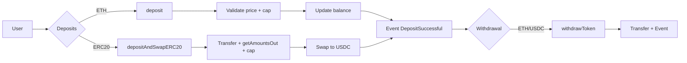
</details>

<details><summary><strong>2. ETH deposit (sequence)</strong></summary>

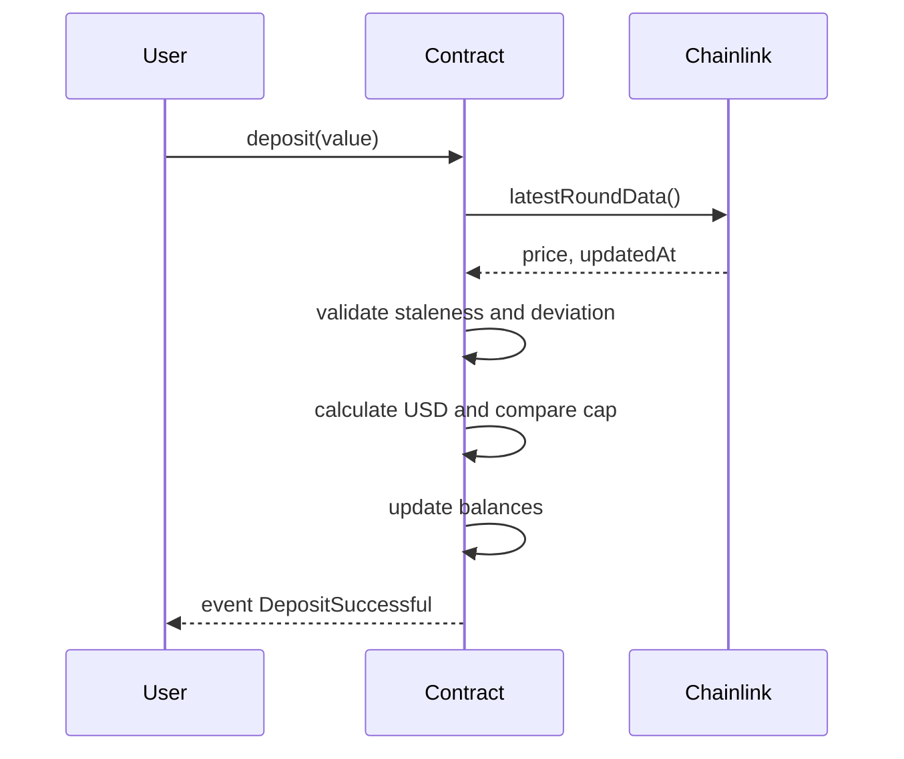
</details>

<details><summary><strong>3. ERC20 deposit with swap</strong></summary>

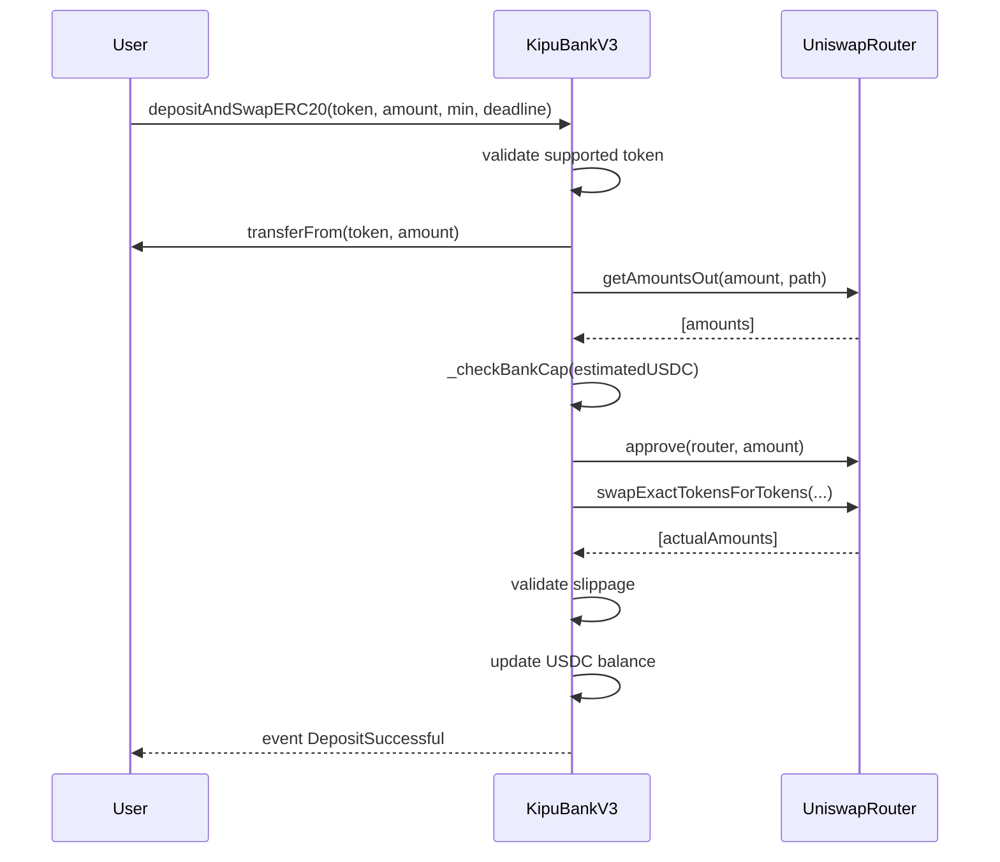
</details>

<details><summary><strong>4. Withdrawal (decision tree)</strong></summary>

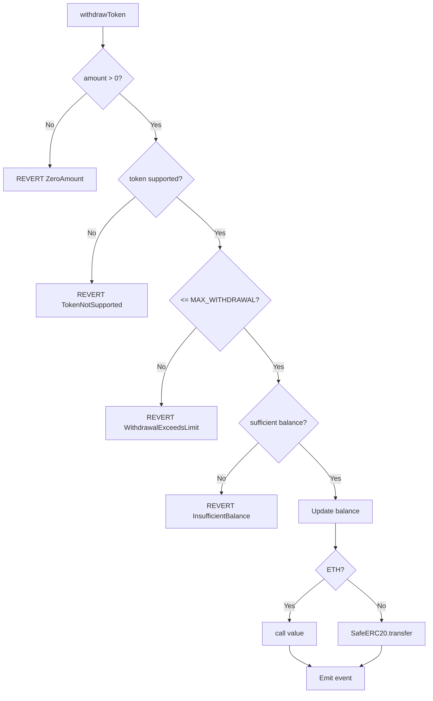
</details>

<details><summary><strong>5. Oracle validation (_getEthPriceInUsd)</strong></summary>

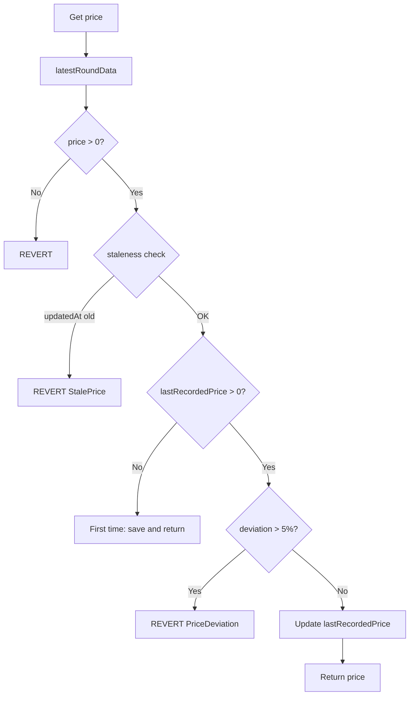
</details>

<details><summary><strong>6. CEI Pattern (Checks-Effects-Interactions)</strong></summary>

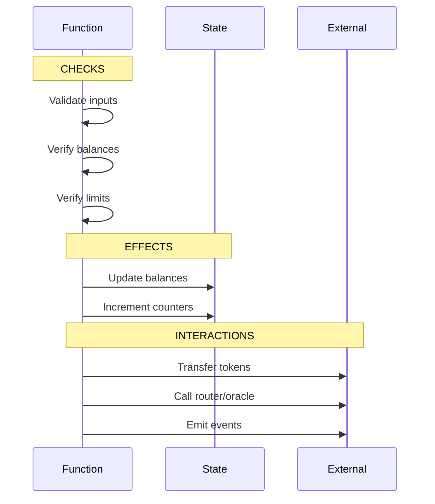
</details>

<details><summary><strong>7. Role management (AccessControl)</strong></summary>

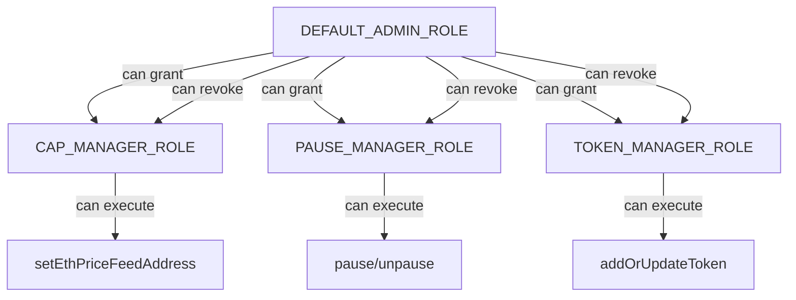
</details>

<details><summary><strong>8. Timelock: schedule operation</strong></summary>

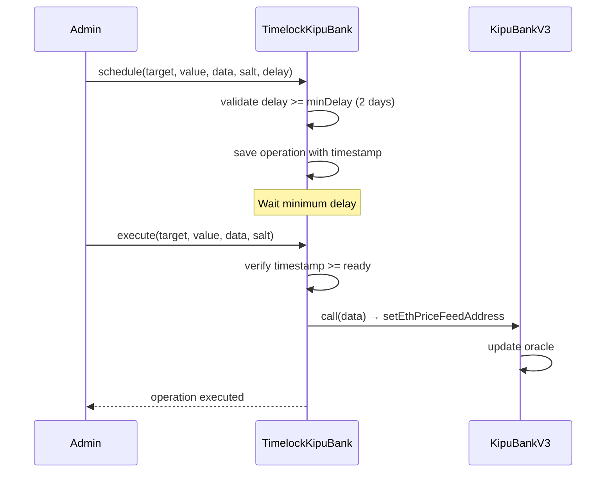
</details>

<details><summary><strong>9. Token catalog</strong></summary>

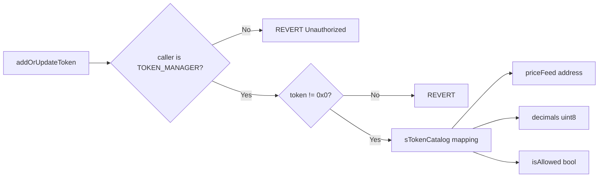
</details>

<details><summary><strong>10. Complete transaction cycle</strong></summary>

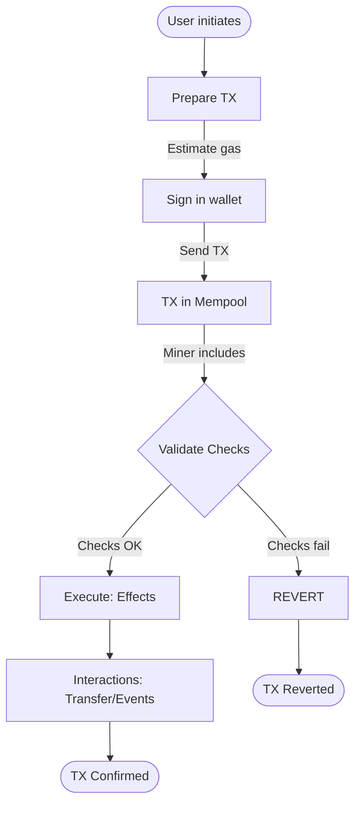
</details>

> Complete reference with detailed ASCII diagrams: [FLOW_DIAGRAMS.md](FLOW_DIAGRAMS.md)

</details>

---

<a id="instalacion-y-uso"></a>
<details>
<summary><h2>Instalación y uso</h2></summary>

```bash
git clone https://github.com/g-centurion/KipuBankV3_TP4.git
cd KipuBankV3_TP4
forge install
```

Configurar `.env` (no commitear):
```bash
PRIVATE_KEY=0xTUCLAVE
RPC_URL_SEPOLIA=https://eth-sepolia.g.alchemy.com/v2/TU_RPC_KEY
ETHERSCAN_API_KEY=TU_KEY
```

Compilar y probar:
```bash
forge build
forge test -vv
forge coverage
```

### Script de interacción (dry‑run)
Archivo: `script/Interact.s.sol`
```bash
source .env
forge script script/Interact.s.sol:InteractScript --rpc-url $RPC_URL_SEPOLIA -vvvv --dry-run
```

#### Guía de frontend
- Ver [FRONTEND_GUIDE.md](FRONTEND_GUIDE.md): guía práctica para integrar el contrato en una aplicación web. Incluye conexión con ethers/viem, ejemplos de lectura/escritura, suscripción a eventos y manejo de errores.

</details>

---

<a id="interaccion-on-chain-cast"></a>
<details>
<summary><h2>Interacción on-chain (cast)</h2></summary>

```bash
# Max withdrawal
cast call 0x773808318d5CE8Bc953398B4A0580e53502eAAe1 "MAX_WITHDRAWAL_PER_TX()(uint256)" --rpc-url $RPC_URL_SEPOLIA

# Router
cast call 0x773808318d5CE8Bc953398B4A0580e53502eAAe1 "I_ROUTER()(address)" --rpc-url $RPC_URL_SEPOLIA

# Ver rol admin
cast call 0x773808318d5CE8Bc953398B4A0580e53502eAAe1 "hasRole(bytes32,address)(bool)" \
   0x0000000000000000000000000000000000000000000000000000000000000000 0xe7Bc10cbDA9e4830921384C49B9E711d48b0E8C2 \
   --rpc-url $RPC_URL_SEPOLIA
```

</details>

---

<a id="informe-de-analisis-de-amenazas-resumen"></a>
<details>
<summary><h2>Informe de análisis de amenazas (resumen)</h2></summary>

- Debilidades y madurez
   - Oráculo único ETH/USD: dependencia central. Paso: TWAP/multi‑feed + fallback manual y alertas.
   - Ruta fija (via WETH): puede no ser la más barata. Paso: ruteo dinámico/Agregador y slippage adaptativo.
   - Gobernanza sin multisig activo: riesgo de clave única. Paso: multisig + timelock operativo y umbrales claros.
   - Sin stress tests de gas/MEV: riesgo de costos y reorgs. Paso: escenarios de carga, bundle testing y simulaciones.

- Cobertura de pruebas
   - Métricas vigentes: ver [Testing y cobertura](#testing-y-cobertura) (tests, % líneas/funciones y reporte HTML opcional).

- Métodos de prueba
   - Unitarias e integración con mocks (router/oráculo), fuzzing, verificación de eventos y RBAC; generación de `lcov` y HTML.

Documento completo: ver [THREAT_MODEL.md](THREAT_MODEL.md) y [AUDITOR_GUIDE.md](AUDITOR_GUIDE.md).

</details>

<a id="testing-y-cobertura"></a>
<details>
<summary><h2>Testing y cobertura</h2></summary>

```bash
- Framework: Foundry (forge-std/Test).
- Tipos de pruebas: unitarias, integración (router/oráculo mocked), fuzzing, eventos, control de acceso y escenarios multi‑usuario.

### Resumen de resultados
| Métrica | Valor |
|--------|-------|
| Tests passing | 43 / 43 |
| Cobertura global (líneas) | 66.5% |
| Cobertura global (funciones) | 67.5% |
| `KipuBankV3_TP4.sol` (líneas) | 89.38% (101/113) |
| `KipuBankV3_TP4.sol` (funciones) | 88.24% (15/17) |

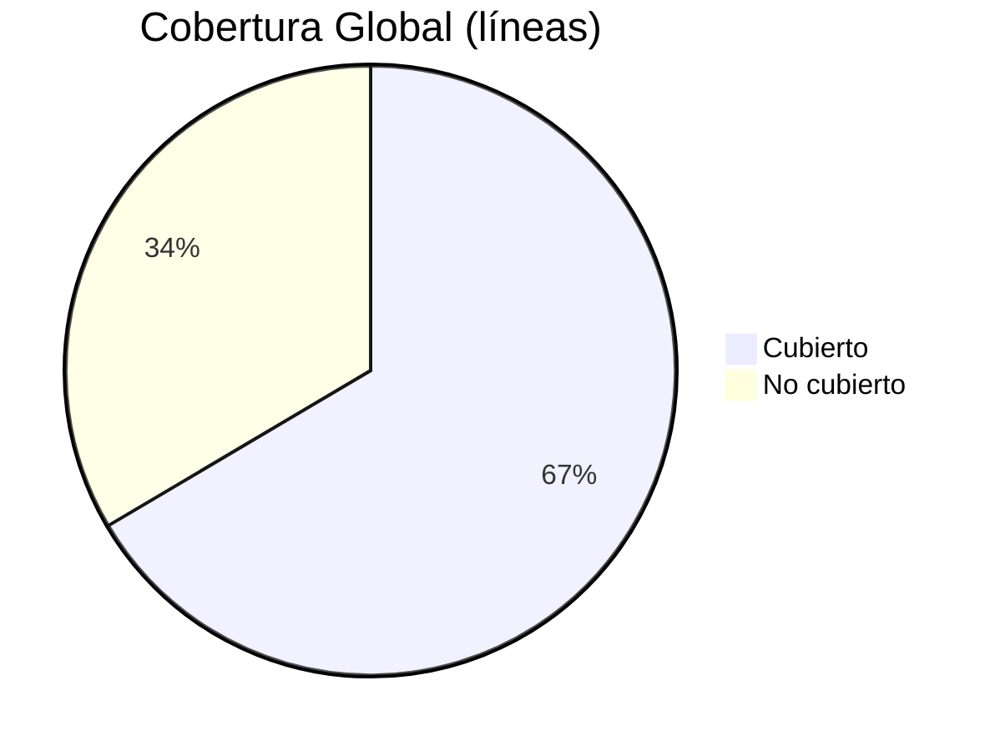

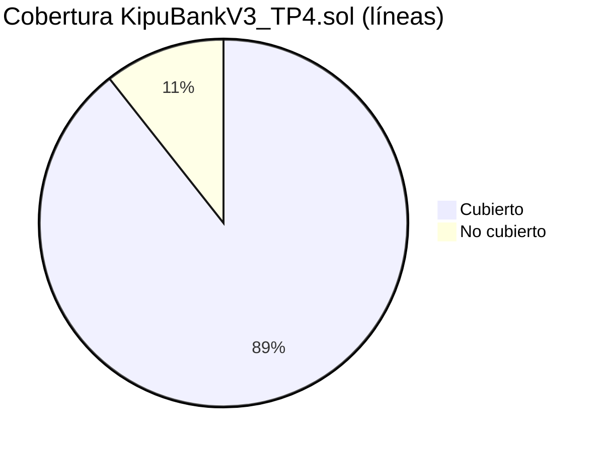

#### Cobertura por archivo (líneas)

| Archivo | Líneas | Cobertura |
|---------|--------|-----------|
| `src/KipuBankV3_TP4.sol` | 101/113 | 89.38% |
| `test/KipuBankV3Test.sol` | 48/59 | 81.36% |
| `script/Deploy.s.sol` | 0/26 | 0% (no ejecutado en tests) |
| `script/Interact.s.sol` | 0/20 | 0% (no ejecutado en tests) |
| `src/TimelockKipuBank.sol` | 0/6 | 0% (sin tests específicos) |

### Áreas cubiertas por los tests
- Depósito de ETH y validación de cap y precio.
- Swap ERC‑20→USDC con slippage mínimo y ruta WETH.
- Retiro con límites y manejo de errores personalizados.
- Pausa/despausa y verificación de roles (grant/revoke, unauthorized).
- Fuzzing de montos y secuencias de operaciones.
- Emisión de eventos y contadores (`getDepositCount`).

### Generar reporte HTML de cobertura (opcional, local)
```bash
forge coverage --report lcov
sudo apt-get install -y lcov
genhtml -o coverage-html lcov.info
```

</details>

---

<a id="entregable-tp4"></a>
<details open>
<summary><h2>Entregable TP4</h2></summary>

### Objetivo
Banco DeFi educativo con depósitos de ETH y ERC‑20, swap automático a USDC vía Uniswap V2, retiros con límites por transacción y validación de precios con Chainlink (staleness + desviación máxima), aplicando buenas prácticas de seguridad.

### Funcionalidades principales
- Depósitos ETH con conversión automática a USD y validación de cap global.
- Depósitos ERC‑20 con swap a USDC mediante ruta Token→WETH→USDC.
- Retiros hasta límite por transacción (ETH y USDC).
- Catálogo de tokens administrado por rol y Timelock opcional para cambios sensibles.
- Sistema de roles (admin, cap manager, pause manager, token manager) y pausa de emergencia.

### Arquitectura
- Herencia: AccessControl, Pausable, ReentrancyGuard
- Librerías: SafeERC20
- Integraciones: Uniswap V2 Router, Chainlink (ETH/USD)
- Red: Sepolia | Contrato: `0x773808318d5CE8Bc953398B4A0580e53502eAAe1`

### Interfaz pública

| Función | Rol | Descripción |
|---------|-----|-------------|
| `deposit()` | — | Acepta ETH nativo y actualiza saldo interno |
| `depositAndSwapERC20()` | — | Recibe ERC‑20 y realiza swap a USDC |
| `withdrawToken()` | — | Retira ETH o USDC respetando límites |
| `pause()` / `unpause()` | PAUSE_MANAGER | Control de emergencia |
| `setEthPriceFeedAddress()` | CAP_MANAGER | Actualiza oráculo ETH/USD |
| `addOrUpdateToken()` | TOKEN_MANAGER | Administra tokens soportados |
| `getDepositCount()` / `getWethAddress()` | — | Consultas públicas |

Eventos: `DepositSuccessful`, `WithdrawalSuccessful`

Errores personalizados: `Bank__ZeroAmount`, `Bank__DepositExceedsCap`, `Bank__WithdrawalExceedsLimit`, `Bank__InsufficientBalance`, `Bank__TokenNotSupported`, `Bank__SlippageTooHigh`, `Bank__StalePrice`, `Bank__PriceDeviation`, `Bank__TransferFailed`

### Parámetros clave
- Cap global: 1,000,000 USD (8 decimales)
- Timeout oráculo: 1 hora
- Desviación máxima: 5% (500 bps)
- Límite por retiro: configurado en constructor

### Seguridad
- Patrón CEI, ReentrancyGuard, SafeERC20
- Validación de oráculo (staleness + desviación)
- Slippage controlado en swaps
- RBAC y pausa de emergencia

- Documentación: AUDITOR_GUIDE.md, THREAT_MODEL.md

</details>

---

<a id="deploy-y-verificacion"></a>
<details>
<summary><h2>Deploy y verificación</h2></summary>

```bash
source .env
forge script script/Deploy.s.sol:DeployScript \
   --rpc-url $RPC_URL_SEPOLIA \
   --broadcast \
   --verify \
   --etherscan-api-key $ETHERSCAN_API_KEY -vvvv
```
Resultado: contrato desplegado y verificado en Sepolia.

- Ejemplo de deploy: [`script/Deploy.s.sol`](script/Deploy.s.sol) documenta direcciones de Sepolia, parámetros clave (feeds, router, `MAX_WITHDRAWAL_PER_TX`) y logs de despliegue para reproducibilidad.

</details>

---

<a id="gas-y-optimizaciones"></a>
<details>
<summary><h2>Gas y optimizaciones</h2></summary>

- `constant`/`immutable` para reducir SLOAD.
- Errores personalizados en lugar de strings.
- `unchecked` en incrementos con pre‑checks.
- Una sola lectura de oráculo por función.
- Reutilización de memoria en rutas de swap.

</details>

---

<a id="limitaciones-y-roadmap"></a>
<details>
<summary><h2>Limitaciones y roadmap</h2></summary>

| Área | Limitación |
|------|------------|
| Oráculos | Solo ETH/USD (sin TWAP/multi‑feed) |
| Swaps | Ruta fija Token→WETH→USDC |
| Gobernanza | Timelock opcional, sin multisig |
| Auditoría | Slither debe ejecutarse localmente |
| Tests | Faltan stress tests de gas/MEV |

Siguientes mejoras sugeridas: integrar multisig + timelock, TWAP/multi‑oracle, módulos de estrategia y CI con cobertura y Slither.

</details>

---

<a id="licencia"></a>
<details open>
<summary><h2>Licencia</h2></summary>

MIT

</details>

<sub>Last updated: 28 Nov 2025</sub>


---


