 
<div align="center">

# KipuBankV3 – Banco DeFi Educativo (Swaps + Oráculos + Límites)
<strong>Contrato desplegado en Sepolia (Versión actualizada - Noviembre 2025)</strong>

<p>
<strong>Dirección del contrato:</strong> <code>0xc6d24cBbF2CCC70ef6E4EeD507fEA0F801321691</code><br/>
<strong>Transacción de deploy:</strong> <code>0x9e01b146c4fdcb3ff2968efe6ccbd34ddeeabfee4007a28be88b8128676ca409</code><br/>
<a href="https://sepolia.etherscan.io/address/0xc6d24cBbF2CCC70ef6E4EeD507fEA0F801321691#code">Etherscan</a> ·
<a href="https://eth-sepolia.blockscout.com/address/0xc6d24cBbF2CCC70ef6E4EeD507fEA0F801321691">Blockscout</a>
</p>

</div>

---

<details open>
<summary><h2>Resumen del Trabajo Práctico 4 (incluye correcciones del TP3)</h2></summary>

- Visión general: [Resumen Ejecutivo](#resumen-ejecutivo) y [Decisiones de Diseño](#decisiones-de-diseno-y-trade-offs).
- Despliegue e interacción: [Instalación y Uso](#instalacion-y-uso), [Deploy y Verificación](#deploy-y-verificacion), [Interacción On‑Chain (cast)](#interaccion-on-chain-cast).
- Seguridad: [Resumen de Análisis de Amenazas](#informe-de-analisis-de-amenazas-resumen) y archivo completo [THREAT_MODEL.md](THREAT_MODEL.md).
- Pruebas: [Testing y Cobertura](#testing-y-cobertura).
- Verificación técnica: [Bytecode y diferencias](#verificacion-tecnica-bytecode).

</details>

## Tabla de Contenidos
- [Resumen Ejecutivo](#resumen-ejecutivo)
- [Características Clave](#caracteristicas-clave)
- [Evolución desde V2](#evolucion-desde-kipubankv2)
- [Especificaciones Técnicas](#especificaciones-tecnicas)
- [Decisiones de Diseño y Trade-offs](#decisiones-de-diseno-y-trade-offs)
- [Integraciones DeFi](#integraciones-defi)
- [Diagramas Esenciales](#diagramas-esenciales)
- [Instalación y Uso](#instalacion-y-uso)
- [Interacción On-Chain (cast)](#interaccion-on-chain-cast)
- [Testing y Cobertura](#testing-y-cobertura)
- [Resumen de Análisis de Amenazas](#informe-de-analisis-de-amenazas-resumen)
- [Entregable TP4](#entregable-tp4)
- [Deploy y Verificación](#deploy-y-verificacion)
- [Verificación Técnica Bytecode](#verificacion-tecnica-bytecode)
- [Optimizaciones de Gas](#gas-y-optimizaciones)
- [Limitaciones y Roadmap](#limitaciones-y-roadmap)
- [Changelog](#changelog)
- [Licencia](#licencia)

---

<a id="resumen-ejecutivo"></a>
<details open>
<summary><h2>Resumen Ejecutivo</h2></summary>

KipuBankV3 es un contrato DeFi educativo que soporta depósitos de ETH y ERC‑20 (con swap automático a USDC), retiros con límite por transacción, validación robusta de precios usando Chainlink y control de riesgos mediante un cap global en USD. Aplica patrón CEI, ReentrancyGuard, Pausable, AccessControl y errores personalizados para seguridad y eficiencia de gas.

</details>

---

<a id="caracteristicas-clave"></a>
<details open>
<summary><h2>Características Clave</h2></summary>

- Depósitos de ETH y ERC‑20 con conversión automática a USDC vía Uniswap V2.
- Contabilidad interna por usuario (balances por token) sin emitir ERC‑20 propio.
- Límite global (cap) en USD y límite de retiro por transacción.
- Validación de oráculo: tiempo máximo de antigüedad (3 horas) y desviación máxima (5%).
- RBAC con separación de roles (admin, cap_manager, pause_manager, token_manager).
- Pausa de emergencia (`pause/unpause`).
- Timelock opcional (`TimelockKipuBank.sol`) para cambios diferidos de configuración sensible.

</details>

---

<a id="evolucion-desde-kipubankv2"></a>
<details open>
<summary><h2>Evolución desde KipuBankV2</h2></summary>

Esta versión incorpora feedback de la iteración anterior y añade funcionalidad avanzada.

Mejoras y correcciones:
- NatSpec completa en funciones, eventos, errores y constantes.
- Errores personalizados (gas menor que `require` con string).
- Atomicidad reforzada en validación de cap (snapshot antes de proyectar depósito pendiente).
- Uso estricto de patrón CEI (Checks → Effects → Interactions).
- Roles gestionados con `AccessControl` y separación de responsabilidades.
- Cap en USD para depósitos ETH y swaps ERC‑20→USDC (con conversión consistente).
- Organización clara de storage (constants/immutables al inicio).
- Uso de `unchecked` únicamente donde el overflow es irrealista dado el cap.

Nuevas características V3:
- Swap automático a USDC (ruta Token→WETH→USDC o WETH→USDC según origen).
- Validación doble de precio (staleness y desviación vs precio anterior).
- Límite por retiro y contador de depósitos/retiros.
- Catálogo de tokens administrado por rol.
- Timelock opcional para gobernanza diferida.

</details>

<a id="especificaciones-tecnicas"></a>
<details>
<summary><h2>Especificaciones Técnicas</h2></summary>

### Arquitectura (herencia, librerías e interfaces)
- Herencia: `AccessControl`, `Pausable`, `ReentrancyGuard`.
- Librerías: `SafeERC20`.
- Interfaces: `IERC20`, `IUniswapV2Router02`, `AggregatorV3Interface`.

### Constantes y parámetros
- `BANK_CAP_USD = 1_000_000 * 10^8` (USD, 8 decimales).
- `PRICE_FEED_TIMEOUT = 3 hours` (actualizado v2).
- `MAX_PRICE_DEVIATION_BPS = 500` (5%).
- `MAX_WITHDRAWAL_PER_TX` (immutable configurado en constructor).

### Módulos funcionales
- Depósito ETH: `deposit()` valida precio y cap antes de mutar estado.
- Depósito ERC‑20 con swap: `depositAndSwapERC20()` ruta dinámica (2 o 3 hops) y validación de cap previa.
- Retiro: `withdrawToken(token, amount)` con límites y soporte ETH/USDC.
- Oráculo: `_getEthPriceInUsd()` staleness (<= 3h) + desviación (<=5%).
- Conversión USD: `_getUsdValueFromWei()`, `_getUsdValueFromUsdc()`.
- Cap global: `_checkBankCap()` y `_checkEthDepositCap()` + `_getBankTotalUsdValue()`.
- Métricas: contadores de depósitos y retiros + `getDepositCount()`.

### Catálogo de tokens
- Base: ETH (address(0)) y USDC (6 decimales) habilitados en constructor.
- Extensión: `addOrUpdateToken(token, priceFeed, decimals)` bajo `TOKEN_MANAGER_ROLE`.

### Timelock opcional
- Archivo: `src/TimelockKipuBank.sol` basado en `TimelockController` de OpenZeppelin (delay mínimo ejemplo: 2 días).

</details>

---

<a id="interaccion-on-chain"></a>
<details open>
<summary><h2>Interacción On‑Chain (ejemplos cast)</h2></summary>

Ejemplos rápidos con `cast`. Sustituir `[ADDR]` por `0xc6d24cBbF2CCC70ef6E4EeD507fEA0F801321691`.

- Contador de depósitos:
   - `cast call [ADDR] "getDepositCount()(uint256)" --rpc-url $RPC_URL_SEPOLIA`
- Dirección WETH:
   - `cast call [ADDR] "getWethAddress()(address)" --rpc-url $RPC_URL_SEPOLIA`
- Balance USDC de usuario:
   - `cast call [ADDR] "balances(address,address)(uint256)" 0xTU_DIRECCION 0x1c7D4B196Cb0C6B364C3d6eB8F0708a9dA00375D --rpc-url $RPC_URL_SEPOLIA`
- Depósito ETH (0.01 ETH):
   - `cast send [ADDR] --value 0.01ether --rpc-url $RPC_URL_SEPOLIA --private-key $PRIVATE_KEY`
- Retiro USDC (1 USDC = 1_000_000 unidades):
   - `cast send [ADDR] "withdrawToken(address,uint256)" 0x1c7D4B196Cb0C6B364C3d6eB8F0708a9dA00375D 1000000 --rpc-url $RPC_URL_SEPOLIA --private-key $PRIVATE_KEY`

Notas:
- Ejecutar `source .env` en WSL antes de usar cast.
- Verificar fondos y RPC antes de interactuar.

</details>

<a id="decisiones-de-diseno-y-trade-offs"></a>
<details>
<summary><h2>Decisiones de Diseño y Trade-offs</h2></summary>

- Base USDC para contabilidad: simplifica UX ⇒ dependencia de router/oráculo.
- Ruta fija vía WETH: alta liquidez ⇒ puede no ser óptimo en todos los pares.
- Validación de precio (staleness + desviación): robustez ⇒ posibles reverts en alta volatilidad.
- Cap global y límite por retiro: menor riesgo de drenaje ⇒ restringe operaciones grandes.
- Roles separados: menor superficie de error ⇒ más gestión administrativa.
- Patrón CEI + ReentrancyGuard: baseline seguridad ⇒ costo marginal de gas.
- Timelock opcional: protección contra cambios apresurados ⇒ menos agilidad operativa.

</details>

<a id="integraciones-defi"></a>
<details>
<summary><h2>Integraciones DeFi</h2></summary>

- Uniswap V2 Router: `getAmountsOut` para estimación y `swapExactTokensForTokens` para ejecución.
- Chainlink: `latestRoundData()` ETH/USD + validaciones de staleness/desviación vs `lastRecordedPrice`.

</details>

---

<a id="diagramas-esenciales"></a>
<details open>
<summary><h2>Diagramas Esenciales</h2></summary>


<details><summary><strong>1. General system flow</strong></summary>

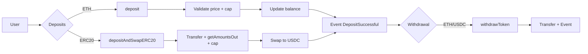
</details>

<details><summary><strong>2. ETH deposit (sequence)</strong></summary>

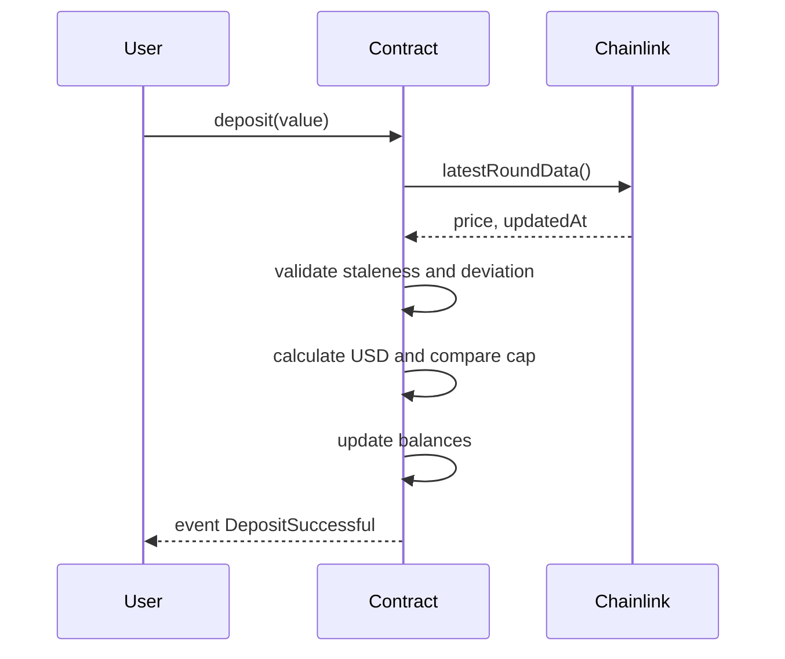
</details>

<details><summary><strong>3. ERC20 deposit with swap</strong></summary>

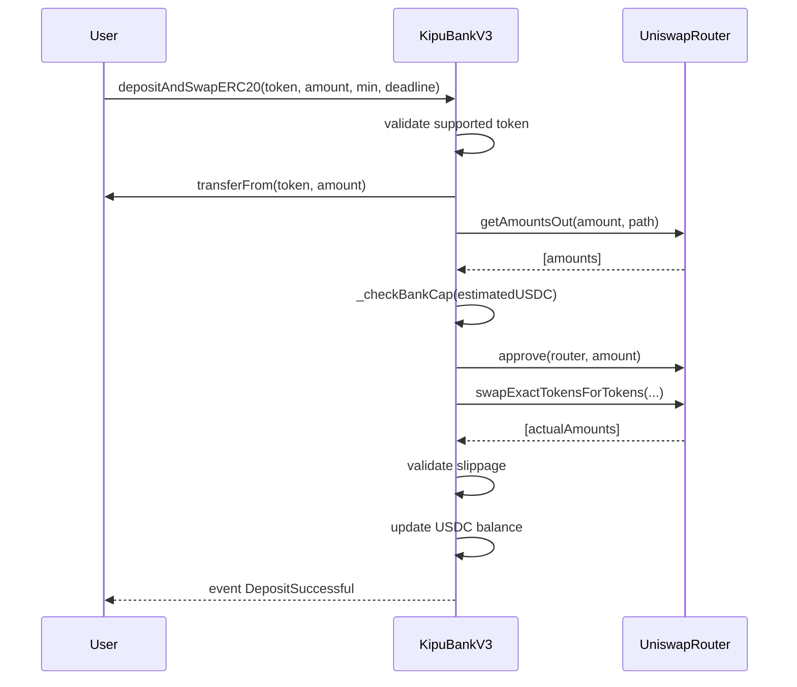
</details>

<details><summary><strong>4. Withdrawal (decision tree)</strong></summary>

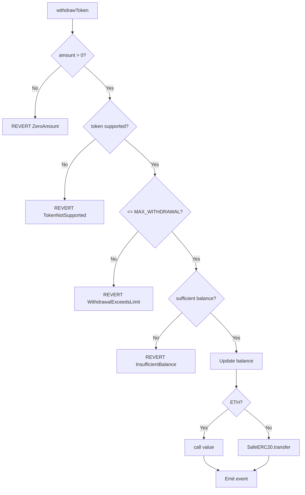
</details>

<details><summary><strong>5. Oracle validation (_getEthPriceInUsd)</strong></summary>

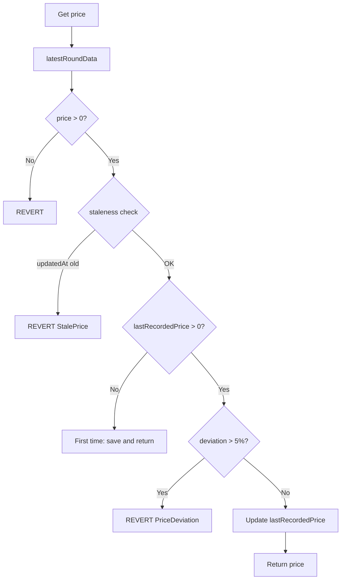
</details>

<details><summary><strong>6. CEI Pattern (Checks-Effects-Interactions)</strong></summary>

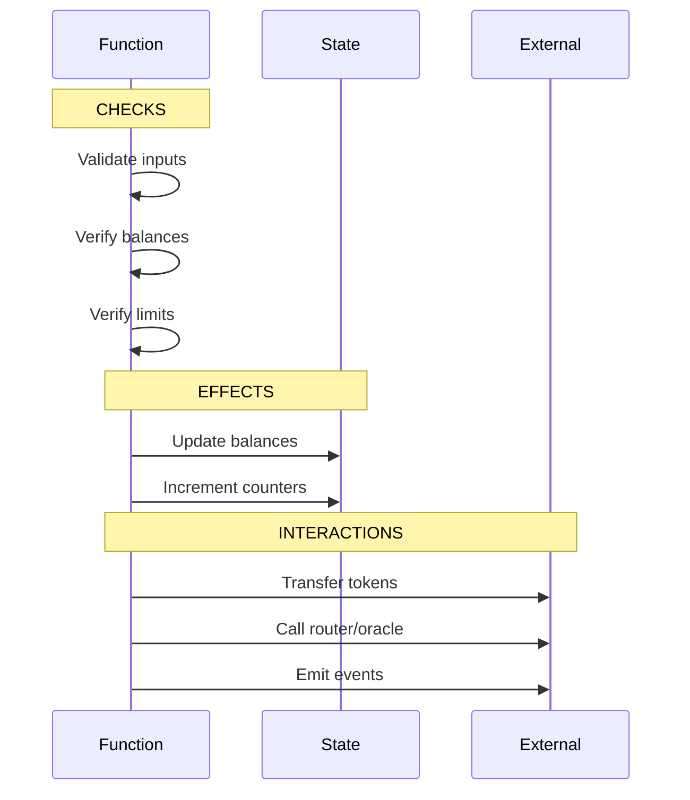
</details>

<details><summary><strong>7. Role management (AccessControl)</strong></summary>

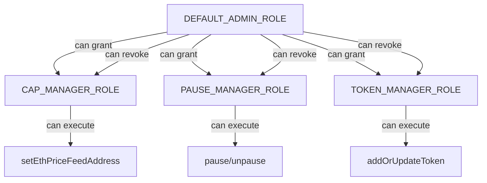
</details>

<details><summary><strong>8. Timelock: schedule operation</strong></summary>

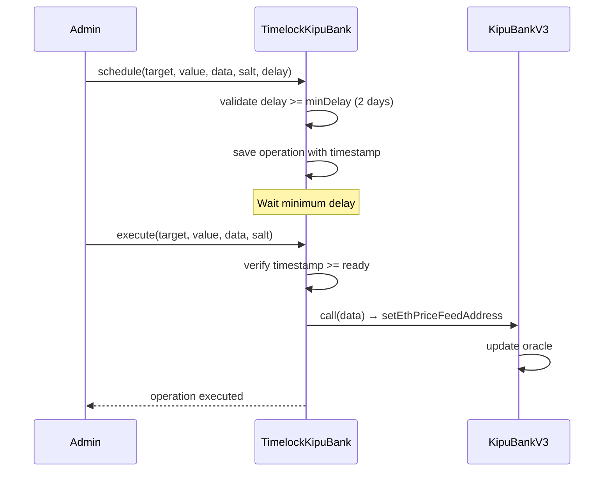
</details>

<details><summary><strong>9. Token catalog</strong></summary>

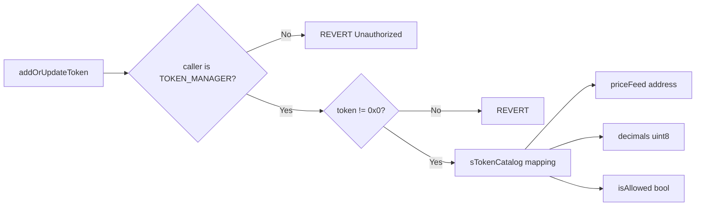
</details>

<details><summary><strong>10. Complete transaction cycle</strong></summary>


</details>

> Complete reference with detailed ASCII diagrams: [FLOW_DIAGRAMS.md](FLOW_DIAGRAMS.md)

---

<a id="instalacion-y-uso"></a>
<details>
<summary><h2>Instalación y Uso</h2></summary>

```bash
git clone https://github.com/g-centurion/KipuBankV3.git
cd KipuBankV3
forge install
```

Configurar `.env` (no commitear):
```bash
PRIVATE_KEY=0xTUCLAVE
RPC_URL_SEPOLIA=https://eth-sepolia.g.alchemy.com/v2/TU_RPC_KEY
ETHERSCAN_API_KEY=TU_KEY
```

Compilar y ejecutar pruebas:
```bash
forge build
forge test -vv
forge coverage
```

### Script de interacción (dry‑run)
Archivo: `script/Interact.s.sol`
```bash
source .env
forge script script/Interact.s.sol:InteractScript --rpc-url $RPC_URL_SEPOLIA -vvvv --dry-run
```

#### Guía de Frontend
Ver [FRONTEND_GUIDE.md](FRONTEND_GUIDE.md) para integración en aplicaciones web (ethers/viem, eventos, manejo de errores).

</details>

---

<a id="interaccion-on-chain-cast"></a>
<details>
<summary><h2>Interacción On-Chain (cast)</h2></summary>

```bash
CONTRACT_ADDRESS=0xc6d24cBbF2CCC70ef6E4EeD507fEA0F801321691

# Lectura: Límite de retiro por transacción
cast call $CONTRACT_ADDRESS "MAX_WITHDRAWAL_PER_TX()(uint256)" --rpc-url $RPC_URL_SEPOLIA

# Lectura: Router configurado
cast call $CONTRACT_ADDRESS "I_ROUTER()(address)" --rpc-url $RPC_URL_SEPOLIA

# Lectura: Ver rol admin
cast call $CONTRACT_ADDRESS "hasRole(bytes32,address)(bool)" \
  0x0000000000000000000000000000000000000000000000000000000000000000 0xTU_ADMIN \
  --rpc-url $RPC_URL_SEPOLIA
```

</details>

---

<a id="informe-de-analisis-de-amenazas-resumen"></a>
<details>
<summary><h2>Resumen de Análisis de Amenazas</h2></summary>

Debilidades y madurez:
- Oráculo único ETH/USD ⇒ dependencia. Próximo: TWAP/multi‑feed + fallback manual.
- Ruta fija vía WETH ⇒ puede no ser óptimo en precio. Próximo: agregador/routing dinámico.
- Gobernanza sin multisig activo ⇒ riesgo clave única. Próximo: multisig + timelock productivo.
- Sin stress tests gas/MEV ⇒ riesgo costos y manipulación. Próximo: escenarios de carga + simulaciones MEV.

Cobertura de pruebas:
- Métricas detalladas en sección [Testing y Cobertura](#testing-y-cobertura).

Métodos de prueba:
- Unitarias, integración con mocks (router/oráculo), fuzzing, verificación de eventos, RBAC y generación de reportes `lcov`.

Ver documentos completos: [THREAT_MODEL.md](THREAT_MODEL.md) y [AUDITOR_GUIDE.md](AUDITOR_GUIDE.md).

</details>

<a id="testing-y-cobertura"></a>
<details>
<summary><h2>Testing y Cobertura</h2></summary>

```bash
- Framework: Foundry (forge-std/Test).
- Tipos de pruebas: unitarias, integración (router/oráculo mocked), fuzzing, eventos, control de acceso y escenarios multi‑usuario.

### Resumen de resultados
| Métrica | Valor |
|--------|-------|
| Tests passing | 43 / 43 |
| Cobertura global (líneas) | 67.3% (152/226) |
| Cobertura global (funciones) | 71.1% (32/45) |
| Cobertura global (branches) | 67.7% (21/31) |
| `KipuBankV3.sol` (líneas) | 90.4% (104/115) |
| `KipuBankV3.sol` (funciones) | 90.9% (20/22) |
| `KipuBankV3.sol` (branches) | 65.0% (13/20) |

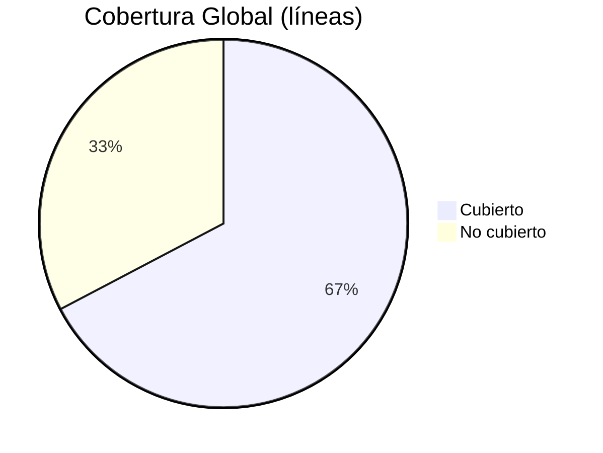

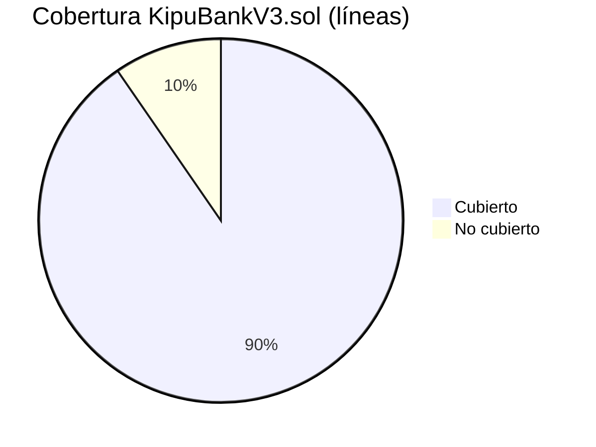

#### Cobertura por archivo (líneas)

| Archivo | Líneas | Funciones | Branches | Cobertura Líneas |
|---------|--------|-----------|----------|------------------|
| `src/KipuBankV3.sol` | 104/115 | 20/22 | 13/20 | 90.4% |
| `test/KipuBankV3Test.sol` | 48/59 | 12/17 | 8/11 | 81.4% |
| `script/Deploy.s.sol` | 0/26 | 0/3 | — | 0% (no ejecutado en tests) |
| `script/Interact.s.sol` | 0/20 | 0/1 | — | 0% (no ejecutado en tests) |
| `src/TimelockKipuBank.sol` | 0/6 | 0/2 | — | 0% (sin tests específicos) |

### Áreas cubiertas por los tests
- Depósito de ETH y validación de cap y precio.
- Swap ERC‑20→USDC con slippage mínimo y ruta WETH.
- Retiro con límites y manejo de errores personalizados.
- Pausa/despausa y verificación de roles (grant/revoke, unauthorized).
- Fuzzing de montos y secuencias de operaciones.
- Emisión de eventos y contadores (`getDepositCount`).

### Generar reporte HTML de cobertura
```bash
# Generar archivo lcov.info
forge coverage --report lcov

# Generar HTML navegable (requiere lcov instalado)
genhtml lcov.info --branch-coverage --output-directory coverage

# Abrir reporte (WSL)
# Navegar a: \\wsl.localhost\Ubuntu\home\sonic\KipuBankV3\coverage\index.html
```

**Nota**: El reporte HTML muestra cobertura detallada línea por línea, destacando código ejecutado y no ejecutado, con estadísticas de branches y funciones.

...</details>

---

<a id="entregable-tp4"></a>
<details open>
<summary><h2>Entregable TP4</h2></summary>

### Objetivo
Banco DeFi educativo con depósitos de ETH y ERC‑20, swap automático a USDC, límites por transacción y validación robusta de precios (staleness + desviación) aplicando buenas prácticas de seguridad.

### Funcionalidades Principales
- Depósitos ETH con validación de cap global.
- Depósitos ERC‑20 y conversión inmediata a USDC.
- Retiros limitados por transacción (ETH o USDC).
- Catálogo de tokens administrado por rol y Timelock opcional.
- Sistema de roles: admin / cap / pause / token.

### Arquitectura
- Herencia: AccessControl, Pausable, ReentrancyGuard.
- Librerías: SafeERC20.
- Integraciones: Uniswap V2 Router, Chainlink ETH/USD.
- Red: Sepolia | Dirección: `0xc6d24cBbF2CCC70ef6E4EeD507fEA0F801321691`.

### Interfaz Pública
| Función | Rol | Descripción |
|---------|-----|-------------|
| `deposit()` | — | Acepta ETH y actualiza balance interno |
| `depositAndSwapERC20()` | — | Recibe ERC‑20 y swapea a USDC |
| `withdrawToken()` | — | Retira ETH o USDC según límite |
| `pause()` / `unpause()` | PAUSE_MANAGER | Control de emergencia |
| `setEthPriceFeedAddress()` | CAP_MANAGER | Actualiza oráculo ETH/USD |
| `addOrUpdateToken()` | TOKEN_MANAGER | Administra catálogo |
| `getDepositCount()` / `getWethAddress()` | — | Lecturas públicas |

Eventos: `DepositSuccessful`, `WithdrawalSuccessful`.

Errores personalizados: `Bank__ZeroAmount`, `Bank__DepositExceedsCap`, `Bank__WithdrawalExceedsLimit`, `Bank__InsufficientBalance`, `Bank__TokenNotSupported`, `Bank__SlippageTooHigh`, `Bank__StalePrice`, `Bank__PriceDeviation`, `Bank__TransferFailed`.

### Parámetros Clave
- Cap global: 1,000,000 USD (8 decimales).
- Timeout oráculo: 3 horas (v2).
- Desviación máxima: 5% (500 bps).
- Límite retiro: configurado en constructor.

### Seguridad
- Patrón CEI + ReentrancyGuard.
- Validación doble de precio (staleness + desviación).
- Slippage protegido (`amountOutMin`).
- RBAC y pausa de emergencia.
- Documentación de soporte: AUDITOR_GUIDE.md, THREAT_MODEL.md.

</details>

---

<a id="deploy-y-verificacion"></a>
<details>
<summary><h2>Deploy y Verificación</h2></summary>

```bash
source .env
forge script script/Deploy.s.sol:DeployScript \
   --rpc-url $RPC_URL_SEPOLIA \
   --broadcast \
   --verify \
   --etherscan-api-key $ETHERSCAN_API_KEY -vvvv
```

El script `Deploy.s.sol` expone direcciones de Sepolia y parámetros (`MAX_WITHDRAWAL_PER_TX`, feeds, router, USDC). La verificación se realizó en Etherscan y Blockscout.

</details>

---

<a id="verificacion-tecnica-bytecode"></a>
<details>
<summary><h2>Verificación Técnica Bytecode</h2></summary>

La diferencia entre `deployedBytecode` local (plantilla) y runtime on‑chain se debe a:
1. Inserción de valores concretos de parámetros del constructor (immutables): direcciones de router, USDC, WETH, price feed y `MAX_WITHDRAWAL_PER_TX`.
2. Normalización y ubicación de esas direcciones en el layout optimizado por el compilador.

Pasos reproducibles para comparar:
```bash
# 1. Compilar y obtener plantilla local
forge build
forge inspect src/KipuBankV3.sol:KipuBankV3 deployedBytecode > local_deployed_bytecode.txt

# 2. Obtener runtime on-chain
cast code 0xc6d24cBbF2CCC70ef6E4EeD507fEA0F801321691 --rpc-url $RPC_URL_SEPOLIA > onchain_deployed_bytecode.txt

# 3. Diff (las diferencias esperadas son direcciones y valores de immutables)
diff -u local_deployed_bytecode.txt onchain_deployed_bytecode.txt || echo "Diferencias esperadas (immutables)"

# 4. Listar selectores para validar superficie de funciones idéntica
grep -o "63........" local_deployed_bytecode.txt | sort -u > selectors_local.txt
grep -o "63........" onchain_deployed_bytecode.txt | sort -u > selectors_onchain.txt
diff selectors_local.txt selectors_onchain.txt || echo "Selectores coinciden salvo orden"
```

Interpretación:
- Ausencia de divergencias funcionales: la verificación en Etherscan/Blockscout confirma que el origen coincide con el runtime.
- Las líneas con `0000…` en plantilla representan slots antes de materializar los argumentos.
- No se detectan diferencias en lógica, sólo inyección de datos específicos.

</details>

---

<a id="gas-y-optimizaciones"></a>
<details>
<summary><h2>Optimizaciones de Gas</h2></summary>

- Uso de `constant` / `immutable` para evitar SLOAD.
- Errores personalizados sin strings.
- Lectura única de oráculo por flujo de depósito.
- `unchecked` en incrementos controlados.
- Reutilización de arrays de ruta (minimizando asignaciones).

</details>

---

<a id="limitaciones-y-roadmap"></a>
<details>
<summary><h2>Limitaciones y Roadmap</h2></summary>

| Área | Limitación |
|------|------------|
| Oráculos | Solo ETH/USD (sin TWAP / multi-feed) |
| Swaps | Ruta fija Token→WETH→USDC |
| Gobernanza | Sin multisig activo (Timelock opcional) |
| Auditoría | Falta integración continua con Slither/echidna |
| Tests | Faltan stress tests de gas y escenarios MEV |

Futuro sugerido: multisig + timelock productivo, TWAP/multi-oráculo, agregador de rutas, test de carga, CI con cobertura y Slither.

</details>

---

<a id="changelog"></a>
<details open>
<summary><h2>Changelog</h2></summary>

### Versión 3 (29 Nov 2025) – NatSpec Completo
- NatSpec completo en todos los parámetros y retornos (incluyendo funciones internas).
- Redespliegue: dirección nueva `0xc6d24cBbF2CCC70ef6E4EeD507fEA0F801321691` verificada en Etherscan y Blockscout.
- Documentación actualizada con nueva dirección.

### Versión 2 (28 Nov 2025) – Correcciones Post Auditoría
- Fix crítico: atomicidad en `_checkBankCap` y `_checkEthDepositCap` (snapshot previo + proyección segura).
- NatSpec completo en errores (`@param` documentado).
- Timeout oráculo: 1h → 3h para mayor resiliencia ante retrasos.
- Documentación actualizada (README, AUDITOR_GUIDE, THREAT_MODEL) y Changelog.

### Versión 1 (12 Nov 2025) – Release Inicial
- Deploy inicial en Sepolia.
- Integración Uniswap V2 + Chainlink.
- 43 tests (cobertura alta en contrato principal).

</details>

---

<a id="licencia"></a>
<details open>
<summary><h2>Licencia</h2></summary>

MIT

</details>

<sub>Última actualización: 29 Nov 2025</sub>

---


