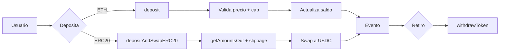

# Informe Educativo – KipuBankV3_TP4

Autor: Equipo KipuBankV3 · Fecha: 12 Nov 2025

Este documento explica, paso a paso y en lenguaje claro, cómo está construido KipuBankV3_TP4, por qué tomamos cada decisión de diseño y cómo reproducir todo el flujo (desde preparar el entorno, entender el contrato, ejecutar pruebas, desplegar, interactuar y revisar seguridad). Está pensado para lectores sin experiencia previa en blockchain.

---

## 1. ¿Qué es KipuBankV3?
KipuBankV3 es un contrato inteligente (smart contract) que funciona como un “banco” educativo en la red Ethereum (testnet Sepolia). Permite:
- Recibir depósitos en ETH y en tokens ERC‑20.
- Convertir automáticamente los depósitos a USDC usando Uniswap V2 (un protocolo de intercambio descentralizado).
- Retirar fondos (ETH o USDC) respetando límites por seguridad.
- Verificar precios con Chainlink para evitar operar con datos desactualizados o manipulados.
- Administrar permisos (roles), pausar el sistema ante emergencias y (opcionalmente) programar cambios con un timelock.

Objetivo pedagógico: mostrar buenas prácticas de ingeniería de smart contracts, integración con protocolos DeFi y enfoque de seguridad.

---

## 2. Conceptos básicos (en simple)
- Blockchain: una base de datos compartida y segura. En Ethereum, los programas se llaman “smart contracts”.
- ETH: la moneda nativa de Ethereum. Sirve para pagar comisiones (gas) y transferir valor.
- Token ERC‑20: estándar para tokens fungibles (por ejemplo USDC). Permite transferir, aprobar y consultar balances.
- Oráculo (Chainlink): servicio que trae datos del mundo real (por ejemplo, precio de ETH en USD) a la blockchain.
- AMM (Uniswap V2): mercado automatizado que permite intercambiar tokens por fórmulas matemáticas y liquidez aportada por usuarios.
- Gas: costo de ejecución de operaciones. Depende de complejidad y del precio de la red.

---

## 3. Requisitos del proyecto (TP4)
- Depósitos en ETH y ERC‑20 con conversión a USDC mediante Uniswap V2.
- Retiro con tope por transacción (`MAX_WITHDRAWAL_PER_TX`).
- Validaciones de precio: staleness (desactualización) y desviación máxima.
- Roles de acceso (RBAC), pausa de emergencia, prevención de reentrancia.
- Métricas y eventos para trazabilidad.

---

## 4. Diseño y decisiones técnicas
### 4.1 Herencia y librerías
- OpenZeppelin: `AccessControl`, `Pausable`, `ReentrancyGuard`, `SafeERC20`.
  - Por qué: estándares auditados, reducen errores comunes, facilitan RBAC y seguridad.

### 4.2 Tokens y catálogo
- ETH (nativo) y USDC habilitados por defecto.
- Extensión con `addOrUpdateToken` bajo `TOKEN_MANAGER_ROLE` para admitir otros tokens.
  - Por qué: mantener un catálogo explícito evita operar con tokens no soportados.

### 4.3 Oráculo de precios
- Chainlink `AggregatorV3Interface` (ETH/USD de 8 decimales).
- Validaciones:
  - Staleness: el dato no debe estar “viejo” más allá de `PRICE_FEED_TIMEOUT`.
  - Desviación: se compara con `lastRecordedPrice` y se rechazan saltos mayores a `MAX_PRICE_DEVIATION_BPS` (p. ej. 5%).
  - Por qué: reduce riesgo de operar con precios incorrectos por fallos o manipulación.

### 4.4 Swaps en Uniswap V2
- Rutas Token→WETH→USDC (o WETH→USDC si ya es WETH).
- Estimación previa con `getAmountsOut` y validación contra `amountOutMin` para limitar slippage.
  - Por qué: asegurar un valor mínimo de salida protege al usuario ante variaciones de precio.

### 4.5 Seguridad
- Patrón CEI (Checks‑Effects‑Interactions) + `ReentrancyGuard`.
- `Pausable` para congelar operaciones ante incidentes.
- Errores personalizados en lugar de strings (menor gas y mayor claridad).
- Límites operativos: cap global en USD y tope de retiro por transacción.

### 4.6 Administración y timelock
- Roles separados: admin, gestor de cap/oráculo, gestor de pausa, gestor de tokens.
- Timelock opcional para programar cambios con retraso mínimo (defensa contra cambios apresurados).

---

## 5. Recorrido del código (alto nivel)
Archivo principal: `src/KipuBankV3_TP4.sol`.

- `deposit()`: recibe ETH, convierte a USD con precio de Chainlink, verifica cap y acredita saldo.
- `depositAndSwapERC20(...)`: transfiere el token de entrada, estima swap, valida cap y slippage, ejecuta swap y acredita USDC.
- `withdrawToken(token, amount)`: valida monto, token soportado, tope por transacción y balance; transfiere al usuario.
- Utilidades internas: cálculo de USD, chequeo de cap, actualización y registro del último precio, contadores y eventos.
- Seguridad transversal: CEI, errores personalizados, pausas, roles, reentrancia.

Cada función está pensada para ser predecible, emitir eventos claros y fallar con mensajes/errores específicos.

---

## 6. Integraciones externas
- Chainlink: `latestRoundData()` para precio ETH/USD y timestamp.
- Uniswap V2 Router: `getAmountsOut` y `swapExactTokensForTokens` para calcular y ejecutar swaps.

Buenas prácticas: siempre validar entradas, manejar retornos, y acotar el riesgo mediante límites y verificación de precio.

---

## 7. Pruebas y cobertura
- Framework: Foundry (`forge-std/Test`).
- Tipos: unitarias, integración (router/oráculo mockeados), fuzzing, eventos y control de acceso.
- Métricas (ejemplo actual): 43/43 tests, 66.5% líneas global, ~89% en contrato principal.

Cómo ejecutar localmente:
```
forge build
forge test -vv
forge coverage
```

---

## 8. Despliegue y verificación
Script: `script/Deploy.s.sol` (Sepolia)
```
forge script script/Deploy.s.sol:DeployScript \
  --rpc-url $RPC_URL_SEPOLIA \
  --broadcast \
  --verify \
  --etherscan-api-key $ETHERSCAN_API_KEY -vvvv
```
Resultado: dirección del contrato y logs con parámetros relevantes.

---

## 9. Interacción on‑chain (ejemplos)
- Consultar límites y direcciones (con `cast` de Foundry).
- Verificar roles (`hasRole`), router configurado, etc.
- Depositar y retirar en redes de prueba.

---

## 10. Seguridad y modelo de amenazas
- Reentrancia: mitigada con CEI + `ReentrancyGuard`.
- Precios: staleness y desviación para evitar operar con datos inválidos.
- Slippage: controlado con `amountOutMin`.
- Roles y pausas: restringen acciones administrativas y permiten respuesta a incidentes.
- Timelock (opcional): añade fricción temporal a cambios sensibles.

Documentos complementarios:
- Auditoría (cómo revisar): `AUDITOR_GUIDE.md`.
- Modelo de amenazas (riesgos y mitigaciones): `THREAT_MODEL.md`.

---

## 11. Operación y monitoreo
- Eventos clave: `DepositSuccessful`, `WithdrawalSuccessful`.
- Contadores: `getDepositCount`.
- Recomendación: registrar métricas y alertas sobre pausas, cambios de roles y variaciones de precio.

---

## 12. Glosario rápido
- CEI: práctica de codificación segura (verificar → actualizar estado → interactuar).
- Slippage: diferencia entre precio esperado y ejecutado.
- Staleness: antigüedad del dato del oráculo.
- RBAC: control de acceso basado en roles.

---

## 13. Pasos para reproducir el proyecto
1) Clonar el repo y ejecutar `forge install`.
2) Configurar `.env` con `PRIVATE_KEY`, `RPC_URL_SEPOLIA`, `ETHERSCAN_API_KEY`.
3) Ejecutar pruebas y cobertura.
4) Desplegar con `Deploy.s.sol`.
5) Verificar en Etherscan.
6) Interactuar (cast/Front‑end) y revisar eventos.

---

## 14. Preguntas frecuentes (FAQ)
- ¿Puedo usar otro token que no sea USDC? Sí, habilitándolo en el catálogo con `addOrUpdateToken` (rol requerido).
- ¿Por qué usar Chainlink? Porque es un oráculo ampliamente adoptado y auditado.
- ¿Por qué errores personalizados? Gastan menos gas y estandarizan diagnósticos.
- ¿Qué pasa si el precio está viejo? La operación revierte para proteger fondos.

---

## 15. Conclusiones
KipuBankV3_TP4 ilustra un flujo completo de diseño, desarrollo, pruebas y despliegue de un smart contract con integraciones DeFi y enfoque en seguridad. El código busca ser legible, modular y seguro, priorizando prácticas recomendadas y límites operativos claros.

---

### Apéndice A – Diagrama general (mermaid)


---

> Repositorio: https://github.com/g-centurion/KipuBankV3_TP4  
> Contrato (Sepolia): `0x5b7f2F853AdF9730fBA307dc2Bd2B19FF51FcDD7`
