# Informe Educativo – KipuBankV3_TP4

Autor: Equipo KipuBankV3 · Fecha: 28 Nov 2025 (última actualización)

- Audiencia: lectores sin experiencia previa en blockchain.
- Objetivo: explicar la construcción de KipuBankV3_TP4 y cómo reproducir el flujo completo (entorno, contrato, pruebas, despliegue, interacción y seguridad).

---

## 1. ¿Qué es KipuBankV3?
KipuBankV3 es un contrato inteligente (smart contract) que funciona como un “banco” educativo en la red Ethereum (testnet Sepolia). Permite:
- Recibir depósitos en ETH y en tokens ERC‑20.
- Convertir automáticamente los depósitos a USDC usando Uniswap V2 (un protocolo de intercambio descentralizado).
- Retirar fondos (ETH o USDC) respetando límites por seguridad.
- Verificar precios con Chainlink para evitar operar con datos desactualizados o manipulados.
- Administrar permisos (roles), pausar el sistema ante emergencias y (opcionalmente) programar cambios con un timelock.

Objetivo pedagógico: mostrar buenas prácticas de ingeniería de smart contracts, integración con protocolos DeFi y enfoque de seguridad.

---

## 2. Conceptos básicos (en simple)
- Blockchain: una base de datos compartida y segura. En Ethereum, los programas se llaman “smart contracts”.
- ETH: la moneda nativa de Ethereum. Sirve para pagar comisiones (gas) y transferir valor.
- Token ERC‑20: estándar para tokens fungibles (por ejemplo USDC). Permite transferir, aprobar y consultar balances.
- Oráculo (Chainlink): servicio que trae datos del mundo real (por ejemplo, precio de ETH en USD) a la blockchain.
- AMM (Uniswap V2): mercado automatizado que permite intercambiar tokens por fórmulas matemáticas y liquidez aportada por usuarios.
- Gas: costo de ejecución de operaciones. Depende de complejidad y del precio de la red.

---

## 3. Requisitos del proyecto (TP4)
- Depósitos en ETH y ERC‑20 con conversión a USDC mediante Uniswap V2.
- Retiro con tope por transacción (`MAX_WITHDRAWAL_PER_TX`).
- Validaciones de precio: staleness (desactualización) y desviación máxima.
- Roles de acceso (RBAC), pausa de emergencia, prevención de reentrancia.
- Métricas y eventos para trazabilidad.

---

## 4. Diseño y decisiones técnicas
### 4.1 Herencia y librerías
- OpenZeppelin: `AccessControl`, `Pausable`, `ReentrancyGuard`, `SafeERC20`.
  - Por qué: estándares auditados, reducen errores comunes, facilitan RBAC y seguridad.

### 4.2 Tokens y catálogo
- ETH (nativo) y USDC habilitados por defecto.
- Extensión con `addOrUpdateToken` bajo `TOKEN_MANAGER_ROLE` para admitir otros tokens.
  - Por qué: mantener un catálogo explícito evita operar con tokens no soportados.

### 4.3 Oráculo de precios
- Chainlink `AggregatorV3Interface` (ETH/USD de 8 decimales).
- Validaciones:
  - Staleness: el dato no debe estar “viejo” más allá de `PRICE_FEED_TIMEOUT`.
  - Desviación: se compara con `lastRecordedPrice` y se rechazan saltos mayores a `MAX_PRICE_DEVIATION_BPS` (p. ej. 5%).
  - Por qué: reduce riesgo de operar con precios incorrectos por fallos o manipulación.

### 4.4 Swaps en Uniswap V2
- Rutas Token→WETH→USDC (o WETH→USDC si ya es WETH).
- Estimación previa con `getAmountsOut` y validación contra `amountOutMin` para limitar slippage.
  - Por qué: asegurar un valor mínimo de salida protege al usuario ante variaciones de precio.

### 4.5 Seguridad
- Patrón CEI (Checks‑Effects‑Interactions) + `ReentrancyGuard`.
- `Pausable` para congelar operaciones ante incidentes.
- Errores personalizados en lugar de strings (menor gas y mayor claridad).
- Límites operativos: cap global en USD y tope de retiro por transacción.

### 4.6 Administración y timelock
- Roles separados: admin, gestor de cap/oráculo, gestor de pausa, gestor de tokens.
- Timelock opcional para programar cambios con retraso mínimo (defensa contra cambios apresurados).

---

## 5. Recorrido del código (alto nivel)
Archivo principal: `src/KipuBankV3_TP4.sol`.

- `deposit()`: recibe ETH, convierte a USD con precio de Chainlink, verifica cap y acredita saldo.
- `depositAndSwapERC20(...)`: transfiere el token de entrada, estima swap, valida cap y slippage, ejecuta swap y acredita USDC.
- `withdrawToken(token, amount)`: valida monto, token soportado, tope por transacción y balance; transfiere al usuario.
- Utilidades internas: cálculo de USD, chequeo de cap, actualización y registro del último precio, contadores y eventos.
- Seguridad transversal: CEI, errores personalizados, pausas, roles, reentrancia.

Cada función está pensada para ser predecible, emitir eventos claros y fallar con mensajes/errores específicos.

---

## 6. Integraciones externas
- Chainlink: `latestRoundData()` para precio ETH/USD y timestamp.
- Uniswap V2 Router: `getAmountsOut` y `swapExactTokensForTokens` para calcular y ejecutar swaps.

Buenas prácticas: siempre validar entradas, manejar retornos, y acotar el riesgo mediante límites y verificación de precio.

---

## 7. Pruebas y cobertura
- Framework: Foundry (`forge-std/Test`).
- Tipos: unitarias, integración (router/oráculo mockeados), fuzzing, eventos y control de acceso.
- Métricas (ejemplo actual): 43/43 tests, 66.5% líneas global, ~89% en contrato principal.

Cómo ejecutar localmente:
```
forge build
forge test -vv
forge coverage
```

---

## 8. Despliegue y verificación
Script: `script/Deploy.s.sol` (Sepolia)
```
forge script script/Deploy.s.sol:DeployScript \
  --rpc-url $RPC_URL_SEPOLIA \
  --broadcast \
  --verify \
  --etherscan-api-key $ETHERSCAN_API_KEY -vvvv
```
Resultado: dirección del contrato y logs con parámetros relevantes.

---

## 9. Interacción on‑chain (ejemplos)
- Consultar límites y direcciones (con `cast` de Foundry).
- Verificar roles (`hasRole`), router configurado, etc.
- Depositar y retirar en redes de prueba.

---

## 10. Seguridad y modelo de amenazas
- Reentrancia: mitigada con CEI + `ReentrancyGuard`.
- Precios: staleness y desviación para evitar operar con datos inválidos.
- Slippage: controlado con `amountOutMin`.
- Roles y pausas: restringen acciones administrativas y permiten respuesta a incidentes.
- Timelock (opcional): añade fricción temporal a cambios sensibles.

Documentos complementarios:
- Auditoría (cómo revisar): `AUDITOR_GUIDE.md`.
- Modelo de amenazas (riesgos y mitigaciones): `THREAT_MODEL.md`.

---

## 11. Operación y monitoreo
- Eventos clave: `DepositSuccessful`, `WithdrawalSuccessful`.
- Contadores: `getDepositCount`.
- Recomendación: registrar métricas y alertas sobre pausas, cambios de roles y variaciones de precio.

---

## 12. Glosario rápido
- CEI: práctica de codificación segura (verificar → actualizar estado → interactuar).
- Slippage: diferencia entre precio esperado y ejecutado.
- Staleness: antigüedad del dato del oráculo.
- RBAC: control de acceso basado en roles.

---

## 13. Pasos para reproducir el proyecto
1) Clonar el repo y ejecutar `forge install`.
2) Configurar `.env` con `PRIVATE_KEY`, `RPC_URL_SEPOLIA`, `ETHERSCAN_API_KEY`.
3) Ejecutar pruebas y cobertura.
4) Desplegar con `Deploy.s.sol`.
5) Verificar en Etherscan.
6) Interactuar (cast/Front‑end) y revisar eventos.

---

## 14. Preguntas frecuentes (FAQ)
- ¿Puedo usar otro token que no sea USDC? Sí, habilitándolo en el catálogo con `addOrUpdateToken` (rol requerido).
- ¿Por qué usar Chainlink? Porque es un oráculo ampliamente adoptado y auditado.
- ¿Por qué errores personalizados? Gastan menos gas y estandarizan diagnósticos.
- ¿Qué pasa si el precio está viejo? La operación revierte para proteger fondos.

---

## 15. Conclusiones
KipuBankV3_TP4 ilustra un flujo completo de diseño, desarrollo, pruebas y despliegue de un smart contract con integraciones DeFi y enfoque en seguridad. El código busca ser legible, modular y seguro, priorizando prácticas recomendadas y límites operativos claros.

---

### Apéndice A – Diagrama general (mermaid)
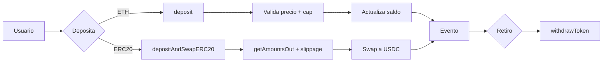

---

## Apéndice B: README completo del proyecto

Se incluye el contenido completo del README (secciones expandidas) para referencia.

---

<div align="center">

# KipuBankV3_TP4 – Banco DeFi con Swaps y Oráculos
<strong>Contrato desplegado en Sepolia</strong>

<sub>
Contrato: <code>0x7700c83b48C2f4247B8e09DaBE4fEAA9bF7a39f9</code> ·
Tx: <code>0x39e16f646659e63d285027d84659eb060b453b3f12f457cfe75d5f1eed247e25</code> ·
<a href="https://sepolia.etherscan.io/address/0x7700c83b48C2f4247B8e09DaBE4fEAA9bF7a39f9#code">Etherscan</a> ·
<a href="https://eth-sepolia.blockscout.com/address/0x7700c83b48C2f4247B8e09DaBE4fEAA9bF7a39f9">Blockscout</a>
</sub>

</div>

---

### Índice
- [Resumen ejecutivo](#resumen-ejecutivo)
- [Características principales](#caracteristicas-principales)
- [Especificaciones técnicas](#especificaciones-tecnicas)
- [Integraciones DeFi](#integraciones-defi)
- [Diagramas esenciales](#diagramas-esenciales)
- [Instalación y uso](#instalacion-y-uso)
- [Interacción on-chain (cast)](#interaccion-on-chain-cast)
- [Testing y cobertura](#testing-y-cobertura)
- [Requisitos esperados del TP4](#entregable-tp4-formato-oficial)
- [Deploy y verificación](#deploy-y-verificacion)
- [Gas y optimizaciones](#gas-y-optimizaciones)
- [Limitaciones y roadmap](#limitaciones-y-roadmap)
- [Licencia](#licencia)

---

### Resumen ejecutivo

KipuBankV3 es un contrato DeFi educativo que admite depósitos de ETH y ERC-20 (con swap automático a USDC), retiros con límites por transacción y validaciones robustas vía Chainlink. Integra seguridad basada en CEI, ReentrancyGuard, Pausable, AccessControl y errores personalizados.

---

### Características principales

- Depósitos: ETH nativo y ERC-20 con conversión a USDC mediante Uniswap V2.
- Contabilidad multi‑token con saldos internos por usuario.
- Límite global de banco en USD y tope de retiro por transacción.
- Validación de oráculo: staleness y desviación máxima (circuit breaker).
- RBAC con roles separados y modo de pausa de emergencia.
- Timelock opcional (`TimelockKipuBank.sol`) para cambios administrativos diferidos.

---

### Especificaciones técnicas

#### Arquitectura (herencia, librerías e interfaces)
- Herencia: `AccessControl`, `Pausable`, `ReentrancyGuard`.
- Librerías: `SafeERC20`.
- Interfaces: `IERC20`, `IUniswapV2Router02`, `AggregatorV3Interface`.

#### Constantes y parámetros
- `BANK_CAP_USD = 1,000,000 * 1e8` (USD, 8 dec)
- `PRICE_FEED_TIMEOUT = 1 hours`
- `MAX_PRICE_DEVIATION_BPS = 500` (5%)
- `MAX_WITHDRAWAL_PER_TX` (immutable, se define en el constructor)

#### Módulos funcionales (TPs previos + TP4)
- Depósitos ETH: `deposit()` con validación de precio y cap.
- Depósitos ERC-20 con swap: `depositAndSwapERC20()` (ruta Token→WETH→USDC; o WETH→USDC).
- Retiros: `withdrawToken(address token, uint256 amount)` (ETH o USDC).
- Oráculos: `_getEthPriceInUsd()`, `_updateRecordedPrice()`.
- Conversión USD: `_getUsdValueFromWei()`, `_getUsdValueFromUsdc()`.
- Límite global: `_checkBankCap()` + `_getBankTotalUsdValue()`.
- Métricas: `getDepositCount()`, contadores internos.

#### Tokens soportados y catálogo
- Base: ETH (address(0)) y USDC (6 dec) habilitados en constructor.
- Extensión: `addOrUpdateToken(token, priceFeed, decimals)` bajo `TOKEN_MANAGER_ROLE`.

#### Timelock opcional
- `src/TimelockKipuBank.sol` (basado en `TimelockController` de OZ): permite programar y ejecutar cambios (p. ej., `setEthPriceFeedAddress`) con delay mínimo de 2 días.

---

### Integraciones DeFi

- Uniswap V2 Router: estimaciones con `getAmountsOut`, swap con `swapExactTokensForTokens` y ruta por WETH.
- Chainlink: `latestRoundData()` para ETH/USD; validación de staleness y desviación contra `lastRecordedPrice`.

---

### Diagramas esenciales


#### 1. Flujo general del sistema

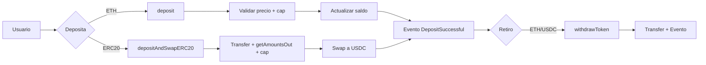

#### 2. Depósito de ETH (secuencia)

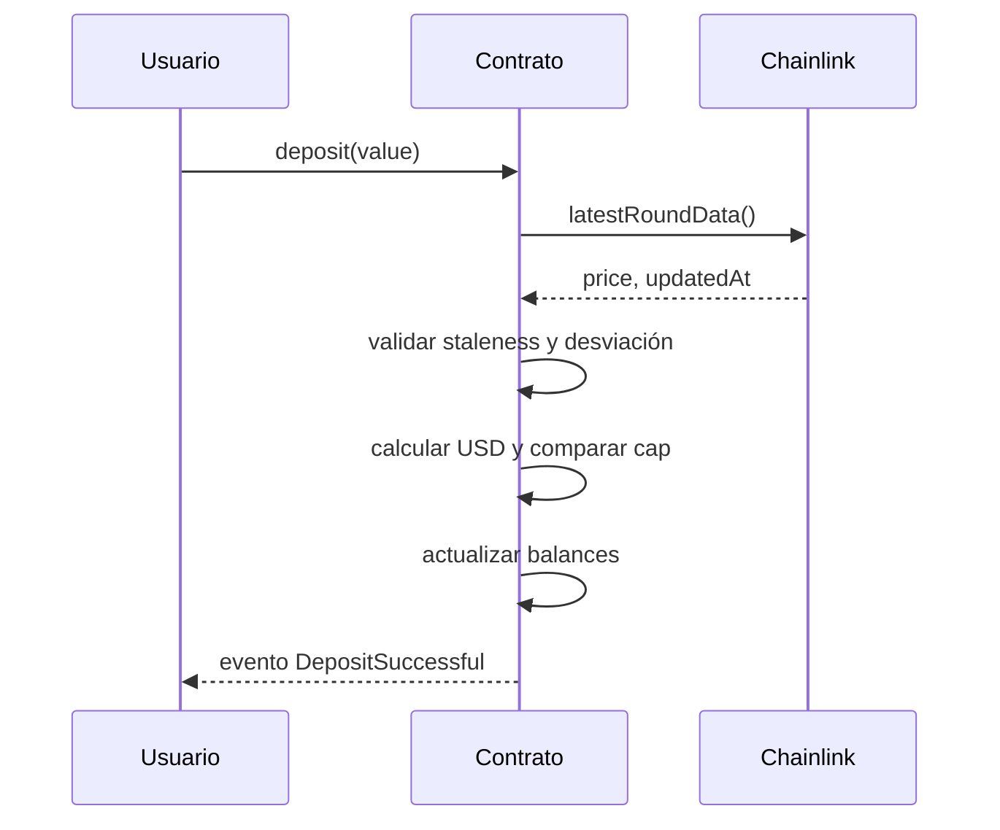

#### 3. Depósito ERC20 con swap

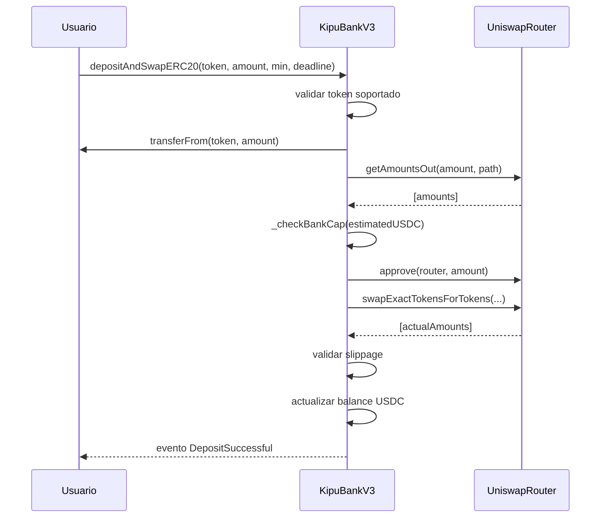

#### 4. Retiro (árbol de decisión)

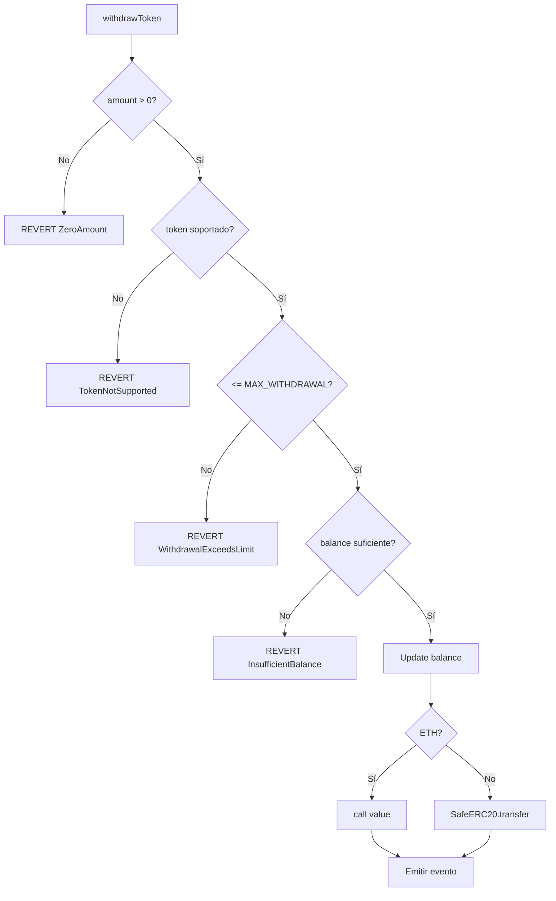

#### 5. Validación de oráculo (_getEthPriceInUsd)

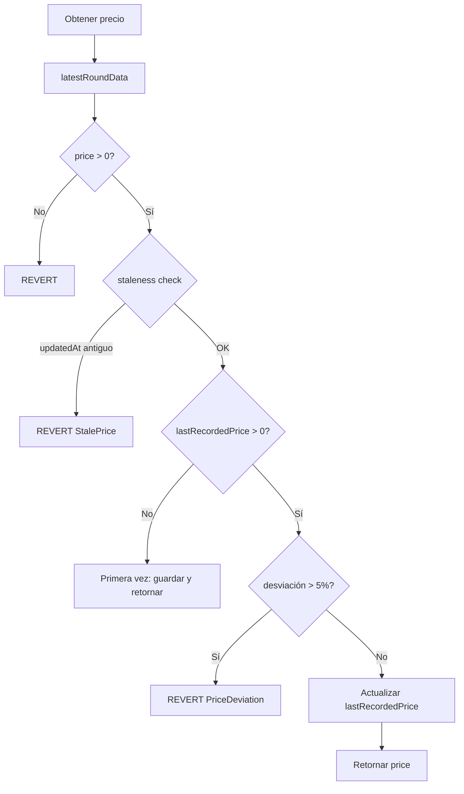

#### 6. Patrón CEI (Checks-Effects-Interactions)

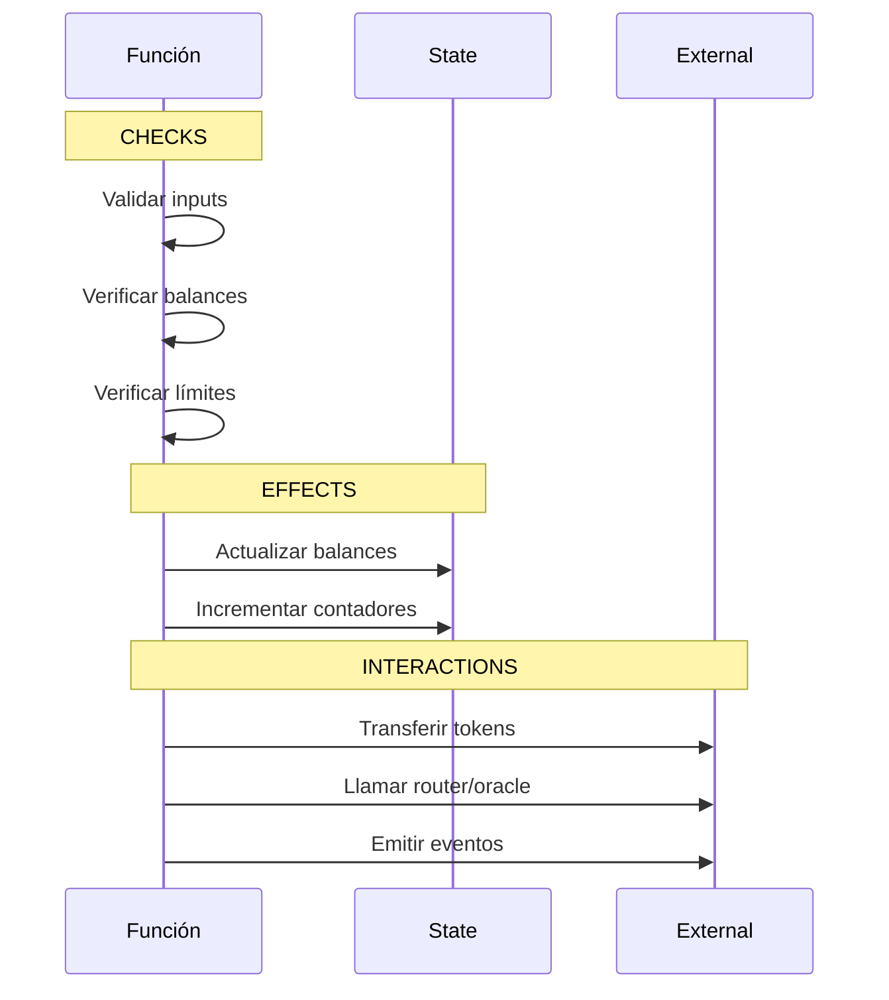

#### 7. Gestión de roles (AccessControl)

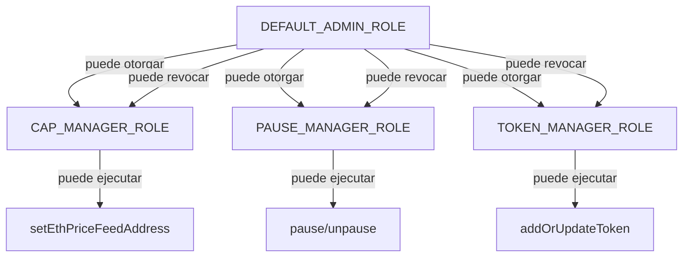

#### 8. Timelock: programar operación

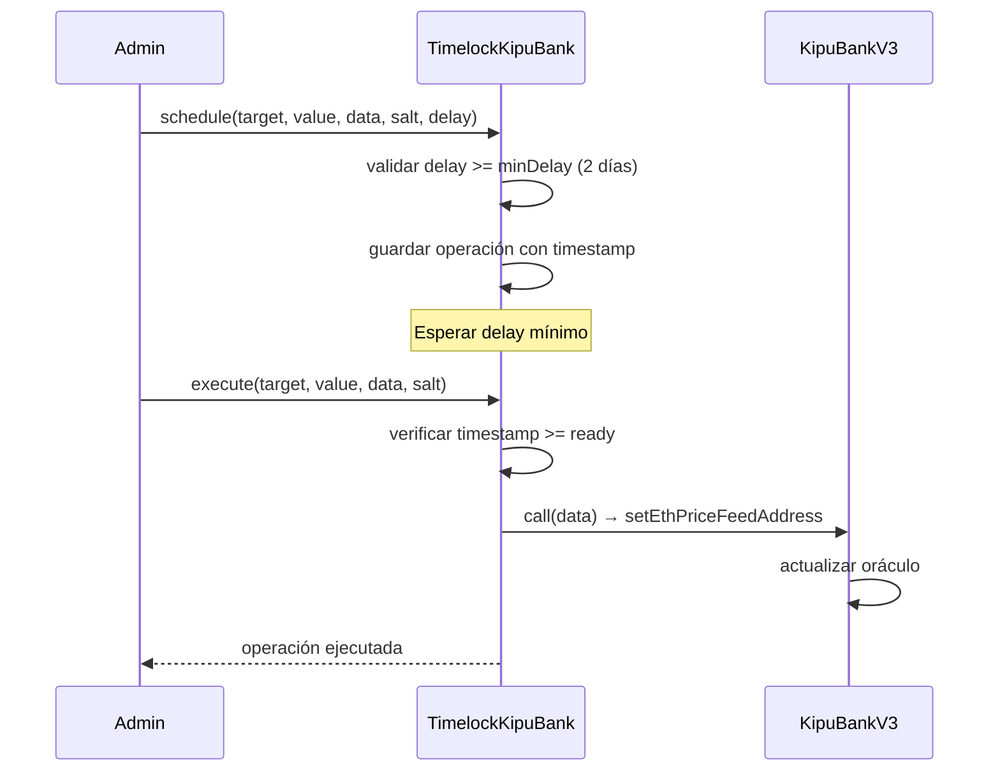

#### 9. Catálogo de tokens

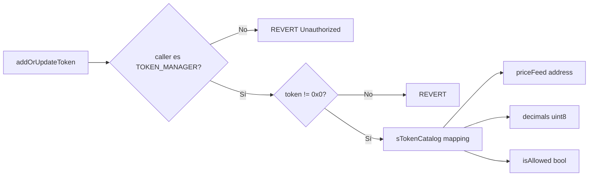

#### 10. Ciclo completo de transacción

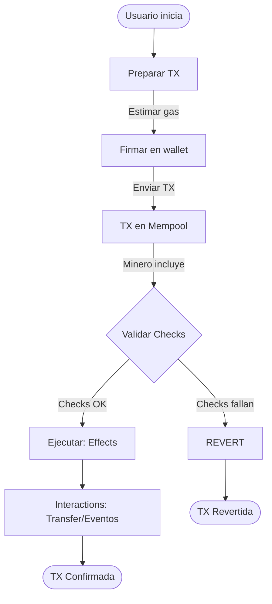

> Referencia completa con diagramas ASCII detallados: FLOW_DIAGRAMS.md

---

### Instalación y uso

```bash
git clone https://github.com/g-centurion/KipuBankV3_TP4.git
cd KipuBankV3_TP4
forge install
```

Configurar `.env` (no commitear):
```bash
PRIVATE_KEY=0xTUCLAVE
RPC_URL_SEPOLIA=https://eth-sepolia.g.alchemy.com/v2/TU_RPC_KEY
ETHERSCAN_API_KEY=TU_KEY
```

Compilar y probar:
```bash
forge build
forge test -vv
forge coverage
```

#### Script de interacción (dry‑run)
Archivo: `script/Interact.s.sol`
```bash
source .env
forge script script/Interact.s.sol:InteractScript --rpc-url $RPC_URL_SEPOLIA -vvvv --dry-run
```

#### Guía de frontend
- Ver FRONTEND_GUIDE.md: guía práctica para integrar el contrato en una aplicación web. Incluye conexión con ethers/viem, ejemplos de lectura/escritura, suscripción a eventos y manejo de errores.

---

### Interacción on-chain (cast)

```bash
# Dirección del contrato en Sepolia
CONTRACT_ADDRESS=0x7700c83b48C2f4247B8e09DaBE4fEAA9bF7a39f9

# Max withdrawal
cast call $CONTRACT_ADDRESS "MAX_WITHDRAWAL_PER_TX()(uint256)" --rpc-url $RPC_URL_SEPOLIA

# Router
cast call $CONTRACT_ADDRESS "I_ROUTER()(address)" --rpc-url $RPC_URL_SEPOLIA

# Ver rol admin
cast call $CONTRACT_ADDRESS "hasRole(bytes32,address)(bool)" \
  0x0000000000000000000000000000000000000000000000000000000000000000 0xe7Bc10cbDA9e4830921384C49B9E711d48b0E8C2 \
  --rpc-url $RPC_URL_SEPOLIA
```

---

### Testing y cobertura

Framework: Foundry (forge-std/Test).
Tipos de pruebas: unitarias, integración (router/oráculo mocked), fuzzing, eventos, control de acceso y escenarios multi‑usuario.

#### Resumen de resultados
| Métrica | Valor |
|--------|-------|
| Tests passing | 43 / 43 |
| Cobertura global (líneas) | 66.5% |
| Cobertura global (funciones) | 67.5% |
| `KipuBankV3_TP4.sol` (líneas) | 89.38% (101/113) |
| `KipuBankV3_TP4.sol` (funciones) | 88.24% (15/17) |

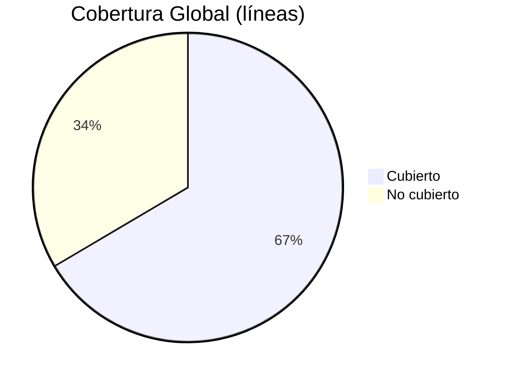

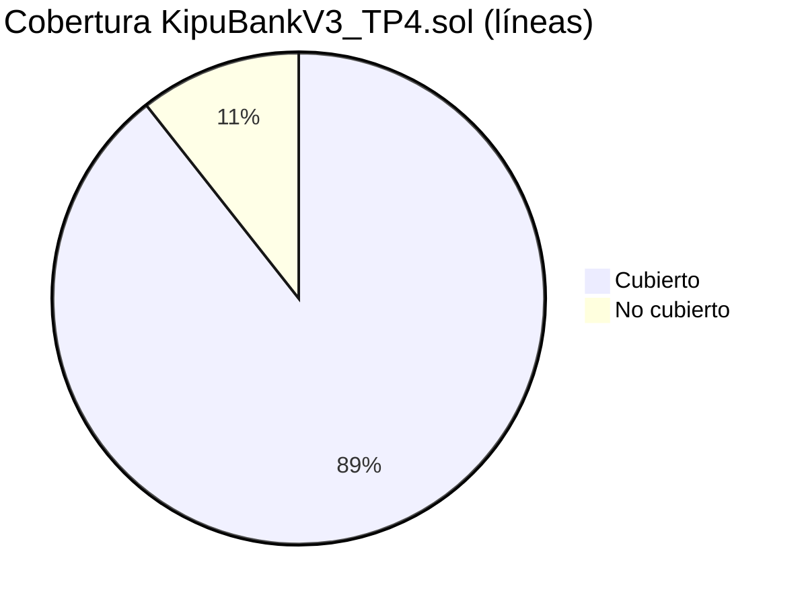

#### Cobertura por archivo (líneas)

| Archivo | Líneas | Cobertura |
|---------|--------|-----------|
| `src/KipuBankV3_TP4.sol` | 101/113 | 89.38% |
| `test/KipuBankV3Test.sol` | 48/59 | 81.36% |
| `script/Deploy.s.sol` | 0/26 | 0% (no ejecutado en tests) |
| `script/Interact.s.sol` | 0/20 | 0% (no ejecutado en tests) |
| `src/TimelockKipuBank.sol` | 0/6 | 0% (sin tests específicos) |

#### Áreas cubiertas por los tests
- Depósito de ETH y validación de cap y precio.
- Swap ERC‑20→USDC con slippage mínimo y ruta WETH.
- Retiro con límites y manejo de errores personalizados.
- Pausa/despausa y verificación de roles (grant/revoke, unauthorized).
- Fuzzing de montos y secuencias de operaciones.
- Emisión de eventos y contadores (`getDepositCount`).

#### Generar reporte HTML de cobertura (opcional, local)
```bash
forge coverage --report lcov
sudo apt-get install -y lcov
genhtml -o coverage-html lcov.info
```

---

### Requisitos esperados del TP4

Formato TP4 condensado para la entrega oficial.

#### 1) Objetivo
Implementar un "banco" DeFi educativo que acepte depósitos de ETH y ERC‑20, realice swap automático a USDC vía Uniswap V2, exponga retiros con límite por transacción y valide precios con Chainlink (staleness + desviación), aplicando buenas prácticas de seguridad.

#### 2) Requisitos funcionales implementados
- Depósito de ETH: `deposit()` con cálculo de valor USD y verificación de `BANK_CAP_USD`.
- Depósito de ERC‑20 con swap a USDC: `depositAndSwapERC20(tokenIn, amountIn, amountOutMin, deadline)`; ruta Token→WETH→USDC (o WETH→USDC).
- Retiros: `withdrawToken(token, amount)` para ETH y USDC, con límite `MAX_WITHDRAWAL_PER_TX`.
- Catálogo de tokens: alta/actualización mediante `addOrUpdateToken` (rol `TOKEN_MANAGER_ROLE`).
- Emisión de eventos: `DepositSuccessful`, `WithdrawalSuccessful`.

#### 3) Requisitos no funcionales
- Seguridad: CEI, `ReentrancyGuard`, `Pausable`, `AccessControl`, `SafeERC20`, errores personalizados.
- Oráculos: validación de staleness (`PRICE_FEED_TIMEOUT`) y desviación (`MAX_PRICE_DEVIATION_BPS`).
- Observabilidad: eventos y contadores (`getDepositCount`).

#### 4) Arquitectura y diagramas
- Herencia y librerías: `AccessControl`, `Pausable`, `ReentrancyGuard`, `SafeERC20`.
- Integraciones: `IUniswapV2Router02`, `AggregatorV3Interface`.
- Diagramas detallados: ver FLOW_DIAGRAMS.md.

#### 5) Contratos y direcciones
- Red: Sepolia
- Contrato principal: `0x7700c83b48C2f4247B8e09DaBE4fEAA9bF7a39f9`
- Verificación: Etherscan y Blockscout enlazados en el encabezado.

#### 6) API del contrato (interfaz pública y consideraciones de seguridad)

##### 6.1 Funciones principales (con roles y errores asociados)

| Función | Descripción | Rol requerido | Errores relevantes |
|---|---|---|---|
| `deposit()` | Acepta ETH nativo y acredita el saldo interno en USD | Ninguno | `Bank__ZeroAmount`, `Bank__DepositExceedsCap`, `Bank__StalePrice`, `Bank__PriceDeviation` |
| `depositAndSwapERC20(tokenIn, amountIn, amountOutMin, deadline)` | Recibe ERC‑20, calcula ruta por WETH y realiza swap a USDC | Ninguno | `Bank__ZeroAmount`, `Bank__TokenNotSupported`, `Bank__SlippageTooHigh`, `Bank__DepositExceedsCap`, `Bank__StalePrice`, `Bank__PriceDeviation` |
| `withdrawToken(token, amount)` | Retira ETH o USDC hasta el límite por transacción | Ninguno | `Bank__ZeroAmount`, `Bank__WithdrawalExceedsLimit`, `Bank__InsufficientBalance`, `Bank__TokenNotSupported`, `Bank__TransferFailed` |
| `pause()` | Activa el modo de pausa de emergencia | `PAUSE_MANAGER_ROLE` | — |
| `unpause()` | Desactiva el modo de pausa | `PAUSE_MANAGER_ROLE` | — |
| `setEthPriceFeedAddress(newAddress)` | Actualiza el oráculo ETH/USD | `CAP_MANAGER_ROLE` | — |
| `addOrUpdateToken(token, priceFeed, decimals)` | Administra el catálogo de tokens soportados | `TOKEN_MANAGER_ROLE` | — |
| `getDepositCount()` | Devuelve el contador de depósitos totales | Ninguno | — |
| `getWethAddress()` | Devuelve la dirección de WETH configurada | Ninguno | — |

Eventos emitidos:
```
event DepositSuccessful(address indexed user, address indexed token, uint256 amount);
event WithdrawalSuccessful(address indexed user, address indexed token, uint256 amount);
```

##### 6.2 Roles del contrato (referencia)

| Rol | Propósito |
|-----|-----------|
| `DEFAULT_ADMIN_ROLE` | Administración general y asignación de roles |
| `CAP_MANAGER_ROLE` | Gestión de oráculo y parámetros de riesgo |
| `PAUSE_MANAGER_ROLE` | Operaciones de pausa/despausa |
| `TOKEN_MANAGER_ROLE` | Alta y actualización de tokens soportados |

##### 6.3 Errores personalizados (referencia)

| Error | Descripción breve |
|-------|-------------------|
| `Bank__ZeroAmount` | Valor de entrada igual a cero |
| `Bank__DepositExceedsCap` | Límite global del banco excedido |
| `Bank__WithdrawalExceedsLimit` | Límite por transacción superado |
| `Bank__InsufficientBalance` | Saldo insuficiente del usuario |
| `Bank__TokenNotSupported` | Token no habilitado en el catálogo |
| `Bank__SlippageTooHigh` | Resultado del swap inferior al mínimo |
| `Bank__StalePrice` | Desactualización del oráculo más allá del tiempo límite |
| `Bank__PriceDeviation` | Desviación de precio por encima del umbral |
| `Bank__TransferFailed` | Fallo en la transferencia del token |

#### 7) Parámetros y constantes relevantes
- `BANK_CAP_USD = 1_000_000 * 1e8`
- `PRICE_FEED_TIMEOUT = 1 hours`
- `MAX_PRICE_DEVIATION_BPS = 500`
- `MAX_WITHDRAWAL_PER_TX` (immutable configurado en el constructor)

#### 8) Roles y permisos
Resumen en la sección [API del contrato](#6-api-del-contrato-interfaz-pública-y-consideraciones-de-seguridad).

#### 9) Consideraciones de seguridad
- Reentrancia mitigada con CEI y `ReentrancyGuard`.
- Oráculo: staleness/desviación + actualización de `lastRecordedPrice`.
- Slippage: parámetro `amountOutMin` y chequeo posterior al swap.
- Límite por retiro y cap global del banco en USD.

- Material para auditoría: ver AUDITOR_GUIDE.md con flujos críticos, checklist de seguridad y pruebas recomendadas.
- Modelo de amenazas: ver THREAT_MODEL.md con riesgos priorizados, escenarios y mitigaciones aplicadas.

#### 10) Despliegue y verificación
Comandos en [Deploy y verificación](#deploy-y-verificacion).

#### 11) Pruebas y cobertura
Resumen en [Testing y cobertura](#testing-y-cobertura). 43/43 tests; 66.5% líneas global; 89.38% en contrato principal.

#### 12) Conclusiones y mejoras
- El contrato cumple los requisitos del TP4 con foco en seguridad y trazabilidad.
- Pendientes sugeridos: TWAP/multi‑feed, multisig+timelock operativo, pruebas de gas y MEV extendidas.

---

### Deploy y verificación

```bash
source .env
forge script script/Deploy.s.sol:DeployScript \
  --rpc-url $RPC_URL_SEPOLIA \
  --broadcast \
  --verify \
  --etherscan-api-key $ETHERSCAN_API_KEY -vvvv
```
Resultado: contrato desplegado y verificado en Sepolia.

- Ejemplo de deploy: `script/Deploy.s.sol` documenta direcciones de Sepolia, parámetros clave (feeds, router, `MAX_WITHDRAWAL_PER_TX`) y logs de despliegue para reproducibilidad.

---

### Gas y optimizaciones

- `constant`/`immutable` para reducir SLOAD.
- Errores personalizados en lugar de strings.
- `unchecked` en incrementos con pre‑checks.
- Una sola lectura de oráculo por función.
- Reutilización de memoria en rutas de swap.

---

### Limitaciones y roadmap

| Área | Limitación |
|------|------------|
| Oráculos | Solo ETH/USD (sin TWAP/multi‑feed) |
| Swaps | Ruta fija Token→WETH→USDC |
| Gobernanza | Timelock opcional, sin multisig |
| Auditoría | Slither debe ejecutarse localmente |
| Tests | Faltan stress tests de gas/MEV |

Siguientes mejoras sugeridas: integrar multisig + timelock, TWAP/multi‑oracle, módulos de estrategia y CI con cobertura y Slither.

---

### Licencia

MIT

<sub>Última actualización del README: 13 Nov 2025</sub>

---

> Repositorio: https://github.com/g-centurion/KipuBankV3_TP4  
> Contrato (Sepolia): `0x7700c83b48C2f4247B8e09DaBE4fEAA9bF7a39f9`  
> Última actualización del Informe Educativo: 13 Nov 2025
